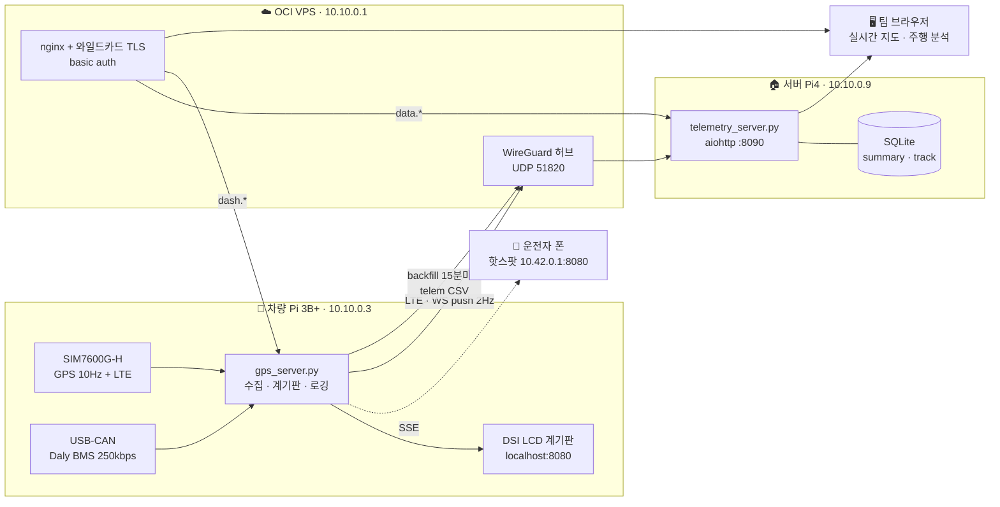

# UNIMOTORS 텔레메트리 시스템

> Raspberry Pi 기반 **전기 레이싱카 실시간 텔레메트리 + 계기판** 시스템.
> LTE · GPS 10Hz · Daly BMS(CAN) · WireGuard VPN · 멀티차량 원격 대시보드 · 주행/랩 분석.

KSAE 대회용 자작 전기차(UNIMOTORS)에 올린 실동작 시스템의 코드와 전체 구축 기록이다.
운전자에게는 차량 내 계기판을, 팀에게는 원격지에서의 실시간 모니터링과 사후 정밀 분석을 제공한다.

<sub>차량 Pi가 GPS·BMS를 수집해 로컬 계기판에 표시하고 LTE→VPN으로 서버에 push,
서버는 SQLite에 쌓으며 브라우저 대시보드로 실시간 지도와 주행 분석을 서빙한다.</sub>

---

## 목차

- [무엇이 들어 있나](#무엇이-들어-있나)
- [아키텍처](#아키텍처)
- [레포 구조](#레포-구조)
- [빠른 시작](#빠른-시작)
- [문서](#문서)
- [하드웨어](#하드웨어)
- [핵심 설계 결정](#핵심-설계-결정)
- [알아둘 함정](#알아둘-함정)
- [English summary](#english-summary)

---

## 무엇이 들어 있나

| | 설명 |
|---|---|
| **차량 계기판** | GPS 10Hz 속도·방위·위성, 배터리, G-G 다이어그램. SSE로 폰/DSI LCD에 표시 |
| **Daly BMS CAN 파서** | DataID `0x90`~`0x98` 전체 실측 검증. 셀전압·온도·밸런싱·알람 비트맵까지 |
| **원격 텔레메트리** | LTE → WireGuard VPN → WebSocket push (2Hz). CGNAT 뒤에서도 동작 |
| **멀티차량 대시보드** | Leaflet 실시간 지도, 차량 선택, 알람 배너 |
| **주행 분석** | 세션별 궤적·그래프 확대/호버·스크러버·궤적 색 그라데이션 |
| **랩 분석** | 출발선 선분교차 감지 + 방향판정 + 이탈거리 가드. 랩별 시간/거리/G/Wh·km |
| **배터리 분석** | 충전 세션 자동 판별, SOC·전압·전류·온도·셀편차, 완충 예상 시간 |
| **구멍 보정(backfill)** | LTE 음영으로 빠진 구간을 로컬 CSV로 사후 보정. 중복은 자동 무시 |
| **시계 점프 방어** | RTC 없는 Pi의 부팅 시계 점프를 `t_mono` + 세션 분리로 격리 |

---

## 아키텍처



**3가지 데이터 레이트** — 용도별로 분리한다.

| 데이터 | 레이트 | 저장 위치 | 용도 |
|---|---|---|---|
| raw NMEA | 10Hz | 차량 SD (`gps_*.csv`) | 정밀 궤적 원본 (업로드 안 함) |
| telem CSV | 1Hz | 차량 SD (`telem_*.csv`) | backfill 소스 / 백업 |
| 계기판 SSE | 1~2Hz | 폰 · DSI LCD | 운전자 실시간 표시 |
| 서버 push | 2Hz | 서버 `summary` | 원격 실시간 모니터링 |

> 실시간 표시엔 2Hz면 사람 눈에 충분하다. 10Hz는 사후 분석용으로 로컬에만 둔다.

---

## 레포 구조

```
.
├── vehicle/                차량 Pi
│   ├── gps_server.py         GPS+BMS 수집 · 계기판 SSE · 로컬 로깅 · 서버 업로더
│   ├── bms_reader.py         Daly BMS CAN 파서 (0x90~0x98)
│   ├── backfill.py           주행 후 telem CSV 업로드 / 구멍 보정
│   └── requirements.txt
├── server/                 서버 Pi4
│   ├── telemetry_server.py   aiohttp WS + SQLite + 분석 API
│   ├── dashboard.html        Leaflet 대시보드 (실시간 · 주행분석 · 랩 · 배터리)
│   └── requirements.txt
├── web/                    OCI 정적 웹
│   ├── index.html            랜딩 (공개)
│   └── app/index.html        데이터 포털 (basic auth)
├── deploy/
│   ├── vehicle/              systemd 5종 · CAN 자동up · lte_auto.sh · kiosk.sh · captive.conf
│   ├── server/               telemetry.service
│   ├── oci/                  nginx 3사이트 + SSL snippet + wg0 예시
│   └── wg0-client.conf.example
├── scripts/
│   ├── install-vehicle.sh
│   └── install-server.sh
├── docs/                   장별 문서 (아래 표) + MASTER.md 통합본
├── .env.example
└── LICENSE
```

---

## 빠른 시작

### 서버 (Raspberry Pi 4B)

```bash
git clone <this-repo> unimotors && cd unimotors
sudo bash scripts/install-server.sh

sudo nano /etc/default/unimotors     # UNIMOTORS_TOKEN 설정
sudo systemctl restart telemetry.service
curl -s http://127.0.0.1:8090/api/status   # {"online":[],"vehicles":[]}
```

### 차량 (Raspberry Pi 3B+)

```bash
git clone <this-repo> unimotors && cd unimotors
sudo bash scripts/install-vehicle.sh       # CAN_METHOD=service 로 바꿀 수 있음

sudo nano /etc/default/unimotors     # UNIMOTORS_TOKEN — 서버와 동일해야 함
sudo systemctl restart gps-dashboard.service
```

브라우저에서 `http://<차량Pi>:8080` (계기판), `http://<서버Pi>:8090` (대시보드).

> **BMS나 GPS가 없어도 동작한다.** BMS 미연결이면 배터리 값이 `--`로 뜨고 나머지는 정상이다.
> 배터리 없는 차량(개인차 테스트)은 `UNIMOTORS_PRESET=starex`로 쓰면 된다.

VPN·도메인·TLS까지 붙이는 전체 경로는 [docs/15-setup-oci.md](docs/15-setup-oci.md)를 본다.

---

## 문서

### 1부 — 설계와 구현

| 문서 | 내용 |
|---|---|
| [01 개요와 아키텍처](docs/01-overview.md) | 목적 · 하드웨어 · 이중 네트워크 · 데이터 흐름 |
| [02 Pi 초기 세팅](docs/02-pi-setup.md) | 헤드리스 OS 굽기 · 국가코드 · 부팅 주의 |
| [03 LTE](docs/03-lte.md) | SIM7600G-H · AT+NDIS Raw IP · udhcpc |
| [04 GPS 10Hz](docs/04-gps.md) | NMEA 마스크 · **버퍼 적체 해결** · 측위 판정 |
| [05 핫스팟 · 캡티브 포털](docs/05-hotspot-captive.md) | nmcli AP · "인터넷 없음" 대응 3방식 |
| [06 WireGuard VPN](docs/06-wireguard.md) | 허브-스포크 메시 · CGNAT keepalive |
| [07 Daly BMS CAN](docs/07-bms-can.md) | **배터리 팩·BMS 사양** · 배선 · CAN 자동 up · **프로토콜 전문** |
| [08 텔레메트리 서버](docs/08-telemetry-server.md) | 멀티차량 · 3층 저장 · API · backfill |
| [09 하드웨어 이관](docs/09-hardware-migration.md) | Zero W → 3B+/4B · 배포 체크리스트 |

### 2부 — 인프라 실배포

| 문서 | 내용 |
|---|---|
| [10 인프라](docs/10-infrastructure.md) | 네트워크 지형도 · 폰 풀터널 · nginx · 와일드카드 TLS |

### 3부 — 데이터 모델과 분석

| 문서 | 내용 |
|---|---|
| [11 데이터 모델](docs/11-data-model.md) | 32필드 스키마 · 누적 사용량 · **시계 점프 방어** |
| [12 주행/랩/배터리 분석](docs/12-analysis.md) | 궤적 그라데이션 · **출발선 랩 감지** · 충전 세션 · 대회 수집 권장 데이터 |

### 4부 — 초기 설정 총정리

| 문서 | 내용 |
|---|---|
| [13 차량 Pi 세팅](docs/13-setup-vehicle.md) | systemd 5종 · CAN 자동up · backfill 타이머 · DSI 키오스크 |
| [14 서버 Pi4 세팅](docs/14-setup-server.md) | WireGuard · telemetry.service · DB 백업 |
| [15 OCI VPS 세팅](docs/15-setup-oci.md) | WireGuard 허브 · 방화벽 · nginx · certbot |

### 5부 — 트러블슈팅과 레퍼런스

| 문서 | 내용 |
|---|---|
| [16 트러블슈팅](docs/16-troubleshooting.md) | 실제로 겪은 모든 문제 — 증상 → 원인 → 해결 |
| [17 레퍼런스](docs/17-reference.md) | 명령 요약 · 기기별 경로 · 백업 · 설계 근거 |
| [18 현재 상태 · TODO](docs/18-status-todo.md) | 완료 항목과 남은 작업 |
| [MASTER.md](docs/MASTER.md) | 위 전체를 합친 통합 원본 |

---

## 하드웨어

| 부품 | 사양 | 비고 |
|---|---|---|
| 차량 컴퓨터 | Raspberry Pi 3B+ | 쿼드코어. DSI LCD 지원 |
| 서버 | Raspberry Pi 4B 2GB | 대시보드 + SQLite |
| VPS | Oracle Cloud Always Free (1GB) | WireGuard 허브 + nginx 전용 |
| LTE/GPS | Waveshare **SIM7600G-H (B)** HAT | LTE + GNSS 내장. Pi 4는 Micro USB 직결 |
| 배터리 | **삼성 INR21700-50S** 14S16P (224셀) | 고니켈 **NMC** · 50.4V · 80Ah · **약 4.0kWh** |
| BMS | **Daly `R24TS1A-17S300A`** | 8~17S · 300A · 1A 액티브 밸런싱 · CAN/RS485/BT |
| CAN | USB-CAN (gs_usb / candleLight) | SocketCAN 네이티브, 드라이버 불필요 |
| 디스플레이 | 5인치 DSI LCD | 계기판. 폰을 안 써도 되게 함 |

**배터리 팩 (14S16P)**

| | |
|---|---|
| 공칭 / 만충 / 차단 | 50.4 V / **58.8 V** / 35.0 V |
| 용량 / 에너지 | 80 Ah / 약 4.03 kWh |
| 방전 상한 | 셀 400A → **BMS 300A에서 제한** (≈15kW) |

> ⚠️ **NMC이지 LFP가 아니다.** Daly 앱의 배터리 타입이 LiFePO4로 남아 있으면
> 3.65V/셀에서 충전이 끊겨 **실용량의 30~40%만 쓰게 된다.** 셀 과충전 보호는
> 4.25V로 두되 **4.25V를 넘기면 안 된다.** 0°C 미만 충전(회생 포함) 금지.
> 전체 점검표와 OCV↔SOC 표는 [docs/07](docs/07-bms-can.md#8-0-배터리-팩과-bms-사양).

**BMS 통신 (실측 확정)**

- 확장 프레임 29-bit: 요청 `0x18 DD 01 40` / 응답 `0x18 DD 40 01`, **250kbps**
- BMS 5핀 중 **CAN H·L만** 연결 (A/B는 RS485 — 절대 연결 금지)
- 전류 `(raw − 30000) × 0.1 A` (음수 = 회생) / 온도 `raw − 40 °C`
- 앱에서 통신방식을 **CAN**으로 바꾸지 않으면 응답이 없다

---

## 핵심 설계 결정

| 선택 | 대안 | 이유 |
|---|---|---|
| WireGuard | ZeroTier / Tailscale | 커널 모듈이라 가볍고, 외부 서비스 의존이 없고, 설정이 conf 하나 |
| AT+NDIS (Raw IP) | QMI (qmicli) | 이 모듈 펌웨어에서 QMI가 CID/timeout 실패 |
| SQLite | PostgreSQL / InfluxDB | 별도 프로세스 0, Pi에 충분, 파일 하나로 백업 |
| WebSocket 평문 | MQTT / HTTPS | WireGuard가 이미 암호화. TLS 이중화 불필요 |
| Leaflet + OSM | Google Maps | 무료, API 키 불필요, 다크 타일 지원 |
| SSE (계기판) | WebSocket | 단방향이면 SSE가 단순 — 단 nginx 버퍼링 주의 |
| systemd 타이머 | cron | `After=wg-quick` 의존성 지정 + `Persistent=true` |

---

## 알아둘 함정

이 프로젝트에서 실제로 시간을 가장 많이 잡아먹은 것들. 자세한 건 [docs/16](docs/16-troubleshooting.md).

- **GPS 계기판이 30초 지연** — 커널 시리얼 버퍼(4095B) 적체. `AT+CGPSNMEA=17`로 GSV 제거 + `os.fsync()` 제거로 해결
- **GPS 설정이 안 먹힘** — GPS가 켜진 상태에선 변경 불가. `AT+CGPS=0` → 설정 → `AT+CGPS=1,1` 순서 필수
- **도메인 경유 계기판만 멈춤** — SSE가 HTTP/1.0 + 길이 미확정이라 nginx가 못 넘김. `protocol_version="HTTP/1.1"` + chunked + `X-Accel-Buffering: no`. **nginx `proxy_buffering off`만으로는 해결되지 않는다**
- **폰이 핫스팟을 끊음** — 캡티브 체크가 포트 80 + DNS라 코드에 도달조차 못 함. DNS 하이재킹 + 80→8080 리다이렉트
- **VPN은 붙는데 인터넷 안 됨** (폰 풀터널) — OCI MASQUERADE 누락
- **원격 SSH가 몇 분 뒤 끊김** — CGNAT 뒤 기기에 `PersistentKeepalive = 25` 누락
- **주행시간이 몇 시간으로 뻥튀기** — RTC 없는 Pi의 부팅 시계 점프. `t_mono` + 세션 분리로 해결
- **출발선에 정차하면 허위 랩 폭증** — 디바운스로는 못 막는다. **이탈거리 가드(30m)**가 핵심
- **재부팅 후 방화벽 소실** — `netfilter-persistent save` 누락
- **Zero W가 WiFi를 못 잡음** — `cmdline.txt`의 `cfg80211.ieee80211_regdom=GB`. KR로 고쳐야 한다

---

## 보안 / 커밋 주의

이 레포는 공개용이라 **공인 IP·도메인이 플레이스홀더로 치환**되어 있다
(`<OCI_PUBLIC_IP>`, `unimotors.example.com`). 실제 값은 팀 비밀번호 관리자에 둔다.

절대 커밋하지 말 것 — `.gitignore`에 이미 들어 있다:

- WireGuard 개인키 / PSK (`*.key`, `*.psk`, `wg0.conf`)
- SSH 개인키, Cloudflare API 토큰, `.htpasswd`, TLS `*.pem`
- 주행 데이터 (`telemetry.db`, `gps_logs/`, `*.csv`)
- `UNIMOTORS_TOKEN` 실제 값 (`/etc/default/unimotors`에만 둔다)

> 이 프로젝트는 이전 서버를 **SSH 키 분실로 잃은 이력**이 있다.
> 개인키는 재생성이 불가능하다 — 반드시 백업할 것. ([docs/17](docs/17-reference.md))

---

## English summary

**UNIMOTORS Telemetry** — a Raspberry Pi telemetry and dashboard system for a
student-built electric racing car (KSAE competition).

A Pi in the car reads **10 Hz GPS** from a SIM7600G-H LTE/GNSS HAT and battery
data from a **Daly `R24TS1A-17S300A` BMS over CAN** (SocketCAN, 250 kbps, DataIDs
`0x90`–`0x98`, all reverse-verified against the real pack). The pack is a
**14S16P array of Samsung INR21700-50S** cells — high-nickel NMC, 50.4 V nominal,
80 Ah, roughly 4 kWh. It renders a driver dashboard locally
over SSE — on a DSI LCD or the driver's phone via a local hotspot — logs raw NMEA
to SD at 10 Hz, and pushes a 32-field snapshot to a home server at 2 Hz over LTE
through a **WireGuard** mesh (the car sits behind CGNAT, so the VPN hub on a free
Oracle Cloud VPS is what makes inbound access possible at all).

The server (`aiohttp` + SQLite) fans snapshots out to a **Leaflet dashboard**
supporting multiple vehicles, per-session replay with a scrubber, speed/G/altitude/
battery charts with shared zoom, **lap detection** via start-line segment crossing
(with a departure-distance guard that eliminates false laps from idling on the line),
and a **battery-only analysis mode** that auto-detects charging sessions. A backfill
timer re-uploads local CSVs every 15 minutes to patch holes left by LTE dead zones —
duplicates are ignored via an `INSERT OR IGNORE` primary key on the timestamp.

Everything is documented in Korean under [`docs/`](docs/) — including the full
Daly CAN protocol table, every systemd unit, the nginx/TLS reverse-proxy setup,
and a long troubleshooting log of problems actually hit in the field.
Code and configs are language-neutral; start with [`docs/01-overview.md`](docs/01-overview.md).

---

## 라이선스

[MIT](LICENSE)
