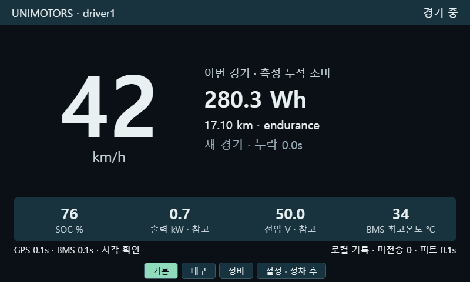
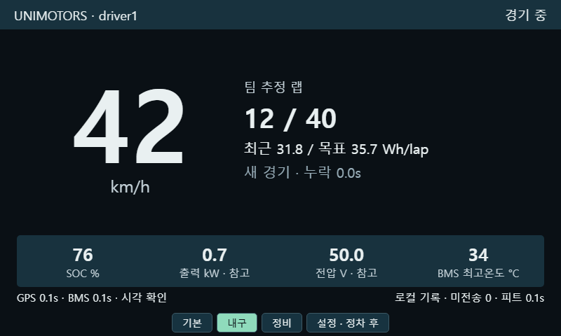
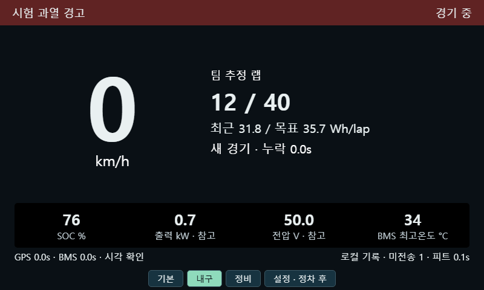
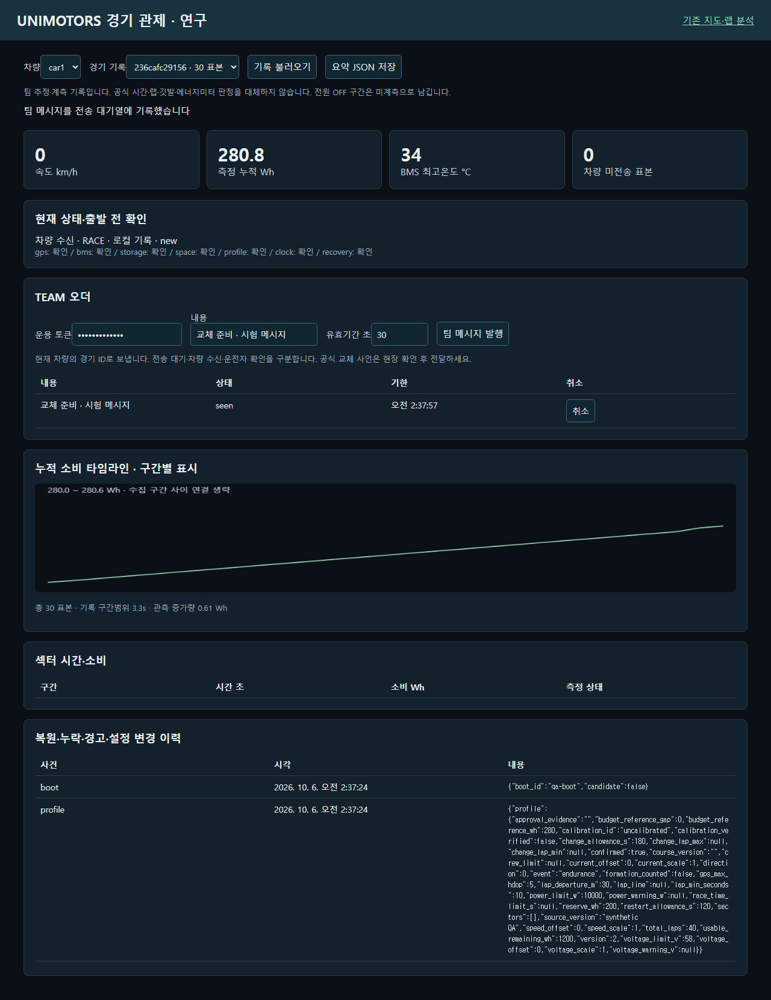

# 31. 클러스터 졸업연구 개선 구현 — V7 / 2026-10-06

이 장은 포스터의 장단점, 상용차 계기판 조사, 대회 규정 적용 분석, 짧은 재시동 복원 토의를 실제 소프트웨어에 연결한 최신 변경 기록이다. 앞선 V5/V6 장과 TODO는 당시의 이력이다. 최신 구현·운용은 이 장을 우선 참고한다.

변경은 로컬 소스와 GitHub 검토용 브랜치에 제공한다. 차량 Pi·서버 Pi·OCI에 원격 설치하거나 실제 차량을 운행한 결과가 아니다. 합성 입력으로 검증한 동작과 실차에서 확인할 조건을 구별한다.

## 31-1. 포스터의 장단점을 개선 요구사항으로 연결

| 포스터·조사에서 얻은 요구 | 이번 구현 | 개선 의미·남은 확인 |
|---|---|---|
| 기존 GPS/BMS·로컬 계기판·원격 관제 기반 | 로컬 RaceRuntime과 센서 수집, 기록, 업로더를 분리 | 인터넷 없이 표시·소비·랩 계산 지속. 실제 GPS 수신율·종단 지연은 실차 측정 필요 |
| VPN 및 이동통신망의 장점 | 현재 WireGuard/WS를 유지하고 ACK가 있는 미전송 큐 추가 | 재접속과 재부팅 후도 중복 없는 재전송. VPN의 가용성 자체를 보장하지 않음 |
| 배터리 소비·거리 역산 부담 | 운전자 기본 화면에 측정 누적 Wh·거리, 내구 화면에 랩별 예산 | 데이터 누락·랩 미확정·미설정 예산은 계산을 중단하고 상태 표시 |
| 비검교정 장치 | 속도·전압·전류 scale/offset, 교정 ID·검증 여부·버전 기록 | 보정 기능과 정확도 검증은 별개. 기준 장비로 오차·부호·응답 시험 필요 |
| BMS 데이터 의존 | 필드별 age, 부분 갱신 처리, 독립 V/I 읽기 전용 입력과 비교 | MOS/잔량 응답이 전압·전류를 새로 갱신한 것처럼 보이지 않음. 홀센서 실장은 미실시 |
| LTE 비용 | 유계 배치 재전송·로컬 원시 로그·별도 CSV 백필 | 비용·데이터량·지연을 기록해 대조할 기반. ISM/아마추어 무선 교체는 후속 후보 |
| 기능 대비 Pi 성능 문제 | CPU·RSS(Linux)·저장 소요·주기 미달·큐·공간 상태 수집 | 보드 교체 판단의 측정 항목 마련. 전력·부팅·Pi 실측은 미실시 |
| 큰 속도와 목적별 콘텐츠, 고정 경고 영역 | 기본/내구/정비 모드, 큰 속도·고정 하단 지표·경고 배너 | 배치와 데이터 유효성 피드백을 같은 로그로 비교 가능 |
| 오더·트랙 상황 전달 | TEAM 출처·기한·수신·운전자 확인·취소 | 공식 깃발·교체 사인과 구분. 오래된 오더를 재시동 때 자동 실행하지 않음 |
| 킬스위치 접점 문제 경험 | BMS 경고·센서 실패·기록 실패를 구분 | 현재 센서로 측정할 수 없는 접점 국부 발열을 감지했다고 주장하지 않음 |
| 전략/AI 확장 | 랩 소비·섹터·온도/전압 추세·이벤트·버전·요약 JSON | 단순 예산 전략을 먼저 검증. AI 모델·효과 검증은 미실시 |

## 31-2. 파일과 책임

| 파일 | 책임 |
|---|---|
| `shared/telemetry_protocol.py` | 공통 52필드, schema_version=7, software_version=7.0.0, 유한 수치·식별자 검증, CSV 인코딩·파싱 |
| `vehicle/race_runtime.py` | 경기 상태·복원·유효 적분·GPS 랩/섹터·예산·TEAM 수신·체크포인트·영구 큐·자체 점검 |
| `vehicle/gps_server.py` | 센서·RAW 기록·표시·샘플러·업로더 스레드, SSE/HTTP·정차 설정·CSV 재생 |
| `vehicle/bms_reader.py` | Daly 읽기 요청. VI와 느린 그룹에 실제 응답 후 단조 수신 시각 부여 |
| `vehicle/driver_dashboard.html` | 새 운전자 화면. 기존 화면은 `/legacy` |
| `vehicle/backfill.py` | 전체 필드 CSV를 최대 100행씩 업로드. 완전한 ACK를 받은 종료 파일만 확인 표시 |
| `server/research_store.py` | 서버 커밋·중복 검증·기존 DB 마이그레이션·경기 연결·TEAM 오더·요약 |
| `server/research_dashboard.html` | `/research` 피트 관제·메시지·섹터·구간별 소비·이벤트·JSON 저장 |
| `server/telemetry_server.py` | 기존 지도·분석 API 유지, 신규 ingest/ACK·연구 API 연결 |
| `server/dashboard.html` | 로컬의 최신 접이식 삭제/확인 모달 반영, 연구 화면 링크 추가 |
| `tests/`, `scripts/browser-smoke.py` | 단위·실제 HTTP/WS 통합·합성 입력의 브라우저 검증 |
| `.github/workflows/tests.yml` | Python 3.11/3.12 시험, Ruff F 검사, Bash 문법 검사, Chromium 화면 시험 |

설치 스크립트는 공통 프로토콜·runtime·연구 저장소·HTML도 기존 평면 설치 폴더에 배치한다. Python 소스만 바꾸고 보조 파일을 빠뜨리면 안 된다. 저장소 코드를 기준으로 변경하며 로컬 계기판 폴더에도 같은 버전의 소스를 동기화한다.

## 31-3. “몇 분 안에 다시 켜지면 이어가기”

### 서로 다른 세 가지 ID

- `race_session_id`: 하나의 경기·배터리 사용 기록. 복원 시 유지한다.
- `segment_id`/`session`: 프로세스 시작, 새 경기, 큰 벽시계 점프 때 새 UUID. `segment_parent`로 수집 순서를 연결한다.
- `sample_id`: `vehicle:segment_id:sequence`. 시계가 초기화돼 같은 시각이 나와도 다른 표본이다.

같은 경기의 누적 소비, 완료 랩·섹터, 거리, 운전자 프로파일·경기 단계·타이머 시작 기준을 복원한다. 현재 속도·위치 필터·BMS 값·적분 전후 기준·현재 랩은 새 센서 수신부터 시작한다. gap_seconds는 복원 전 경과와 VI 누락의 보수적 지표이며 정확한 전원 OFF 시간/손실량이 아니다. 수동 확인 대기 중 측정한 소비는 합산하지만 경과 전체를 미확정으로 둘 수 있다. 전원 OFF 구간의 에너지나 거리를 추정해 더하지 않는다.

### 자동 복원 조건

| 조건 | 처리 |
|---|---|
| 진행 중 기록, 경과 시간 0..300초, 확인된 동일 battery_epoch | 자동 이어가기 |
| 같은 OS 부팅 | 저장된 monotonic 시간과 비교 |
| 다른 OS 부팅 | 이전 저장 시각과 현재 시각이 모두 신뢰됨을 확인한 UTC로 비교 |
| 시각 미확정, 300초 초과, battery_epoch 없음/불일치 | 이전 기록 후보 유지, 정차 후 동일 경기·배터리를 운영자가 확인해 수동 복원 또는 새 경기 |
| 이전 경기 FINISHED | 자동 복원하지 않고 새 경기 |
| 후보 상태에서 충전 연결이 관측됨 | 자동 복원을 보류하고 배터리 사용 구간 확인 요구 |
| 데이터베이스 손상/상태 경로 사용 불가 | 원본을 덮어 복구하지 않음. 메모리로 현재 표시를 계속하고 “기록 실패” 명시 |

300초는 초기 시험값이며 규정 수치가 아니다. `UNIMOTORS_RESUME_SECONDS`로 조정한다. battery_epoch는 하드웨어 배터리 식별자가 아니므로 교체·충전·사용 구간 변경 때 운영자가 갱신해야 한다. 시계는 연도나 GPS GGA 시각만으로 신뢰하지 않는다. 기본은 systemd timesync 동기화 신호이며 `UNIMOTORS_TIME_TRUSTED=1`은 검증한 시각원에서만 사용한다.

복원 후보를 선택하지 않은 채 재시동이 반복되어도 기존 후보와 새로 측정한 소비·거리·임시 경기 ID를 보존한다. 수동 복원 때 해당 임시 경기 ID들을 연결해 서버 요약에서 따로 버려지지 않게 한다. 랩 경계가 끊긴 경우 `lap_uncertain`과 미계측 구간을 표시하고, 팀의 공식 보드 대조 후 랩을 정정한다. 경과 시간이 불명확하면 이벤트에 unknown_duration을 남긴다.

### 기록 내구성과 전원 차단의 한계

차량 `race_state.sqlite3`의 WAL/FULL 트랜잭션에 경기 상태와 미전송 표본·이벤트를 함께 커밋한다. 기본 1초마다 저장하고 설정 변경·정상 종료 때 추가 저장한다. 갑작스러운 종료에서는 마지막 성공 커밋 뒤의 입력이 유실될 수 있다. 1초는 목표 주기이며 저장 지연·오류·SD의 실제 전원 차단 동작까지 포함한 손실 상한을 보장하지 않는다.

원시 NMEA를 별도 큐/기록 스레드로 보내 수집 경로의 디스크 대기를 줄인다. GPS 데이터를 publish한 뒤 RAW 큐에 넣으며 큐가 넘치면 유실량을 명시한다. CSV를 열거나 쓰지 못해도 runtime 샘플링을 계속한다. SD 장애로 영구 저장이 안 될 때 메모리 표본 버퍼는 최대 3000개이며 초과분 유실을 이벤트·health로 기록한다.

## 31-4. 실제로 새로 수신한 센서값에서만 계산

빠른 GPS 및 BMS VI의 기본 TTL은 1.5초, 느린 BMS 그룹은 5초다. 센서의 측정 주기와 표시·저장 주기는 독립적이다. 5Hz SSE/CSV가 모든 센서의 5Hz 측정을 뜻하지 않는다.

- BMS VI 응답을 함께 새로 받은 구간만 monotonic 간격으로 사다리꼴 적분한다. 화면 조회·반복 전송·MOS/온도만 갱신한 응답은 소비를 늘리거나 VI의 age를 초기화하지 않는다.
- 회생의 부호를 보존한 순 소비 Wh/Ah다. 오래된 두 표본 사이를 적분하지 않고 bms_gap을 기록한다.
- GPS GGA와 VTG의 수신 시각을 추적한다. VTG 갱신은 표시를 갱신하고 새 위치 표본에서만 거리/출발선/섹터를 계산한다. 고정 위치 재사용·무효 fix·HDOP·비현실적 점프를 제한한다.
- 출발선의 정확히 선 위 점을 끼는 통과를 처리하고, 단순 지터 누적거리 대신 실제 선 이탈거리와 최소 시간을 사용한다.
- 현재 값은 만료 시 `--`. SSE 1.5초 watchdog과 피트 3초 watchdog이 화면 연결 지연을 별도로 표시한다.
- 현재 BMS 위험, 이전 위험의 해제 미확인, GPS/BMS 수신 실패, 기록 실패를 구분한다. BMS 온도는 접점 온도가 아니다.

교정 설정은 `speed_scale/offset`, `voltage_scale/offset`, `current_scale/offset`, `calibration_id`, `calibration_verified`다. VI 교정 변경 시 기존 적분 기준·현재 VI를 초기화하고 새 응답을 기다린다. 교정 계수 변경과 기준 측정 검증 결과는 이벤트/프로파일 버전으로 추적한다.

외부 V/I 비교는 `POST /api/measurements/external`로 `source, calibration_id, voltage, current, age_seconds, verified`를 입력한다. 출처·age·교정 ID를 검증하고 BMS와 ΔV/ΔI를 비교한다. 외부 누적 소비는 별도로 유지하며 주 소비량이나 모터 제어를 대체하지 않는다. 실제 홀센서 드라이버·배선·동기화·공식 미터와의 등가성은 구현/검증하지 않았다.

## 31-5. 대회에 쓰는 화면·프로파일

### 운전자 화면

기본은 큰 고정 속도 + 누적 Wh/거리, 내구는 팀 추정 랩 + 최근 3개 유효 랩 평균/목표 Wh/lap, 정비는 V/I·셀 편차·공간·자체 점검·최근 표시표본 추세다. 아래 SOC·출력·전압·BMS 온도와 위 경고 배너는 고정한다. 정비 화면/설정은 새 속도가 2km/h 이상이면 제한한다. GPS가 없으면 운영자의 실제 정차 확인이 필요하며 확인 이력을 남긴다. 토큰이 없는 설정 요청은 거부한다.

운전자별 화면·밝기(.2..1)·기본/고대비를 저장한다. 밝기는 브라우저의 CSS 조정이며 LCD 백라이트 제어나 일광 시인성 검증이 아니다. 기존 화면 `/legacy`를 남겨 로그 재생과 동일 과제에서 비교한다.

### 에너지 예산

`target_wh_lap = max(0, usable_remaining_wh - (used_wh - budget_reference_wh) - reserve_wh) / remaining_laps`

usable_remaining_wh는 프로파일 저장 시점에 검증/재확인한 사용 가능 잔량이다. SOC만으로 용량을 확정하지 않는다. 확정 프로파일·확인된 남은 랩·유효 VI·미계측 구간 없음 조건에서 참고 예산을 표시한다. 누락/랩 미확정 뒤에는 랩과 잔량을 재확인해야 한다. confirmed는 팀의 설정 확인이지 공식 승인이다.

### 단계와 참고 타이머

`READY → FORMATION → RACE → CHANGE/RESTART → COOLDOWN → FINISHED`를 운영자가 현장 사인에 맞춰 변경한다. CHANGE, RESTART, 경기 경과 타이머를 별도로 기록한다. 같은 부팅에서는 monotonic, 다른 부팅에서는 신뢰 UTC를 사용해 OFF 시간이 빠지지 않게 한다. 신뢰 시각이 없으면 타이머를 확정해서 표시하지 않는다. COOLDOWN은 코스 밖까지 규칙 적용을 인지하기 위한 팀 상태다.

프로파일은 종목·총 랩·포메이션 집계·교체 가능 랩·인원·교체/재출발 참고 시간·경기 참고 제한 시간·출발선·섹터·방향·규정 출처/버전·확인 근거를 담는다. 초기 총 랩은 비워 두고 confirmed=false다. 코드의 10kW/58V, 180초/120초는 참고 초기값이며 최종 현장 설정을 대신하지 않는다.

초기 규정 적용 조사에는 3월 규정과 9월 핸드북/검차표의 랩·전압·포메이션·인원 차이가 있었다. 최종 자료의 우선관계·브리핑 변경은 주최 측 확인 후 프로파일에 기록한다. 검차 후 표시/로깅 소프트웨어 변경이 가능하다는 사용자 판단은 작업 가정이며 공식 허용을 확인한 결과가 아니다. 본 코드는 AIR/BOTS/모터 토크/보호 설정을 변경하지 않으며 BMS·화면의 속도로 100ms/500ms 제한 준수를 인증하지 않는다.

## 31-6. 통신 단절·재전송·전체 CSV

WS 업로더는 최신 표본 우선 + 영구 큐의 오래된 표본 최대 40개를 묶어 보내고 서버 트랜잭션이 커밋된 뒤 받은 accepted ID만 ACK 처리한다. 이벤트도 ID별 ACK한다. ACK 유실이면 같은 표본을 재전송하며 같은 ID/동일 내용은 한 번 저장한다. 같은 ID에 다른 내용은 거부한다.

서버는 52필드 원본 정규 레코드와 summary/track 호환 테이블을 함께 저장한다. 기존 `(vehicle, ts)` 기본키를 sample_id로 트랜잭션 마이그레이션하여 재시동/시계 초기화 때 같은 벽시각 표본을 잃지 않게 한다. 마이그레이션 재실행은 기존 기록을 보존한다. 이전 legacy 입력의 ID는 기존 vehicle/session/ts로 만들므로 v7 수준의 시계 충돌 분리를 보장하지 않는다.

CSV는 정규 CSV 파서/작성기를 사용한다. 쉼표/따옴표가 든 경고와 meta를 보존하고, 중복 헤더·부분 행·비유한 숫자·손상 인코딩·미완성 인용을 거부한다. 전체 에너지·온도·알람·ID 필드를 백필한다. v7 ID가 있는 파일의 vehicle/session을 임의 덮어쓰지 않는다.

활성 CSV에는 `.active` 표시를 둔다. 파일 크기/mtime이 바뀌지 않고 모든 행에 완전한 ACK를 받은 종료 CSV만 `.acked`에 크기·mtime·행 수를 원자적으로 기록한다. 보관 파일 수를 초과해도 활성·미확인 파일 및 원시 GPS는 자동 삭제하지 않는다. 비정상 종료에서 남은 .active는 수집기가 사용하지 않는 파일임을 운영자가 확인한 뒤 정리해야 종료 파일 처리된다. 디스크/DB가 계속 늘 수 있으므로 검증된 백업·보관 정책과 공간 감시가 필요하다.

기존 삭제 UI의 접이식 위험 영역·모달·이름 재입력·서버 confirm/verify를 보존했다. 승인된 세션 삭제는 정규 연구 레코드와 해당 구간 이벤트도 지우고, 차량 전체 삭제는 오더/연결 이력도 정리한다. 차량 큐·로컬 CSV는 별개라 나중에 재전송하면 서버 기록이 다시 생성될 수 있다. 삭제 전 백필 운용과 보존 정책을 함께 정한다.

## 31-7. TEAM 메시지·섹터·보고서

피트 `/research`에서 차량·현재 경기 ID로 1..300초 기한의 메시지를 발행한다. 상태는 queued → received → seen이며 공식 사인과 다른 TEAM 출처를 표시한다. 차량/경기 불일치·미래 발행·만료·시각 미확정·ID 재사용을 거부한다. 전송 지연과 운전자 인지를 같은 상태로 취급하지 않는다.

재시동 전 수신된 미확인 메시지는 history로 두고 서버가 유효 기한 내 다시 전달한 경우에만 활성화한다. 취소는 차량의 취소 수신 확인까지 전달하며 뒤늦은 received가 취소를 되돌리지 않는다. 서버에 저장된 오더가 발행됐다는 사실만으로 운전자 행동을 확정하지 않는다.

GPS 게이트 사이의 섹터 시간·소비와 순서 유효성을 기록한다. 신호 단절·재시동으로 끊긴 랩은 완료 랩에 넣지 않는다. 수동 랩 정정에는 이벤트를 남긴다. 온도 °C/min와 전압 변화는 최근 표시표본 추세이며 열 모델·셀 건강 진단이 아니다.

차량 `/api/report`는 해당 경기와 연결된 임시 기록의 상태·유효 완료 랩·이벤트·버전을 반환한다. 피트 `/api/race-report`는 연결된 경기 레코드·합산된 측정 증가량·구간별 타임라인(최대 2000점)·섹터·이벤트를 JSON으로 제공한다. 늦은 백필 수신 순서가 최신 누적값을 덮지 않도록 구간 부모와 sequence를 사용한다. 기록 구간 범위는 구간의 마지막/첫 monotonic 차이 합이며 전체 경주시간·연속 유효 계측시간이 아니다. 이벤트의 벽시각도 신뢰 여부를 함께 해석해야 한다.

## 31-8. 실행·설정·API

### 기본 환경

| 변수 | 기본/의미 |
|---|---|
| UNIMOTORS_TOKEN | change-me를 실제 공유 토큰으로 변경. 차량·서버 일치 |
| UNIMOTORS_BATTERY_EPOCH | 빈 값이면 자동 복원 보류. 교체/충전/사용 구간 변경 때 새 ID |
| UNIMOTORS_RESUME_SECONDS | 300초 시험값 |
| UNIMOTORS_TIME_TRUSTED | 0 기본; 실제 검증한 시각원이 있을 때만 1 |
| UNIMOTORS_LOG_DIR / STATE_DIR | ~/gps_logs 및 그 아래 state (환경 예시는 /home/unimotors) |
| UNIMOTORS_PERSIST_SECONDS | 1초 목표 체크포인트 주기 |
| UNIMOTORS_DISPLAY_RATE / SAMPLE_RATE / SSE_RATE | .1 / .2 / .2초; 센서 수신율과 별개 |
| UNIMOTORS_SERVER_WS / SERVER_HTTP | 기존 VPN 서버 /ingest 및 /upload 기본 주소 |
| UNIMOTORS_VEHICLE_PORT / SERVER_PORT / SERVER_DB | 로컬 시험 시 포트·서버 DB 분리 가능 |

실행 `python vehicle/gps_server.py`, `python server/telemetry_server.py`. 차량은 `/`, `/stream`, `/api/state`, `/api/report`, `/legacy`. 서버는 기존 지도 `/`와 연구 `/research`, `/api/research/live`, `/api/races`, `/api/race-report`, `/api/commands`.

설정 `POST /api/control`은 X-Auth-Token과 실제 정차 확인이 필요하다. action은 resume/new_race/profile/phase/driver/lap_correction. GPS 미수신에서는 confirm_stationary=true를 운영자가 실제 정차 후 입력한다. 새 속도가 2km/h 이상이면 이 확인으로 우회할 수 없다. new_race는 기존 기록을 종료하고 새 race/segment를 만든다. resume은 same_battery=true 확인을 요구한다.

TEAM 발행/취소는 서버 `POST /api/commands`, 운전자 확인은 차량 `POST /api/command/seen`. 외부 센서 입력은 `POST /api/measurements/external`. 모두 설정 토큰이 필요하다. 토큰은 화면 입력에만 두고 URL·로그·GitHub에 게시하지 않는다. 읽기·기존 지도 API의 접근 보호는 기존 VPN/리버스 프록시/basic auth 운용을 따른다.

### 배포와 DB 되돌리기

1. 기존 차량/서버 서비스를 정지한 상태에서 SQLite backup API 또는 sqlite3 .backup으로 DB를 백업하고 소스·환경파일 버전을 보관한다. 실행 중 WAL DB의 본체 파일만 복사하지 않는다.
2. 서버를 먼저 업데이트해 새 스키마/ACK를 제공한 뒤 차량의 Python·공통 파일·HTML을 함께 업데이트한다. 기존 토큰과 VPN 설정은 보존한다.
3. 출발 전 `gps,bms,storage,space,profile,clock,recovery` 자체 점검, 저장 성공 시각/갱신 지연·미전송량·CSV/RAW 오류·공간·자원·주기 미달을 확인한다. 이것은 공식 검차가 아니다.
4. 같은 배터리 재시동·배터리 변경·미신뢰 시각·GPS/BMS 중단·LTE 단절·저장 지연을 벤치에서 확인한 후 실차 검증한다.
5. v7 DB 기본키 변경 때문에 코드만 구버전으로 되돌리면 안 된다. 서비스를 정지하고 이전 코드와 이전 DB 백업을 함께 복원한다. 신규 데이터는 별도로 보관한다.

### 재생과 소프트웨어 검증

```bash
python -m pip install -r requirements-dev.txt
python -m pytest -q
ruff check vehicle server shared tests scripts/browser-smoke.py --select F
bash -n scripts/install-vehicle.sh scripts/install-server.sh
python -m playwright install chromium
python scripts/browser-smoke.py
python vehicle/gps_server.py --replay path/to/telem.csv --bind 127.0.0.1 --replay-interval .2
```

재생은 차량 ID를 replay-로 구분하고 로그·상태를 별도 replay 하위 폴더에 둔다. 업로드와 실제 센서 수집을 끄므로 운영 큐와 데이터를 섞지 않는다. 재생 표본의 원래 누적 Wh를 덮어 보여주는 도구가 아니라 입력 V/I·GPS로 계산 경로를 다시 실행하는 도구다. GPS 랩 설정도 비교 실험에 맞춰 동일하게 구성해야 한다.

## 31-9. 확인한 시험과 남은 연구

2026-10-06 로컬 Python 3.12: **34개 단위/통합 시험 통과**, Ruff F 검사 통과. 실제 HTTP/WS 경계를 사용해 인증·정차 제한·업로드 커밋 뒤 ACK·재시도·운전자 seen을 확인했다. CLI 재생 시험에서 별도 차량 ID·상태 DB와 운영 DB 보존을 확인했다. 비정상 프로세스 종료(os._exit) 시험에서 마지막 커밋 누적량/큐를 복원하고 현재 센서는 복원하지 않는 것을 확인했다. 물리적 전원 차단/SD 내구성 시험은 아니다.

| 소프트웨어 시험 | 확인한 조건 |
|---|---|
| 복원 | 300초 경계 밖, 시각 불신, 배터리 변경, FINISHED, 후보 중 반복 재시동, staged 소비/ID 연결 |
| 계산 | 조회/부분 응답 중복 적분 없음, 회생, 미계측 간격, 벽시계 점프 분리, 타이머 |
| 기록 | 커밋된 outbox 재시동 보존, 부패 DB/쓰기 불가 경로의 표시 유지·기록 실패, 관계 없는 경기 보고서 제외 |
| 통신/CSV | 100행 유계 백필, 활성/부분/손상 CSV, 완전 ACK·재시도, 필드 보존·동일 ID 충돌·트랜잭션 실패 |
| 서버/TEAM | 구 DB 기본키 마이그레이션·동일 벽시각 보존, 늦은 백필 순서, 취소 이후 늦은 received, canonical 삭제 |
| 게이트 | 정확히 선 위 점, 실제 이탈거리·지터 가드 |
| 외부 비교 | BMS를 덮지 않는 비교, 만료 |
| 브라우저 | 800×480 기본/내구/정비, 동일 운전자 설정 변경·고대비, 경고·교체, 실 WS TEAM 전달/seen, 보고서, SSE/관제 단절, 기존 화면 접근 |

브라우저 검증은 합성 입력을 사용했고 JS 오류 없이 7개 화면 캡처를 남겼다. CI는 같은 시험을 Python 3.11/3.12 및 Chromium에서 실행한다. GitHub 실행 결과는 발행 기록에서 별도로 확인한다.

### 화면 증거 — 합성 입력, 실차 사진 아님






### 졸업연구의 다음 검증

1. 기준 계측으로 속도·V/I·순 소비 적분의 편향/변동/최대오차·회생 부호·시각 동기를 확인한다.
2. 실 Pi와 실제 LCD에서 센서→표시 지연(p50/p95), 경고 탐지, 전원 차단 후 복구·손실, CPU/RSS·전력·부팅·저장/통신 부하를 측정한다.
3. 같은 로그·같은 과제·조건 순서 균형화로 기존/새 배치 × 기존/유효성 피드백의 효과를 분리한다. 응답 정확도·시간·오래된 값 오인·경고 누락·작업부하를 기록한다.
4. 공식 보드와 랩/포메이션/교체 사인을 대조하고 사용 가능 잔량·Wh/lap 예산의 오차를 평가한다.
5. 검교정·센서 실장·통신망 변경·공식 미터 연동·AI는 각각 설치/운용 근거와 비교 실험을 확보한 뒤 채택한다.

본 구현이 규정 준수·운전자 성능·완주 성능·비용 절감을 입증했다는 주장은 하지 않는다. 연구 가설과 비교할 구현, 동작을 재현할 소프트웨어 시험을 제공한 단계다.

## 31-10. 발행 기록

발행 브랜치: `codex/cluster-recovery-research`. GitHub 업로드 및 PR 검증 결과는 이 항목에 추가한다.
