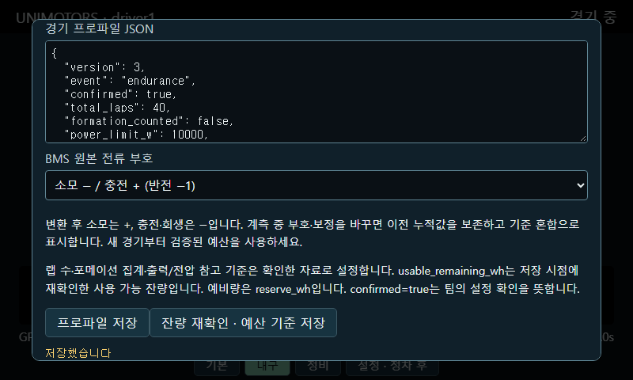

# UNIMOTORS 텔레메트리 시스템 — 종합 마스터 문서 (V3)

> Raspberry Pi 기반 전기 레이싱카 텔레메트리 시스템의 **전체 설계·구현·배포·운영 기록.**
> LTE 통신 · GPS 10Hz 계기판 · Daly BMS(CAN) · WireGuard VPN 메시 ·
> 멀티차량 실시간 대시보드 · 도메인/TLS 리버스 프록시 · 주행 분석까지
> 이 문서 하나로 처음부터 재현할 수 있도록 정리함.
>
> **최종 갱신**: 2026-07-23
> **현재 단계**: 서버 인프라 실배포 완료 + 실차 1차 검증 완료.
> 남은 것은 하드웨어 이관(Zero W→3B+)과 실차 튜닝.
>
> **문서 구성**
> - **I부(1~13장)** 설계·프로토콜·코드 — 무엇을 어떻게 만들었나
> - **II부(14~19장)** 인프라 실배포 — OCI/기숙사 Pi4/도메인 실제 구축 기록
> - **III부(20~23장)** 데이터 모델 확장·분석 고도화 — 스키마 최종형, 시계 문제, 대시보드
> - **IV부(24~26장)** 초기 설정 총정리 — 새 기기 세팅 시 이 장만 따라가면 됨
> - **V부(27~36장)** 트러블슈팅 종합 — 실제로 겪은 모든 문제
> - **부록** 명령 요약 · 파일 경로 · 접속 정보 · 백업 · 참고 URL · 설계 근거
>
> 📎 **이 문서는 단일 통합본이다.** 이전에 별도로 있던 문서
> (LTE HAT 초기설정 가이드 · 서버 VPN 세팅 가이드 · backfill systemd 가이드 ·
> 캡티브 포털 가이드 · Zero W WiFi 문제 기록)의 내용이 모두 이 안에 병합되어 있다.
>
> ⚠️ **III부에서 스키마가 32개 필드로 확장됨.** 차량과 서버 코드를 **함께** 갱신해야 한다
> (`TELEM_FIELDS` = `FIELDS` 완전 일치 필수).

---

## 목차

1. [프로젝트 개요와 하드웨어](#1-프로젝트-개요와-하드웨어)
2. [전체 시스템 아키텍처](#2-전체-시스템-아키텍처)
3. [1단계: 라즈베리파이 초기 세팅 (헤드리스)](#3-1단계-라즈베리파이-초기-세팅-헤드리스)
4. [2단계: LTE 통신 (KT / SIM7600G-H)](#4-2단계-lte-통신-kt--sim7600g-h)
5. [3단계: GPS 10Hz 계기판](#5-3단계-gps-10hz-계기판)
6. [4단계: 로컬 핫스팟 (운전자 폰 계기판)](#6-4단계-로컬-핫스팟-운전자-폰-계기판)
7. [5단계: WireGuard VPN (원격 관리)](#7-5단계-wireguard-vpn-원격-관리)
8. [6단계: Daly BMS CAN 통신](#8-6단계-daly-bms-can-통신)
9. [7단계: 텔레메트리 서버 + 실시간 대시보드](#9-7단계-텔레메트리-서버--실시간-대시보드)
10. [하드웨어 이관: Zero W → Pi 3B+ / 4B](#10-하드웨어-이관-zero-w--pi-3b--4b)
11. [파일 목록과 배포 체크리스트](#11-파일-목록과-배포-체크리스트)
12. [트러블슈팅 종합](#12-트러블슈팅-종합)
13. [남은 작업 (TODO)](#13-남은-작업-todo)

**II부 — 서버 인프라 & 웹 배포 (실작업 기록)**

14. [네트워크 지형도 (실제 배포)](#14-네트워크-지형도-실제-배포된-상태)
15. [WireGuard 피어 추가 & 폰 풀터널](#15-wireguard-피어-추가--폰-풀터널)
16. [OCI nginx 리버스 프록시 + 와일드카드 TLS](#16-oci-nginx-리버스-프록시--와일드카드-tls)
17. [Pi 4B 서버 배포 (실작업)](#17-pi-4b-서버-배포-실작업)
18. [실차 1차 테스트 결과와 과제](#18-실차-1차-테스트-개인차-결과와-과제)
19. [파일 배치 최종 요약 (기기별)](#19-파일-배치-최종-요약-기기별)

**III부 — 데이터 모델 확장 & 주행 분석 고도화**

20. [스키마 최종형 (32개 필드)](#20-스키마-최종형-32개-필드)
21. [⭐ 시계 점프 문제 (RTC 없는 Pi)](#21--시계-점프-문제-rtc-없는-pi)
22. [주행 분석 대시보드 고도화](#22-주행-분석-대시보드-고도화)
22-B. [랩 분석 · **충전/배터리 분석** · 데이터 삭제 · **대회 수집 권장 데이터**](#22-b-랩-분석--데이터-삭제--대회-수집-항목)
23. [실차 1차 주행에서 발견된 문제](#23-실차-1차-주행에서-발견된-문제)

**IV부 — 초기 설정 총정리 (systemd / 자동화 / 명령어)**

24. [차량 Pi 전체 세팅 순서](#24-차량-pi-전체-세팅-순서)
    (systemd 5종 · CAN 자동up · backfill 타이머 · 핫스팟 · **24-12 DSI 키오스크**)
25. [서버 Pi4 전체 세팅 순서](#25-서버-pi4-전체-세팅-순서)
26. [OCI VPS 전체 세팅 순서](#26-oci-vps-전체-세팅-순서)

**V부 — 트러블슈팅 종합**

27. [초기 세팅 / OS](#27-초기-세팅--os) (**27-1 Zero W 헤드리스 복구 · USB OTG**) ·
28. [전원](#28-전원) · 29. [LTE](#29-lte) ·
30. [GPS](#30-gps) · 31. [CAN / BMS](#31-can--bms) · 32. [VPN](#32-vpn-wireguard) ·
33. [nginx / TLS / 도메인](#33-nginx--tls--도메인) · 34. [웹 / 대시보드](#34-웹--대시보드) ·
35. [서버 / DB](#35-서버--db) · 36. [접근 불가 시 최후 수단](#36-접근-불가-시-최후-수단-oci)

**부록**

A. [핵심 명령 요약](#a-핵심-명령-요약) · B. [파일·서비스 위치](#b-파일서비스-위치-기기별) ·
C. [접속 정보](#c-접속-정보) · D. [백업](#d-백업--가장-중요) ·
E. [참고 자료 URL](#e-참고-자료-url) · F. [설계 근거](#f-왜-이-기술을-골랐나-설계-근거)

---

## 1. 프로젝트 개요와 하드웨어

### 1-1. 목적
전기 레이싱카(자작차)에 실시간 텔레메트리 시스템 구축. 운전자에게는 차량 내 계기판을,
팀에게는 원격지에서 차량 상태(위치·속도·배터리·G포스)를 실시간 모니터링 + 사후 정밀 분석
기능을 제공.

### 1-2. 현재 보유 하드웨어
- **Raspberry Pi Zero W** ×1 (현재 개발/검증기, ARMv6 싱글코어, 512MB) — 곧 이관 예정
- **Raspberry Pi 3B+** ×2 (쿼드코어 ARMv8 1.4GHz, 1GB) — 차량용으로 이관 예정
- **Raspberry Pi 4B (2GB)** ×2 — 기숙사 서버용으로 사용 예정
- **SIM7600G-H (B) LTE HAT** (Waveshare) — LTE + GPS 내장. USB 인터페이스(포고핀으로
  GPIO에서 전원·USB D+/D- 수급). 별도 Micro USB B 단자 있음(Pi 4 직결용).
- **USB-CAN 어댑터** (gs_usb / candleLight 계열, SocketCAN 네이티브) — Daly BMS 연결
- **배터리 팩** — **삼성 INR21700-50S** (고니켈 NMC, 5.0Ah/셀) **14S16P = 224셀**
  → 공칭 50.4V · 만충 58.8V · 방전차단 35.0V · 80Ah · **약 4.0kWh** (팩 상세는 8-0)
- **Daly Smart BMS `R24TS1A-17S300A`** — 8~17S 대응(14S 사용) · **300A 연속** ·
  **1A 액티브 밸런싱** · Li-ion/LFP/LTO 선택 · RS485 + **CAN** + 블루투스 내장
- **5인치 DSI LCD** (알리익스프레스, 리본케이블 방식) — Pi 3B+/4B용 차량 계기판 (Zero 미지원)

### 1-3. 통신사/네트워크
- **LTE:** KT망, APN `lte.ktfwing.com`, 50GB USIM
- **VPS:** Oracle Cloud (OCI) Always Free, 서울 리전, `VM.Standard.E2.1.Micro`
  (AMD 1/8 OCPU, 1GB RAM), Ubuntu 24.04, 공인 IP `<OCI_PUBLIC_IP>`
- **계정명:** 모든 Pi가 `unimotors` 동일 (파일 경로 통일 목적, 문제 없음)

---

## 2. 전체 시스템 아키텍처

### 2-1. 이중 네트워크 전략
```
[서버] <---LTE(KT, wwan0)--- [차량 Pi] ---Hotspot(로컬)---> [운전자 휴대폰]
                                  |
                           SIM7600G-H HAT (LTE+GPS)
                                  |
                           USB-CAN --- Daly BMS
```
- **WAN (LTE):** 서버로 텔레메트리 전송 (아웃바운드). CGNAT 뒤라 인바운드는 VPN으로 해결.
- **LAN (핫스팟):** 차량 내부 로컬망. 운전자 폰이 계기판 접속. 인터넷 공유(NAT) 안 함.

### 2-2. 데이터 흐름 (3단계 완성형)
```
차량 Pi (gps_server.py)
  ├─ 10Hz raw NMEA   → 로컬 SD (gps_*.csv)          [정밀 궤적/랩분석 원본]
  ├─ 1Hz telem       → 로컬 SD (telem_*.csv)         [백업/보정]
  ├─ 2Hz 계기판       → 폰/LCD (SSE, 포트 8080)       [운전자 표시]
  └─ 2Hz 텔레메트리   → WS push (10.10.0.9:8090)  ┐
                                                    ↓ VPN
기숙사 Pi4 (telemetry_server.py)
  ├─ 메모리 latest/recent → /live 브로드캐스트
  ├─ SQLite summary (ts PK, 보정 대비)
  ├─ /upload → track (10Hz raw 주행후 업로드)
  └─ dashboard.html 서빙
                                                    ↓
                                        브라우저 (실시간 지도 + 주행 분석)
```

### 2-3. 3가지 데이터 레이트 (용도별 분리)
| 데이터 | 레이트 | 위치 | 용도 |
|---|---|---|---|
| raw NMEA | 10Hz | 로컬 SD | 정밀 궤적, 랩타임, G분석 (사후) |
| telem CSV | 1Hz | 로컬 SD | 백업, 실시간 구멍 보정 |
| 계기판 | 1~2Hz | 폰/LCD (SSE) | 운전자 실시간 표시 |
| 서버 push | 2Hz | WS → 서버 | 원격 실시간 모니터링 |

> **핵심 원칙:** 실시간 표시엔 2Hz면 충분(사람 눈). 10Hz는 사후 정밀 분석용으로
> 로컬에만 원본 보관. "버티니까 10Hz"가 아니라 "필요한 만큼만".

---

## 3. 1단계: 라즈베리파이 초기 세팅 (헤드리스)

### 3-1. OS 굽기 (Raspberry Pi Imager)
1. CHOOSE DEVICE: 해당 Pi 모델
2. OS: Raspberry Pi OS Lite (Zero는 32-bit Bookworm)
   - Trixie(테스팅) 피할 것 — Zero W에서 NetworkManager 충돌
3. 설정(톱니바퀴)에서 반드시:
   - SSH 활성화 (비밀번호 인증)
   - WiFi SSID/비밀번호 (**2.4GHz** — Zero W는 5GHz 미지원)
   - **무선 LAN 국가 = KR** ← 누락 시 WiFi 안 잡히는 최대 원인

### 3-2. 부팅 주의
- **LTE HAT은 초기 세팅 끝난 뒤 결합** (USB 라인 점유로 OTG 충돌 방지)
- `config.txt`/`cmdline.txt` 건드리지 말 것 (수동 수정이 부팅 실패 유발)
- Zero W 첫 부팅 3~5분 대기

---

## 4. 2단계: LTE 통신 (KT / SIM7600G-H)

> 최종 채택: **AT 명령어(NDIS) + Raw IP + udhcpc**.
> (QMI/qmicli는 이 모듈 펌웨어에서 실패.)

### 4-1. HAT 결합 절차
```bash
sudo poweroff              # 핫스왑 금지
```
1. LED 꺼진 뒤 전원 분리 (전원 인가 상태 결합은 GPIO 합선 위험)
2. **USIM 삽입** (전원 off 필수)
3. 포고핀-GPIO 맞춰 결합
4. 전원 재인가

### 4-2. 인식 확인
```bash
lsusb                      # 1e0e:9001 SimTech (SIM7600 계열)
ls -l /dev/ttyUSB*         # ttyUSB0~4 (5개)
```
> ttyUSB1 = GPS NMEA 출력 / ttyUSB2 = AT 커맨드

### 4-3. 필수 패키지 + ModemManager 비활성화
```bash
sudo apt update
sudo apt install -y minicom udhcpc
sudo systemctl stop ModemManager
sudo systemctl disable ModemManager
```
> `udhcpc` 필수 (구형 dhclient는 Raw IP 못 다룸)

### 4-4. 자동화 스크립트 `/home/unimotors/lte_auto.sh`
> ⭐ LTE 연결 + **GPS 활성화까지 한 스크립트에서 처리**한다.
> GPS 설정은 반드시 `AT+CGPS=0`(끄기) → 설정 → `AT+CGPS=1,1`(켜기) 순서여야 반영된다.
```bash
#!/bin/bash
# 1. 차량 전원 인가 시 모뎀 포트가 올라올 때까지 대기
while [ ! -e /dev/ttyUSB2 ]; do sleep 1; done
sleep 3

# 2. 시리얼 포트 통신 설정
stty -F /dev/ttyUSB2 115200 raw -echo

# 3. KT APN 설정 및 NDIS 데이터 콜
echo -e "AT+CGDCONT=1,\"IP\",\"lte.ktfwing.com\"\r\n" > /dev/ttyUSB2
sleep 1
echo -e "AT\$QCRMCALL=1,1\r\n" > /dev/ttyUSB2
sleep 5

# 4. 인터페이스 초기화 및 Raw IP 모드 적용
ip link set wwan0 down
echo 'Y' > /sys/class/net/wwan0/qmi/raw_ip
ip link set wwan0 up
sleep 2

# 5. 백그라운드에서 IP 할당 요청
udhcpc -b -i wwan0

# 6. GPS 활성화 + 10Hz + NMEA 마스크
#    ⭐ 설정 변경은 GPS를 껐다 켜야 반영됨. 순서 필수.
echo -e "AT+CGPS=0\r\n" > /dev/ttyUSB2
sleep 2
echo -e "AT+CGPSNMEARATE=1\r\n" > /dev/ttyUSB2   # 1 = 10Hz (0 = 1Hz)
sleep 1
echo -e "AT+CGNSSMODE=15,1\r\n" > /dev/ttyUSB2    # GPS+GLONASS+BeiDou+Galileo (위성 수 ↑)
sleep 1
echo -e "AT+CGPSNMEA=17\r\n" > /dev/ttyUSB2       # 이 개체선 GGA+VTG만. GSV 제외 → 버퍼 적체 방지(필수!)
sleep 1
echo -e "AT+CGPS=1,1\r\n" > /dev/ttyUSB2          # stand-alone 재시작
sleep 2
```
```bash
sudo chmod +x /home/unimotors/lte_auto.sh
```
> - 서비스 재시작/부팅 직후엔 GPS가 껐다 켜지며 **웜스타트 재측위**를 하므로 수 초~수 분간
>   NMEA에 빈 값이 나올 수 있음(정상).
> - 로그의 `stty: unable to perform all requested operations` 경고는 무시 가능.
> - `CGNSSMODE=15`로 위성계를 늘려도 `CGPSNMEA=17`로 GSV(위성목록)를 막았으므로
>   Zero W에서도 버퍼 적체가 없다. (실측: `in_waiting` 0~34B 유지)

### 4-5. systemd 서비스 `/etc/systemd/system/lte-auto.service`
```ini
[Unit]
Description=Auto LTE Connection for SIM7600
After=network.target

[Service]
Type=oneshot
ExecStart=/home/unimotors/lte_auto.sh
RemainAfterExit=yes
User=root

[Install]
WantedBy=multi-user.target
```
```bash
sudo systemctl daemon-reload
sudo systemctl enable lte-auto.service
```

### 4-6. 검증 (WiFi 끄지 말 것!)
```bash
ping -I wwan0 -c 4 8.8.8.8
curl --interface wwan0 ifconfig.me    # KT 대역 공인 IP 확인
```

---

## 5. 3단계: GPS 10Hz 계기판

### 5-1. GPS 켜기 + 10Hz 설정 (minicom, ttyUSB2)
> ⭐ **설정 변경은 GPS를 껐다 켜야 반영됨** (핵심 함정)
```
AT+CGPS=0
AT+CGPSNMEARATE=1      # 1 = 10Hz (0=1Hz, '=10'은 ERROR)
AT+CGPSNMEA=17         # 출력 문장 마스크 (아래 주의)
AT+CGPS=1,1
```

### 5-2. ⭐ 버퍼 적체 문제 (이번 프로젝트 최대 난관)
**증상:** 10Hz로 켜니 계기판이 최대 30초 지연, 감속 반대 표시.
**원인:** Zero W(싱글코어)가 10Hz raw를 못 소화 → 커널 시리얼 버퍼(4095B) 꽉 참 →
항상 과거 데이터를 읽음. 측위되면 위성목록($GPGSV/$GLGSV/$BDGSV) 폭증이 방아쇠.

**해결 2단계:**
1. **NMEA 문장 최소화** — `AT+CGPSNMEA=17`로 불필요한 위성목록 문장 제거 (데이터량 1/3)
   > ⚠️ **이 개체(SIM7600G-H)에서 `CGPSNMEA=17`은 표준(RMC+GGA)이 아니라
   > 실제로 `GGA + VTG`를 출력함.** 비트 정의가 표준과 다름. 모듈 교체 시
   > `cat /dev/ttyUSB1`로 실제 출력 문장 재확인 필수.
   > - GGA: 위경도, fix quality, 위성수, 고도, 시각
   > - VTG: 속도(km/h 직접), 진북 방향
2. **파이썬 최적화** — `os.fsync()` 금지(SD쓰기가 읽기 블로킹), `flush()`만 주기적.
   파싱은 pynmea2 대신 콤마 split 직접 파싱(초경량). 읽기/파싱/표시 스레드 분리.

**검증:** `--debug` 실행 시 `in_waiting`이 0~수백 B 유지면 정상 (4095B 고정이면 적체).

### 5-3. 위성계(GNSS) 설정
```
AT+CGNSSMODE=15,1      # GPS+GLONASS+BeiDou+Galileo 전부 (도심 측위 안정성↑)
```
- 트인 경기장은 기본값(3)으로 충분. 도심 코스면 15 권장.

### 5-4. 속도/측위 판정 로직 (gps_server.py 반영)
- **fix 판정은 GGA(측위)만 신뢰.** VTG 속도 필드는 정지 시 빈 값으로 옴 →
  'VTG 비었음 = 측위 실패'로 오판 금지. GGA fix인데 VTG 비면 '정지'로 처리(속도 0).
- **이동평균(SPEED_WINDOW) + 프론트 보간**으로 저속 지터 완화.

### 5-5. GPS 물리적 한계 (코드로 못 고침)
- 급감속 지연 2~3초 (GPS 도플러 특성, 고속일수록 개선)
- 저속 지터 ±1~2km/h
- 건물 근처 멀티패스 → 안테나를 트인 곳(대시보드, 금속 비차폐)에
- 폰이 부드러운 건 IMU 센서 융합 덕분. **정밀 G/부드러운 속도는 IMU 필요** (10절 참고)

---

## 6. 4단계: 로컬 핫스팟 (운전자 폰 계기판)

> 순수 로컬 대시보드 전용. 인터넷 공유(NAT) 안 함.
> 폰은 WiFi(계기판) + 자기 LTE(인터넷) 동시 사용 가능 (목적지별 자동 분리).

### 6-1. 영구 핫스팟 프로파일 (부팅 자동)
> ⚠️ 실행 순간 wlan0가 발신 모드로 바뀌어 **WiFi SSH 끊김**.
> 반드시 **WireGuard VPN(LTE 경유) 세션에서** 실행. `who`로 `10.10.0.2` 확인.
```bash
sudo nmcli connection add type wifi ifname wlan0 con-name unimotors-hotspot \
  autoconnect yes ssid UNIMOTORS_DASH
sudo nmcli connection modify unimotors-hotspot \
  802-11-wireless.mode ap \
  802-11-wireless.band bg \
  ipv4.method shared \
  wifi-sec.key-mgmt wpa-psk \
  wifi-sec.psk "<핫스팟_비밀번호>"
sudo nmcli connection up unimotors-hotspot
```
- `band bg` = 2.4GHz (Zero W 필수), `ipv4.method shared` = 10.42.0.1 게이트웨이 + DHCP
- 폰에서 `UNIMOTORS_DASH` 접속 → `http://10.42.0.1:8080`

### 6-2. ⭐ 캡티브 포털 ("인터넷 연결 없음" 문제)
폰이 WiFi에 붙으면 **인터넷 확인 요청**을 보내고, 응답이 없으면 "인터넷 없음"으로
판정해 경고를 띄우거나 WiFi를 끊는다.

| OS | 요청 URL | 포트 |
|---|---|---|
| Android | `connectivitycheck.gstatic.com/generate_204` | **80** |
| iOS | `captive.apple.com/hotspot-detect.html` | **80** |
| Windows | `www.msftconnecttest.com/connecttest.txt` | **80** |

⚠️ **`gps_server.py`의 `_captive()` 만으로는 동작하지 않는다.** 두 가지가 막혀 있다:
1. **포트** — 서버는 8080, 폰은 80으로 요청
2. **DNS** — 체크 도메인이 실제 구글/애플 IP로 해석되어 연결 자체가 실패

**핵심 트레이드오프**: 체크에 "성공"으로 답하면 폰이 *"이 WiFi는 인터넷이 된다"*고 믿고
**모든 트래픽을 WiFi로 보낸다.** 실제 인터넷이 없으면 폰 인터넷이 완전히 끊겨 더 나빠진다.
그래서 "성공" 응답은 **실제 인터넷(NAT)을 제공할 때만** 쓴다.

**세 가지 선택지**
| 방식 | 폰 상태 | 폰 인터넷 | LTE 데이터 |
|---|---|---|---|
| **A. LTE 공유(NAT)** | 경고 없음 | Pi의 LTE 경유 | 소모됨 |
| **B. 캡티브 포털(302)** | "로그인 필요" | **셀룰러 유지** | 없음 |
| **C. 폰에서 무시 설정** | "인터넷 없음" | 셀룰러 유지 | 없음 |

원래 설계 의도(*폰은 자기 LTE, WiFi는 계기판 전용*)에 맞는 것은 **B**다.

**코드 설정** (`gps_server.py`)
```python
CAPTIVE_MODE = "portal"                        # portal | success | off
CAPTIVE_REDIRECT = "http://10.42.0.1:8080/"
```
- `portal`  : 302 리다이렉트 → 폰이 캡티브로 인식, 셀룰러 유지 (NAT 없을 때 권장)
- `success` : 204/Success → **NAT 켰을 때만** 사용
- `off`     : 404

**방식 B 실제 설정 2단계**

① DNS 하이재킹 (체크 도메인만 Pi 로)
```bash
sudo mkdir -p /etc/NetworkManager/dnsmasq-shared.d
sudo tee /etc/NetworkManager/dnsmasq-shared.d/captive.conf > /dev/null <<'EOF'
address=/connectivitycheck.gstatic.com/10.42.0.1
address=/connectivitycheck.android.com/10.42.0.1
address=/clients3.google.com/10.42.0.1
address=/captive.apple.com/10.42.0.1
address=/www.msftconnecttest.com/10.42.0.1
address=/www.msftncsi.com/10.42.0.1
address=/detectportal.firefox.com/10.42.0.1
EOF
sudo nmcli connection down unimotors-hotspot
sudo nmcli connection up unimotors-hotspot
```
> `address=/#/10.42.0.1`(전체 하이재킹)은 폰의 다른 앱까지 가로채므로 쓰지 않는다.

② 포트 80 → 8080 리다이렉트 (**wlan0 에만**)
```bash
sudo iptables -t nat -A PREROUTING -i wlan0 -p tcp --dport 80 -j REDIRECT --to-port 8080
sudo netfilter-persistent save
```

**확인**
```bash
curl -s -o /dev/null -w "%{http_code} -> %{redirect_url}\n" \
  -H "Host: connectivitycheck.gstatic.com" http://10.42.0.1/generate_204
# 302 -> http://10.42.0.1:8080/  이면 정상
```

**방식 A (LTE 공유)로 갈 경우**
```bash
echo 'net.ipv4.ip_forward=1' | sudo tee /etc/sysctl.d/99-hotspot.conf
sudo sysctl -p /etc/sysctl.d/99-hotspot.conf
sudo iptables -t nat -A POSTROUTING -o wwan0 -j MASQUERADE
sudo iptables -A FORWARD -i wlan0 -o wwan0 -j ACCEPT
sudo iptables -A FORWARD -i wwan0 -o wlan0 -m state --state RELATED,ESTABLISHED -j ACCEPT
sudo netfilter-persistent save
```
> `ipv4.method shared`가 이미 NAT를 구성하므로, 안 되면 먼저 진단할 것:
> `ip route`(default가 wwan0인지), `ping -I wwan0 8.8.8.8`,
> `iptables -t nat -L POSTROUTING -n | grep -i masq`, `cat /proc/sys/net/ipv4/ip_forward`
> 폰에서 `http://1.1.1.1`이 되면 NAT는 정상이고 DNS만 문제다.

**방식 C (폰 설정)**
- Android: "인터넷에 연결되어 있지 않습니다" 알림 → **연결 유지 / 항상**
- iOS: 보통 자동으로 셀룰러 유지(Wi-Fi Assist)

**권장 조합**
| 상황 | 권장 |
|---|---|
| 데이터 여유 있음, 경험 매끄럽게 | **A**(NAT) + `CAPTIVE_MODE="success"` |
| 폰의 셀룰러 유지 (원래 설계) | **B**(portal) + DNS 하이재킹 + 80→8080 |
| 대회 당일 급함 | **C**(폰에서 "연결 유지" 선택) |
| **주행 중 폰으로 통화·오더 필요** | **24-12 (Pi 내장 디스플레이)** — 폰을 아예 안 씀 |

> ⭐ **가장 좋은 해법은 폰을 계기판으로 쓰지 않는 것이다.** DSI LCD를 달아
> `localhost`로 계기판을 띄우면(24-12) 이 문제 전체가 사라지고 폰은 셀룰러 100%로 자유롭다.
> 핫스팟은 피트 크루용 보조로만 남긴다.

**주의사항**
- **`CAPTIVE_MODE="success"`를 NAT 없이 쓰지 말 것.** 폰이 WiFi로 모든 트래픽을 보내
  인터넷이 완전히 끊긴다.
- 포트 80 리다이렉트는 **`-i wlan0`으로 제한**한다. 전체 인터페이스에 걸면 VPN/LTE
  트래픽까지 가로챈다.
- iptables 규칙은 `sudo netfilter-persistent save`로 저장(재부팅 시 소실).
- 핫스팟 설정 변경 후 `nmcli connection down/up`으로 dnsmasq를 재시작해야 DNS가 반영된다.
- **폰에서 `UNIMOTORS_DASH` 자동 연결을 끄는 것**을 잊지 말 것 — 차 근처에서 폰이
  자동으로 붙어 인터넷을 잃는 사고를 막는다.

### 6-3. 계기판 서버 systemd `/etc/systemd/system/gps-dashboard.service`
```ini
[Unit]
Description=UNIMOTORS GPS Dashboard Server
After=lte-auto.service
Wants=lte-auto.service

[Service]
Type=simple
ExecStart=/usr/bin/python3 /home/unimotors/gps_server.py
Restart=on-failure
RestartSec=5
User=unimotors

[Install]
WantedBy=multi-user.target
```
```bash
sudo systemctl enable --now gps-dashboard.service
```

---

## 7. 5단계: WireGuard VPN (원격 관리)

> CGNAT(LTE) 뒤의 차량에 외부에서 접속하기 위한 관리 채널.
> OCI를 공인 IP 허브로, 차량·서버·클라이언트가 가상 사설망(10.10.0.0/24)을 이룸.

### 7-1. 메시 구성 (완료됨)
```
OCI 10.10.0.1 (허브, 공인 <OCI_PUBLIC_IP>, UDP 51820)
├─ 10.10.0.2  노트북 (PC)
├─ 10.10.0.3  차량 Pi (PersistentKeepalive=25 필수 — CGNAT NAT 유지)
└─ 10.10.0.9  기숙사 Pi4 서버 (실제 배포됨)
```

### 7-2. 서버 conf `/etc/wireguard/wg0.conf` (핵심 구조)
```ini
[Interface]
Address = 10.10.0.1/24
ListenPort = 51820
PrivateKey = <server_private>

[Peer]                       # PC
PublicKey = <pc_public>
PresharedKey = <psk>
AllowedIPs = 10.10.0.2/32

[Peer]                       # 차량 Pi
PublicKey = <pi_public>
PresharedKey = <psk>
AllowedIPs = 10.10.0.3/32
```
- 서버 쪽 `AllowedIPs .../32` = 피어 신원 지정 (클라이언트의 라우팅 지정과 의미 다름)

### 7-3. 서버 방화벽 (2곳 모두 필수)
```bash
# 커널 IP 포워딩 (피어 간 통신)
echo 'net.ipv4.ip_forward = 1' | sudo tee /etc/sysctl.d/99-wireguard.conf
sudo sysctl -p /etc/sysctl.d/99-wireguard.conf
# iptables: WireGuard 포트 + 피어간 포워딩
sudo iptables -I INPUT -p udp --dport 51820 -j ACCEPT
sudo iptables -I FORWARD 1 -i wg0 -o wg0 -j ACCEPT
sudo netfilter-persistent save
```
> **OCI Security List에서도 UDP 51820 인바운드 개방 필수** (SSH는 22/TCP).
> WireGuard는 UDP인 것 주의!

### 7-4. 차량 Pi conf (차이점: Address .3, Keepalive)
```ini
[Interface]
PrivateKey = <pi_private>
Address = 10.10.0.3/24

[Peer]
PublicKey = <server_public>
PresharedKey = <psk>
Endpoint = <OCI_PUBLIC_IP>:51820
AllowedIPs = 10.10.0.0/24
PersistentKeepalive = 25
```
> ⭐ `PersistentKeepalive = 25` — Pi는 CGNAT 뒤라 25초마다 패킷 보내 NAT 구멍 유지.
> 없으면 몇 분 뒤 외부→Pi 접속(원격 SSH) 불가.
> `AllowedIPs = 10.10.0.0/24` — VPN 대역만 (0.0.0.0/0 금지: LTE/핫스팟 라우팅 꼬임).

### 7-5. 새 피어 추가 (기숙사 Pi4 = 10.10.0.9)
```bash
# OCI 서버에서
cd ~; umask 077
wg genkey | tee pi_srv_private.key | wg pubkey | tee pi_srv_public.key
# wg0.conf에 [Peer] 추가 (AllowedIPs = 10.10.0.9/32), restart
sudo systemctl restart wg-quick@wg0
```

### 7-6. ⭐ 백업 (이 프로젝트 이전 서버는 SSH 키 분실로 접근 불가된 이력)
백업 대상: SSH 개인키/공개키, 서버 WireGuard 설정, 공인 IP.
> 개인키는 재생성 불가, 공개키는 재생성 가능. **개인키 반드시 백업.**

---

## 8. 6단계: Daly BMS CAN 통신

### 8-0. 배터리 팩과 BMS 사양

#### 구성 요약

| | |
|---|---|
| **셀** | 삼성 SDI **INR21700-50S** — 고니켈 NMC(Ni-rich), 흑연+Si 음극, 5.0Ah |
| **팩 구성** | **14S16P = 224셀** · 50.4V 공칭 · 80Ah · **약 4.03kWh** |
| **BMS** | Daly **`R24TS1A-17S300A`** — 8~17S · 300A 연속 · 1A 액티브 밸런싱 |

> ⚠️ **화학종 정정**: 초기 문서에 "LiFePO4 추정"으로 적혀 있었으나 **NMC(삼원계)가 맞다.**
> 전압 창·보호 파라미터·온도 관리·안전 대응이 전부 달라지므로 아래 값을 기준으로 삼는다.

#### 셀 사양 — 삼성 INR21700-50S (데이터시트)

| 항목 | 값 |
|---|---|
| 공칭 용량 | 5,000 mAh (최소 4,800 mAh) |
| 공칭 전압 | 3.6 V |
| 충전 상한 | **4.20 V** |
| 방전 차단 | **2.5 V** |
| 표준 충전 | 0.5C (2.5 A) · 연속 최대 6 A |
| 최대 연속 방전 | **25 A** (온도컷 없음) · 45 A (80°C 온도컷 조건) |
| 내부 임피던스 | ≤ 14 mΩ (AC 1kHz) |
| 무게 / 크기 | 72 g / ⌀21.25 × 70.62 mm |
| 충전 온도 | **0 ~ 60 °C** (0°C 미만 충전 금지) |
| 방전 온도 | −20 ~ 60 °C |

#### BMS 사양 — Daly R24TS1A-17S300A

모델명 해석: **`R24TS`** 시리즈(24~60V급 스마트 액티브 밸런스) · **`1A`** 밸런싱 전류 ·
**`17S`** 최대 직렬 수 · **`300A`** 연속 전류.

| 항목 | 값 | 우리 팩 |
|---|---|---|
| 지원 직렬 수 | 8~17S | 14S ✓ |
| 연속 전류 | **300 A** | 실사용 대비 충분 |
| 밸런싱 | **1 A 액티브** (전하 이동식) | 16P 팩에 유리 |
| 지원 화학종 | Li-ion(NMC) / LFP / LTO | **Li-ion 으로 설정해야 함** |
| 전압 범위 | 24~60 V | 만충 58.8V — **여유 1.2V뿐** |
| 통신 | RS485 · **CAN** · 블루투스 내장 | CAN 사용 (250kbps) |

> **60V 상한에 주의.** 14S NMC 만충이 58.8V로 BMS 정격 상단에 거의 붙는다.
> 여유가 1.2V뿐이라 15S로는 확장할 수 없다. 지금 구성이 이 BMS로 가능한 최대치다.
>
> 블루투스가 내장되어 있지만 이 프로젝트는 **CAN을 쓴다.** 블루투스는 앱으로 파라미터를
> 바꿀 때만 쓰고, 데이터 수집 경로는 CAN으로 단일화하는 편이 안정적이다.

#### 팩 환산 (14S16P)

| 항목 | 계산 | 값 |
|---|---|---|
| 공칭 전압 | 14 × 3.6 | **50.4 V** |
| 만충 전압 | 14 × 4.2 | **58.8 V** |
| 방전 차단 | 14 × 2.5 | **35.0 V** |
| 용량 | 16 × 5.0 Ah | **80 Ah** |
| 에너지 | 50.4 × 80 | **약 4.03 kWh** |
| 셀 방전 능력 | 16 × 25 A | 400 A |
| **실제 상한** | **BMS 300 A** | **≈ 15 kW** ← 여기서 걸린다 |
| 권장 충전 | 16 × 2.5 A | 40 A (0.5C) |
| 셀 무게 합 | 224 × 72 g | 약 16.1 kg (케이스·버스바 별도) |

> 셀은 400A까지 낼 수 있지만 **BMS가 300A에서 제한**한다. 그래도 모터·컨트롤러가
> 절대 못 쓰는 수치이므로 실질 제한은 컨트롤러 쪽에 있다. 배터리 걱정 없이 출력을 써도 된다.

#### ⭐ OCV ↔ SOC 대응표 (무부하 기준, 근사)

NMC는 LFP와 달리 전압 곡선이 완만하게 기울어져 있어 **셀 전압으로 SOC를 어느 정도 읽을 수 있다.**
(LFP였다면 3.2~3.3V 평탄구간이라 불가능하다.)

| 셀 전압 | 팩 전압(14S) | 대략 SOC |
|---|---|---|
| 4.20 V | 58.8 V | 100% |
| 4.06 V | 56.8 V | 90% |
| 3.95 V | 55.3 V | 80% |
| 3.85 V | 53.9 V | 70% |
| 3.75 V | 52.5 V | 60% |
| 3.68 V | 51.5 V | 50% |
| 3.60 V | 50.4 V | 40% |
| 3.52 V | 49.3 V | 30% |
| **3.44 V** | **48.2 V** | **20~25%** |
| 3.35 V | 46.9 V | 15% |
| 3.20 V | 44.8 V | 10% |
| 2.50 V | 35.0 V | 0% (차단) |

#### ⚠️ 실측 baseline 재해석 — BMS의 SOC 50%는 틀린 값이었다

8-4의 실측값(48.2V, 셀 3442~3446mV)을 위 표에 대보면 **실제 SOC는 20~25%**다.
그런데 BMS는 **50%**, 잔여용량 **40Ah**를 보고했다. 원인 후보는 셋이다.

1. **BMS 파라미터가 LFP로 설정되어 있다** — 가장 유력. 앱에서 배터리 타입이 LiFePO4면
   SOC 곡선과 보호 전압이 전부 LFP 기준이 된다. 이 BMS는 Li-ion/LFP/LTO를 모두 지원하므로
   **설정에서 Li-ion 으로 바꾸면 된다.**
2. **쿨롱카운터 드리프트** — 만충 1회로 리셋되지 않은 채 누적 오차가 쌓인 경우.
3. **정격 용량 설정 불일치** — 앱의 정격 용량이 실제 80Ah와 다르게 들어간 경우.

`bms_reader.py`는 BMS가 주는 SOC를 그대로 전달할 뿐이라 **코드로는 고칠 수 없다.**
앱에서 파라미터를 바로잡고 만충 1회로 캘리브레이션해야 한다.

#### ✅ Daly 앱 파라미터 점검 체크리스트

주행 전에 반드시 확인한다. **LFP 기본값이 남아 있으면 팩의 절반도 못 쓴다.**

| 파라미터 | 넣어야 할 값 | LFP 기본값이면 생기는 일 |
|---|---|---|
| 배터리 타입 | **Li-ion (NMC/삼원계)** | SOC 곡선이 전부 어긋남 |
| 셀 수 | 14S | — |
| 정격 용량 | 80 Ah | 잔여용량·SOC 오차 |
| 셀 과충전 보호 | 4.25 V (복귀 4.15) | 3.65V에서 충전 중단 → **실용량 30~40%만 사용** |
| 셀 과방전 보호 | 2.60 V (복귀 2.90) | 대체로 무해 |
| 팩 과충전 | 59.5 V | 위와 동일 |
| 팩 과방전 | 36.4 V | — |
| 밸런싱 시작 전압 | 4.0 V 부근 | LFP값(3.4V)이면 상시 밸런싱 |
| 충전 저온 차단 | **0 °C** | ⚠️ 필수 — 아래 안전 항목 참고 |
| 통신 방식 | **CAN** | RS485면 `candump`이 조용하다 (8-1) |

> **충전 상한을 올릴 때 4.25V를 절대 넘기지 말 것.** NMC는 과충전 내성이 LFP보다 훨씬 낮다.
> "조금 더 넣으려고" 4.3V 이상으로 올리면 발화로 이어진다.

#### 🔥 NMC 안전 — LFP보다 훨씬 까다롭다

이 팩은 **4kWh 고니켈 NMC**다. LFP를 전제로 한 운영 습관을 그대로 쓰면 안 된다.

- **열폭주 위험이 실재한다.** LFP는 사실상 발화하지 않지만 NMC는 다르다.
  과충전·내부단락·압착·과열 중 하나만 걸려도 연쇄 반응이 가능하다.
- **온도 센서 2개는 224셀에 대해 부족하다.** 최소한 팩 중앙부와 배기 쪽에 추가를 권한다.
  `0x92`/`0x96`으로 이미 읽고 있으므로 **센서만 늘리면 코드 변경 없이 반영된다.**
- **0°C 미만 충전 금지.** 리튬 플레이팅으로 내부 단락이 생긴다. 겨울 새벽 대회장에서
  실제로 걸릴 수 있는 조건이다. `0x98` Byte1의 "충전 저온" 알람을 무시하지 말 것.
- **회생제동도 충전이다.** 저온에서 회생이 걸리면 같은 문제가 생긴다. 추운 날 첫 랩은
  회생을 줄이거나 팩이 데워질 때까지 기다린다.
- **셀 편차(`cell_v_diff`) 추이를 본다.** 실측 1~4mV는 매우 양호하다. NMC는 곡선이
  기울어져 있어 20mV 이상 벌어지면 특정 셀 열화를 의심할 만하다.
- **소화 대비.** 리튬 화재에 물·ABC 분말은 효과가 제한적이다. 대량의 물로 냉각하거나
  D급/리튬 전용 소화기를 피트에 둔다.

#### 대시보드에 미치는 영향 — 코드 변경 없음

계기판·대시보드 어디에도 **전압 임계값이 하드코딩되어 있지 않다.** 셀 전압·팩 전압·온도는
전부 BMS 값을 그대로 표시하고, 그래프 축은 데이터에서 자동 스케일되며, 알람은 `0x98`
비트맵을 그대로 쓴다. `bms_reader.py`의 `RATED_CAPACITY_AH = 80.0`도 그대로 맞다.
따라서 **앱에서 파라미터만 바로잡으면 시스템 전체가 새 화학에 맞게 동작한다.**

### 8-1. 하드웨어 연결
- **USB-CAN 어댑터 = gs_usb (SocketCAN 네이티브)** — `can0`로 자동 인식, 드라이버 불필요
- **BMS 단자:** CAN/RS485 겸용 5핀 (CAN H, CAN L, A, B, ABGND)
  - **CAN H, CAN L만 연결** (A/B는 RS485라 절대 연결 금지)
  - 짧은 배선 1:1이면 GND 없이도 통신. 불안정 시 ABGND 추가.
- **앱에서 통신방식을 CAN으로 설정** (RS485로 되어 있으면 CAN 응답 안 나옴)
- **속도: 250kbps 확정** (100balance CAN 프로토콜)

### 8-2. CAN 인터페이스 올리기
```bash
sudo apt install -y can-utils
sudo ip link set can0 up type can bitrate 250000
candump can0
```

### 8-3. ⭐ CAN 자동 up (부팅/USB 재연결 자동화)

> ⚠️ **정정**: 이전 판에서 `systemd-networkd`(`80-can0.network`)를 권장했으나
> **Raspberry Pi OS에는 부적합**하다. Pi OS는 **NetworkManager**로 네트워크를 관리하는데,
> `systemd-networkd`를 함께 켜면 두 데몬이 wlan0/eth0을 동시에 관리하려 해
> **핫스팟(nmcli)이 깨질 수 있다.** 아래 두 방법 중 하나를 쓴다. (둘 다 넣지 말 것)

#### 방법 A — udev 규칙 (간단, NetworkManager와 무관)
```bash
sudo tee /etc/udev/rules.d/90-can.rules > /dev/null <<'EOF'
SUBSYSTEM=="net", ACTION=="add", KERNEL=="can*", \
  RUN+="/sbin/ip link set %k up type can bitrate 250000"
EOF
sudo udevadm control --reload-rules
```
```bash
command -v ip      # /usr/sbin/ip 이면 규칙의 경로도 그에 맞출 것
# 이미 꽂혀 있으면 재트리거
sudo udevadm trigger --subsystem-match=net --action=add
```

#### 방법 B — systemd device 유닛 (로그가 남아 디버깅 유리)
`/etc/systemd/system/can0.service`
```ini
[Unit]
Description=Bring up can0 (250kbps)
BindsTo=sys-subsystem-net-devices-can0.device
After=sys-subsystem-net-devices-can0.device

[Service]
Type=oneshot
RemainAfterExit=yes
ExecStart=/sbin/ip link set can0 up type can bitrate 250000
ExecStop=/sbin/ip link set can0 down

[Install]
WantedBy=sys-subsystem-net-devices-can0.device
```
```bash
sudo systemctl daemon-reload
sudo systemctl enable can0.service
journalctl -u can0.service        # 문제 시 원인 확인
```
> `BindsTo` + `WantedBy=...device`로 **장치 유닛에 묶여** 부팅·핫플러그 모두에서 동작한다.

#### 확인
```bash
ip -details link show can0        # state UP, bitrate 250000
candump can0
```

### 8-4. Daly CAN 프로토콜 (실측 검증 완료)
- **확장 프레임(29-bit):** 우선순위(0x18) + DataID + 수신주소 + 송신주소
  - PC→BMS 요청: `0x18 DD 01 40` (수신=BMS 0x01, 송신=PC 0x40)
  - BMS→PC 응답: `0x18 DD 40 01`
- **요청 방식:** `cansend can0 18DD0140#8888888888888888` (DD=DataID, 데이터는 Reserved)

**검증된 DataID 전체 (실측값 기준):**

| DataID | 내용 | 파싱 |
|---|---|---|
| 0x90 | 전압/전류/SOC | B0~1 총전압(0.1V), B4~5 전류(**30000 오프셋**, 0.1A, 음수=회생), B6~7 SOC(0.1%) |
| 0x91 | 셀 최대/최소 전압 | B0~1 최대(mV), B2 셀번호, B3~4 최소, B5 셀번호 |
| 0x92 | 온도 최대/최소 | B0 최대(**40 오프셋**,°C), B1 셀번호, B2 최소, B3 셀번호 |
| 0x93 | MOS 상태 | B0 상태(0정지/1충전/2방전), B1 충전MOS, B2 방전MOS, B3 BMS수명, **B4~7 잔여용량(mAh)** |
| 0x94 | 상태정보 | **B0 셀개수(=14)**, B1 온도센서수(=2), B2 충전기, B3 부하 |
| 0x95 | 셀전압 | 멀티프레임(셀당2B, 프레임당3셀, B0=프레임번호 1부터). 14셀=5프레임 |
| 0x96 | 셀온도 | 멀티프레임(센서당1B, 40오프셋, B0=프레임번호) |
| 0x97 | 밸런싱 | 비트맵(셀당1비트, 0닫힘/1밸런싱) |
| 0x98 | 고장/알람 | 비트맵 (Byte0~6 각 비트가 알람, Byte7 고장코드) |

**0x98 알람 비트 (level 1=주의, 2=위험):**
- Byte0: 셀 과전압/저전압, 총전압 과전압/저전압
- Byte1: 충전/방전 고온/저온
- Byte2: 충전/방전 과전류, SOC 높음/낮음
- Byte3: 전압편차, 온도편차
- Byte4: MOS 고온/센서오류/융착/개방
- Byte5: AFE칩/전압수집/EEPROM/RTC/프리차지/통신 오류
- Byte6: 전류모듈/총전압검출/단락보호/저전압충전금지

**실측 baseline (무부하, 정상):**
전압 48.2V, 전류 0.0A, BMS 표시 SOC 50%, 잔여 40Ah(정격 80Ah), 온도 22°C,
셀 14개(3442~3446mV, 편차 1~4mV), 밸런싱 없음, **0x98 전부 0(무결함)**

### 8-5. 회생제동 처리
- 전류 부호로 표현: 방전 raw>30000(양수), **회생 raw<30000(음수)**
- **잔여용량(0x93)은 BMS 쿨롱카운팅이라 회생 시 자동 증가** → 주행거리 계산에 자동 반영
- 주행거리 = 잔여용량(회생 반영) × 학습된 전비(km/Ah)

### 8-6. bms_reader.py (완성)
- `BMSReader` 클래스: python-can 4.1.0 socketcan
- 개별 파서 0x90~0x98 + 주기별 그룹 (`read_fast`/`read_slow`/`read_alarms`)
- 0x98 → warnings(주의)/dangers(위험) 리스트 분리
- BMS 없어도 계기판 정상 동작 (예외 삼키고 재연결)

---

## 9. 7단계: 텔레메트리 서버 + 실시간 대시보드 (멀티 차량)

> ⚠️ 이 장의 스키마·API는 이후 III부(20~22장)에서 확장되었다.
> **최종 스키마(32필드), 고도·배터리 사용량, 세션별 분석은 20~22장 참고.**

### 9-0. 멀티 차량 지원 (v2)
- **차량 구분:** 스냅샷의 `vehicle` 필드로 서버가 자동 구분. `latest/recent/last_seen`을
  차량별 dict로 관리.
- **대시보드 표시:** 한 번에 1대만 표시. 온라인 차량이 2대 이상이면 헤더에 **선택 박스**
  자동 표시, 1대면 자동 선택(박스 숨김).
- **차량 프리셋 (gps_server.py 상단 `PRESET`):**
  | 프리셋 | VEHICLE_ID | BMS | 서버전송 | 용도 |
  |---|---|---|---|---|
  | `car1` | car1 | O | O | 레이싱카 |
  | `starex` | starex | X | O | 개인차(배터리 없음) |
  | `car_personal2` | car_personal2 | X | O | 개인차 추가 템플릿 |
  | `local_only` | local | X | X | 순수 로컬 로거(전송X) |
  - 환경변수로도: `UNIMOTORS_PRESET=starex python3 gps_server.py`
  - 배터리 없는 차는 스냅샷 배터리 필드가 전부 null → 대시보드에서 자동 `--` 표시
- **폰 임시 추적 (미래):** `vehicle="phone-*"`로 시작하면 서버가 **DB 저장 제외**
  (개인정보), 실시간 지도에만 표시. 브라우저 Geolocation/DeviceMotion으로 위치·G 전송
  가능. HTTPS(보안 컨텍스트) 필요. 서버 훅(`is_ephemeral`)은 이미 구현됨.

### 9-1. 아키텍처 결정
- **차량 = Pi 3B+** (쿼드코어면 수집+계기판 충분, DSI LCD 지원)
- **서버 = 기숙사 Pi4 2GB** (대시보드+DB+지도, RAM 여유)
- **OCI = VPN 허브 전용** (1GB라 무거운 스택 부적합, 라우팅만)
- **프로토콜 = WebSocket** (VPN 내부 평문, TLS 불필요 — WireGuard가 이미 암호화)
- **저장 = SQLite** (경량, 별도 프로세스 0)
- **지도 = Leaflet + OpenStreetMap(CARTO 다크 타일)** (무료, API키 불필요)

### 9-2. 서버 저장 3층 구조
```
① 실시간 표시 : 서버 메모리 (latest + recent deque) → 브라우저 WS. DB 안 거침.
② 세션 저장   : SQLite summary 테이블 (2Hz, ts PRIMARY KEY)
③ 정밀 원본   : SQLite track 테이블 (10Hz raw, 주행후 업로드)
```
> temporary view는 RAM 캐싱이 아님(저장된 쿼리일 뿐). 메모리 변수 + SQLite INSERT 병행이 정답.

### 9-3. 실시간 구멍 보정 (backfill)
- LTE 음영(터널 등)으로 실시간 스트림에 구멍 발생 → 로컬 telem CSV로 사후 메꿈
- **summary.ts = PRIMARY KEY + INSERT OR IGNORE** → 중복 무시, 구멍만 채워짐 (검증 완료)
- 소스: telem CSV(1Hz, 서버 스키마와 동일). 트리거: 수동 backfill 스크립트(추후) → WiFi 자동

### 9-4. telemetry_server.py (aiohttp + asyncio, v2 멀티차량, 완성)
- `WS /ingest` — 차량/폰 push (토큰 인증). `vehicle`로 구분 → 메모리+DB+브로드캐스트
  (phone-*는 DB 저장 제외)
- `WS /live` — 브라우저 (접속 시 온라인 차량목록 + 각 차량 latest/recent 초기전송)
- `POST /upload?session=&vehicle=` — 10Hz raw CSV → track (세션별)
- `GET /api/vehicles` — 기록/온라인 차량 목록
- `GET /api/sessions?vehicle=` — 차량의 날짜/세션 목록
- `GET /api/history?date=&vehicle=` / `/api/track?session=` — 조회
- `GET /api/cumulative?vehicle=` — 전체 궤적 + 누적 통계
- `GET /` — dashboard.html 서빙
- SQLite `run_in_executor` 비블로킹, 오프라인 감시(차량별 600초)
```bash
pip3 install aiohttp --break-system-packages
python3 telemetry_server.py    # :8090
```

### 9-5. dashboard.html (v2 멀티차량, 완성)
**실시간 탭:** Leaflet 지도 + 속도/헤딩/위성 + G-G 다이어그램 + 배터리 전체 + 알람 배너.
차량 2대+면 헤더 선택박스로 전환(1대면 자동).
**주행 분석 탭:** 차량 선택 → [전체(누적) / 궤적 세션 / 요약 날짜] 계층
- 개별 세션: 10Hz 궤적 + 속도/종G/횡G 스파크라인 + 요약(최고속도/가속·제동·코너G)
- **전체(누적):** 전체 궤적 겹침 + 통계(총거리/주행횟수/최고속도/**평속**/**최대G**/주행시간)

**UNIST/영광 지도 로직 (중요):**
- GPS fix 없으면 → 지도 배경만 **UNIST(35.572, 129.189)**, 궤적 안 그림
- 첫 실제 좌표(fix + 유효 위경도) → 그때부터 지도 이동 + 궤적 누적 시작
- 대회장(영광) 도착해 fix 잡히면 자동으로 영광으로 이동. UNIST는 시작점 아님, 기본 배경일 뿐
- **차량 신호 없음(10분):** "차량 신호 없음" 오버레이. 차량 전환 시 궤적 리셋

### 9-5b. backfill.py (실시간 구멍 보정 + 10Hz 정밀 업로드, 완성)
주행 후 로컬 telem CSV를 서버 `/upload`로 전송. 표준 라이브러리만 사용(설치 불필요).
```bash
python3 backfill.py ~/gps_logs/telem_20260721_140134.csv   # 단일
python3 backfill.py --all                                   # gps_logs 전체
python3 backfill.py telem_x.csv --session race1 --vehicle car1
```
- session 미지정 → 파일명에서 자동 생성 / vehicle 미지정 → CSV에서 자동 추출
- **중복 무시 검증됨:** 같은 파일 재업로드 시 inserted=0 (summary.ts PRIMARY KEY 덕).
  여러 번 올려도 데이터 안 꼬임, 빠진 것만 채워짐.
- 서버 주소 기본 `http://10.10.0.9:8090` (VPN). `--server`로 변경 가능.

### 9-6. G-force (GPS 기반, IMU 자리 열어둠)
- 종G = 속도 미분, 횡G = 속도 × 방향변화율 (검증 완료)
- GPS 기반이라 근사. `_calc_gforce`만 나중에 IMU 값으로 교체
- **IMU 추가 예정:** MPU6050 (I2C, ~2천원). 정밀 G + 자세 + GPS 센서융합.
  현재 미보유, 구매 예정.

### 9-7. 상수 일치 필수 (차량 ↔ 서버)
| 항목 | 차량 gps_server.py | 서버 telemetry_server.py |
|---|---|---|
| 토큰 | `UPLOAD_TOKEN` | `AUTH_TOKEN` (동일해야 함) |
| 주소 | `SERVER_WS_URL=ws://10.10.0.9:8090/ingest` | 포트 8090 |
| 차량ID | `VEHICLE_ID=car1` | (다중차량 대비) |

---

## 10. 하드웨어 이관: Zero W → Pi 3B+ / 4B

### 10-1. 이관 배경
- Zero W(싱글코어 ARMv6)는 GPS10Hz+BMS+계기판+전송 동시 처리에 빠듯
- 5인치 DSI LCD가 Zero엔 커넥터 없어 불가 (3B+/4B는 DSI 있음)
- 레이싱용 고속 계기판(10Hz 표시) 위해 여유 필요

### 10-2. 이관 배치
| 역할 | 기계 | 이유 |
|---|---|---|
| 차량 | Pi 3B+ | 쿼드코어 충분, DSI LCD, LTE HAT Micro USB 직결 |
| 서버 | Pi 4B 2GB | 대시보드+DB+지도, RAM 여유 |

### 10-3. 이관 시 코드 변경 (거의 없음)
- `bms_reader.py`, `telemetry_server.py`, `dashboard.html`: **그대로**
- `gps_server.py`: **레이트 상수만** 조정 (구조 변경 X)
  - `DISPLAY_RATE` 1.0 → 0.1~0.2 (부드러운 계기판)
  - `SSE_RATE`, `UPLOAD_RATE`, BMS 주기 상향 가능
- **Zero 최적화(스레드 분리, 직접 파싱, flush)는 3B+에서도 유익 → 유지**
- asyncio 재작성 불필요 (스레드가 쿼드코어에 오히려 적합)

### 10-4. 이관 물리 연결 (USB로 통일 — Zero의 OTG 허브 지옥 해방)
- **LTE HAT:** GPIO에 얹지 말고 **Micro USB B → Pi USB 직결** (폼팩터 불일치 무관)
- **USB-CAN:** USB 직결 (gs_usb 자동인식)
- **GPS:** SIM7600 USB 복합포트 → 이관 후 `ls /dev/ttyUSB*`로 **번호 재확인**
  (ttyUSB1이 바뀔 수 있음. 필요 시 udev 규칙으로 고정)

### 10-5. DSI LCD 설정 (미완 — 모델 확인 필요)
- 알리 5인치 DSI는 공식 Pi LCD가 아니라 자체 오버레이 필요할 수 있음
- 뒷면 모델명/터치칩(GT911 등)/주문링크 확인 후 config.txt 설정
- 삽질 시 대안: Pi 4 micro-HDMI로 임시 표시 가능
- 로컬 표시 방법: Chromium 키오스크로 `localhost:8080` 풀스크린

### 10-6. 기타 이관 세팅
- **hostname 구분:** `sudo hostnamectl set-hostname unimotors-car` / `-srv` (계정명은 unimotors 유지)
- **NTP 동기화:** `systemd-timesyncd` 켜두기 (ts 정확도 = backfill 정밀도)

---

## 11. 파일 목록과 배포 체크리스트

### 11-1. 차량 Pi (3B+) 파일
```
/home/unimotors/
├── gps_server.py          (v6: GPS+BMS+G+uploader, 프리셋+레이트 상수화)
├── bms_reader.py          (Daly CAN 파서)
├── backfill.py            (주행후 telem CSV 서버 업로드/보정)
├── lte_auto.sh            (LTE 자동연결)
└── gps_logs/
    ├── gps_*.csv          (10Hz raw NMEA)
    └── telem_*.csv        (1Hz 통합 스냅샷)
```
설치:
```bash
pip3 install pyserial python-can websocket-client --break-system-packages
```
차량 종류 선택 (파일 상단 PRESET 또는 환경변수):
```bash
UNIMOTORS_PRESET=car1 python3 gps_server.py      # 레이싱카
UNIMOTORS_PRESET=starex python3 gps_server.py    # 개인차(스타렉스)
```

### 11-2. 서버 Pi4 파일
```
/home/unimotors/
├── telemetry_server.py    (aiohttp WS + SQLite)
├── dashboard.html         (Leaflet 대시보드)
└── telemetry.db           (자동 생성)
```
설치:
```bash
pip3 install aiohttp --break-system-packages
```

### 11-3. 집 가서 세팅 순서
1. 3B+ 부팅 + hostname(unimotors-car) + WireGuard 피어(10.10.0.3)
2. LTE HAT Micro USB 직결 + GPS 포트 재확인
3. gps_server.py + bms_reader.py 복사 + 레이트 상수 조정
4. CAN 자동 up (udev 규칙 또는 can0.service — 8-3)
5. Pi4 서버 세팅 + WireGuard 피어(10.10.0.9) 추가
6. telemetry_server.py + dashboard.html 복사, aiohttp 설치
7. **양쪽 토큰 일치** 확인
8. 파이프라인 전체 테스트 (배터리 없이 GPS만으로도 지도+계기판 검증 가능)
9. (배터리 있는 곳에서) CAN 꽂으면 배터리 데이터 자동 표시

---

## 12. 트러블슈팅 종합

| 증상 | 원인 / 해결 |
|---|---|
| 헤드리스 WiFi 안 잡힘 | 국가코드 KR 확인, 2.4GHz, WPA2 |
| cmdline.txt 수정 후 부팅 멈춤 | 한 줄이어야 함 (줄바꿈 금지) |
| dhclient Unsupported device 65534 | Raw IP를 못 다룸 → udhcpc 사용 |
| qmicli CID/timeout | ModemManager 점유 → stop/disable, 안 되면 AT+NDIS 방식 |
| GPS 계기판 30초 지연 | 버퍼 적체(in_waiting=4095) → NMEA 문장 최소화(CGPSNMEA=17) + fsync 제거 |
| GPS 설정 변경 ERROR | GPS 켜진 상태에선 변경 불가 → AT+CGPS=0 후 설정 |
| candump 조용함 | 앱 통신방식이 RS485 → CAN으로 변경, BMS 절전 시 앱으로 깨우기 |
| CAN `Network is down` | can0 는 있는데 DOWN. `sudo ip link set can0 up type can bitrate 250000`. 매번 반복되면 자동화 미적용 → 8-3 (udev 또는 can0.service) |
| VPN 핸드셰이크 안 됨 | OCI Security List UDP 51820 개방, iptables INPUT 확인 |
| PC↔Pi Destination Host Prohibited | 서버 FORWARD 미개방 → iptables FORWARD wg0 wg0 ACCEPT |
| Pi 원격 몇 분 뒤 끊김 | conf에 PersistentKeepalive=25 누락 |
| 재부팅 후 방화벽 사라짐 | netfilter-persistent save 안 함 |
| 폰이 핫스팟 자동 해제 / "인터넷 없음" | **캡티브 체크가 포트 80 + DNS 때문에 코드에 도달 못 함.** 6-2절: DNS 하이재킹 + 80→8080 리다이렉트, 또는 LTE NAT 공유 |
| SSH 키 분실 | OCI Cloud Shell / 직렬 콘솔 / 부팅볼륨 분리로 복구. **개인키 백업 필수** |

---

## 13. 남은 작업 (TODO)

> ⚠️ 이 장은 II부 작성 시점의 스냅샷이다.
> **최신 상태는 문서 맨 끝 "최종 상태 요약"을 볼 것.**

### 완료 ✅ (I부: 차량/서버 코드 + VPN 기초)
- LTE 통신 (KT, Raw IP + udhcpc)
- GPS 10Hz 계기판 (버퍼 적체 해결)
- 로컬 핫스팟 + 캡티브 포털
- WireGuard VPN (PC + 차량 Pi)
- Daly BMS CAN 통신 (0x90~0x98 전체 검증)
- bms_reader.py (파서 모듈)
- gps_server.py v6 (GPS+BMS+G-force+uploader+로컬 로깅+차량 프리셋)
- telemetry_server.py v2 (멀티차량 WS + SQLite + 누적 통계 API)
- dashboard.html v2 (실시간 멀티차량 선택 + 분석 탭 차량/세션/누적 + 스크러버)
- backfill.py (주행후 CSV 업로드/보정, 중복무시 검증)

### 완료 ✅ (II부: 이번 세션 — 서버 인프라 실배포. 14~18장 참고)
- WireGuard 메시 확장 (서버 Pi 10.10.0.9, 내부망 10.10.0.11 피어 추가)
- 폰 WireGuard 연결 (풀 터널 + OCI MASQUERADE로 외부 인터넷)
- Pi 4B 서버 **실배포** (Debian 13 trixie, VPN + telemetry_server + systemd)
- OCI nginx 리버스 프록시 3서브도메인 (unimotors./data./dash.)
- 와일드카드 TLS 인증서 (`*.unimotors.example.com`, Cloudflare DNS 플러그인)
- basic auth 보호 + 랜딩/포털 웹페이지
- **전체 파이프라인 실차 1차 검증** (차량→VPN→서버→도메인→대시보드, GPS fix까지)

### 진행/예정 ⬜
- [x] ⭐ **차량 코드 IP 수정 완료** — `gps_server.py`, `backfill.py` 모두 `10.10.0.9` 반영됨
- [ ] **dash SSE 버퍼링** — nginx `proxy_buffering off` 추가함, 실험 대기 (17장)
- [ ] **궤적 노이즈 개선** — CGNSSMODE=15(위성↑) + 좌표 필터(정지 스킵/최소이동거리) (18장)
- [ ] **하드웨어 이관** — Zero W → 3B+ (차량). 서버 Pi4는 완료
- [x] **CAN 자동 up 적용** — `can0.service`(방법 B)로 적용 완료. 핫플러그·재부팅 모두 검증됨
- [ ] **5인치 DSI LCD** — 모델 확인 + config.txt 오버레이 + Chromium 키오스크
- [ ] **IMU 추가** — MPU6050(I2C) 구매 후 정밀 G-force + 센서융합
- [ ] **폰 임시 추적 페이지** — /tracker (Geolocation→WS, HTTPS 준비됨, 서버 훅 있음)
- [ ] **랜딩 페이지 꾸미기** — 로고, 팀 소개, 대회 결과(대회 후 아카이브)
- [ ] **삭제 기능** — 테스트 데이터 정리 (DELETE FROM 또는 /api/purge)
- [ ] **OCI 재부팅 후 iptables/MASQUERADE 유지 확인** (커널 업그레이드 대기 중)
- [ ] **주행 분석 고도화** — 랩타임 자동 감지, 여러 랩 비교, 코너 라인 분석

---

# II부 — 서버 인프라 & 웹 배포 (이번 세션 실작업 기록)

> I부(1~13장)는 코드/프로토콜 설계. II부는 그것을 **실제 서버에 배포**하고
> 도메인으로 서비스한 기록. OCI VPS + 기숙사 Pi4 + Cloudflare 도메인 연동.

## 14. 네트워크 지형도 (실제 배포된 상태)

### 14-1. WireGuard 메시 (10.10.0.0/24) — 최종
```
OCI VPS (unimotors-vps, 공인 <OCI_PUBLIC_IP>, UDP 51820)
  = 허브 10.10.0.1  [nginx 리버스 프록시 + WireGuard 허브]
  ├─ 10.10.0.2   PC (노트북)
  ├─ 10.10.0.3   차량 Pi (unimotors-car, keepalive 25)
  ├─ 10.10.0.9   기숙사 서버 Pi4 (unimotors-srv, keepalive 25) ★이번 세션 실연결
  └─ 10.10.0.11  내부망/폰 클라이언트 (con_1, keepalive 25)
```
- **모든 피어 공통 PSK** (shared.psk) 사용
- **keepalive=25는 NAT 뒤 기기(.3/.9/.11)에만**, OCI 허브(.1) conf엔 안 넣음
- 서버 conf(OCI)의 각 `[Peer] AllowedIPs`는 `/32` (피어 신원 지정)

### 14-2. ⭐ 서버 IP = 10.10.0.9 (이력)
- 초기 설계 단계에서는 서버를 `10.10.0.4`로 계획했으나,
  **실제 배포 시 `10.10.0.9`로 등록**했다 (OCI conf에 이 IP로 피어 생성).
- **현재 문서·코드 전체가 `10.10.0.9`로 통일되어 있다:**
  - `gps_server.py`: `SERVER_WS_URL = "ws://10.10.0.9:8090/ingest"`
  - `backfill.py`: `DEFAULT_SERVER = "http://10.10.0.9:8090"`
  - nginx `unimotors-data`: `proxy_pass http://10.10.0.9:8090`
- 혹시 예전 사본을 쓰게 되면 아래로 확인:
```bash
grep -rn "10.10.0.4" ~/gps_server.py ~/backfill.py    # 결과 없어야 정상
```

### 14-3. 도메인 구조 (Cloudflare 관리, example.com)
```
unimotors.example.com        → OCI nginx → 랜딩 페이지(정적, nginx 직접 서빙)
  └ /app                       → basic auth → 데이터 포털(정적)
data.unimotors.example.com   → OCI nginx → 10.10.0.9:8090 (기숙사 Pi 대시보드)
dash.unimotors.example.com   → OCI nginx → 10.10.0.3:8080 (차량 계기판)
```
- 서브도메인 전부 같은 OCI 공인 IP를 가리킴 (nginx가 server_name으로 분기)
- `*.unimotors` 와일드카드 A 레코드 하나로 커버 가능 (새 서브도메인 시 DNS 작업 불필요)

## 15. WireGuard 피어 추가 & 폰 풀터널

### 15-1. 서버 Pi(10.10.0.9) 피어 추가 (방식 B: Pi에서 키 생성)
개인키가 Pi를 떠나지 않는 안전한 방식.
```bash
# Pi에서
umask 077
wg genkey | tee srv_private.key | wg pubkey > srv_public.key
cat srv_public.key      # 이 공개키를 OCI에 등록
```
OCI `wg0.conf`에 `[Peer]` 추가 (PublicKey=위 공개키, AllowedIPs=10.10.0.9/32), 재시작.
Pi `/etc/wireguard/wg0.conf`:
```ini
[Interface]
PrivateKey = <Pi srv_private>
Address = 10.10.0.9/24
[Peer]
PublicKey = <OCI server_public>
PresharedKey = <shared.psk>
Endpoint = <OCI_PUBLIC_IP>:51820
AllowedIPs = 10.10.0.0/24
PersistentKeepalive = 25
```
```bash
sudo systemctl enable --now wg-quick@wg0
sudo wg show            # handshake 확인
ping -c3 10.10.0.1      # 8ms 정상 확인됨
```
> 키 자리 규칙: `[Interface] PrivateKey`=자기 개인키, `[Peer] PublicKey`=상대(OCI) 공개키.
> 개인키는 절대 서로 바뀌면 안 됨.

### 15-2. 키 파일 권한
- 개인키/PSK는 `chmod 600` (소유자만). 공개키는 644 무방.
- `server_private.key`가 root 소유 644로 노출돼 있던 것 → `sudo chmod 600`로 교정.
- **소유자는 600이어도 `cat` 가능** (600은 남 차단이지 본인 차단 아님).
  root 소유 파일만 `sudo cat`.

### 15-3. 폰 WireGuard (QR로 등록)
```bash
sudo apt install -y qrencode
# 폰용 conf 내용을 QR로 (터미널에 표시, 파일 안 남김)
cat <<EOF | qrencode -t ansiutf8
[Interface]
PrivateKey = <con_1_private>
Address = 10.10.0.11/24
DNS = 1.1.1.1, 8.8.8.8          # 풀터널일 때 필수
[Peer]
PublicKey = <OCI server_public>
PresharedKey = <shared.psk>
Endpoint = <OCI_PUBLIC_IP>:51820
AllowedIPs = 0.0.0.0/0          # 풀터널(모든 트래픽). 스플릿이면 10.10.0.0/24
PersistentKeepalive = 25
EOF
```
폰 WireGuard 앱 → QR 스캔 → 등록.

### 15-4. ⭐ 풀터널(0.0.0.0/0) → OCI MASQUERADE 필수
풀터널로 폰 인터넷을 VPN 경유시키려면 OCI가 NAT 마스커레이딩 해야 함.
**이거 없으면 "VPN은 붙는데 인터넷 안 됨" 증상** (이번에 실제 겪음).
```bash
# OCI에서. 인터페이스 이름 확인:
ip route get 8.8.8.8            # dev 뒤 이름 (보통 ens3)
# 포워딩 + NAT
echo 'net.ipv4.ip_forward=1' | sudo tee /etc/sysctl.d/99-wireguard.conf
sudo sysctl -p /etc/sysctl.d/99-wireguard.conf
sudo iptables -t nat -A POSTROUTING -s 10.10.0.0/24 -o ens3 -j MASQUERADE
sudo iptables -I FORWARD 1 -i wg0 -o ens3 -j ACCEPT
sudo iptables -I FORWARD 1 -i ens3 -o wg0 -m state --state RELATED,ESTABLISHED -j ACCEPT
sudo netfilter-persistent save
```
- 진단: `wg show`에 handshake 있는데 인터넷만 안 되면 = MASQUERADE 문제 확정
- 스플릿 터널(10.10.0.0/24)만 쓰면 이 규칙 불필요
- 풀터널 conf엔 `DNS=` 필수 (없으면 이름 해석 안 됨)

## 16. OCI nginx 리버스 프록시 + 와일드카드 TLS

### 16-1. 설치 + 방화벽
```bash
sudo apt install -y nginx
# 80/443 개방 (iptables + OCI Security List 콘솔 둘 다!)
sudo iptables -I INPUT -p tcp --dport 80 -j ACCEPT
sudo iptables -I INPUT -p tcp --dport 443 -j ACCEPT
sudo netfilter-persistent save
```
> 80/443은 TCP만. (WireGuard만 UDP 51820)
> OCI는 **Security List(콘솔) + iptables(서버)** 둘 다 열어야 함.

### 16-2. 와일드카드 인증서 (Cloudflare DNS-01)
HTTP 챌린지는 서브도메인마다 개별 발급이라, 와일드카드로 한 방에:
```bash
sudo apt install -y certbot python3-certbot-dns-cloudflare
# Cloudflare API 토큰 발급 (Edit zone DNS, example.com 한정) 후:
sudo tee /etc/letsencrypt/cloudflare.ini >/dev/null <<'EOF'
dns_cloudflare_api_token = <토큰>
EOF
sudo chmod 600 /etc/letsencrypt/cloudflare.ini
sudo certbot certonly --dns-cloudflare \
  --dns-cloudflare-credentials /etc/letsencrypt/cloudflare.ini \
  -d "unimotors.example.com" -d "*.unimotors.example.com"
```
- 루트 + 와일드카드 **둘 다 `-d`** (별표는 서브만, 루트 자신은 커버 안 함)
- 인증서: `/etc/letsencrypt/live/unimotors.example.com/` (만료 2026-10-19, 자동갱신)
- DNS 플러그인이 TXT 자동 생성/삭제 → Cloudflare 프록시(주황/회색) 무관하게 발급됨
- HTTP 챌린지로 처음 시도 시 **Cloudflare 프록시(주황구름)면 403** → 회색(DNS only)으로
  바꾸거나 DNS 챌린지 사용 (이번에 겪은 함정)

### 16-3. nginx 설정 구조
```
/etc/nginx/snippets/unimotors-ssl.conf   ← 공통 SSL (모든 서브도메인 공유)
/etc/nginx/sites-available/
  ├─ unimotors-root   (랜딩: 정적 서빙, / 공개 + /app basic auth)
  ├─ unimotors-data   (10.10.0.9:8090 프록시, WebSocket)
  └─ unimotors-dash   (10.10.0.3:8080 프록시, SSE → proxy_buffering off 필요)
```
**공통 SSL snippet:**
```nginx
ssl_certificate     /etc/letsencrypt/live/unimotors.example.com/fullchain.pem;
ssl_certificate_key /etc/letsencrypt/live/unimotors.example.com/privkey.pem;
include /etc/letsencrypt/options-ssl-nginx.conf;
ssl_dhparam /etc/letsencrypt/ssl-dhparams.pem;
```
**랜딩(root) — 공개 홍보 + /app만 인증:**
```nginx
server {
    listen 443 ssl; server_name unimotors.example.com;
    include snippets/unimotors-ssl.conf;
    root /var/www/unimotors; index index.html;
    location / { try_files $uri $uri/ =404; }              # 공개
    location /app {                                          # 로그인 필요
        auth_basic "UNIMOTORS";
        auth_basic_user_file /etc/nginx/.htpasswd;
        try_files $uri $uri/ /app/index.html;
    }
}
server { listen 80; server_name unimotors.example.com; return 301 https://$host$request_uri; }
```
**data (대시보드, WebSocket):**
```nginx
server {
    listen 443 ssl; server_name data.unimotors.example.com;
    include snippets/unimotors-ssl.conf;
    auth_basic "UNIMOTORS"; auth_basic_user_file /etc/nginx/.htpasswd;
    location / {
        proxy_pass http://10.10.0.9:8090;
        proxy_http_version 1.1;
        proxy_set_header Upgrade $http_upgrade;      # WebSocket 필수
        proxy_set_header Connection "upgrade";
        proxy_set_header Host $host;
        proxy_read_timeout 86400;
    }
}
```
**dash (계기판, SSE) — 버퍼링 꺼야 함:**
```nginx
    location / {
        ... (위와 동일) ...
        proxy_pass http://10.10.0.3:8080;
        proxy_buffering off;    # ★ SSE 실시간 위해 필수 (없으면 계기판 속도 멈춤)
        proxy_cache off;
    }
```
```bash
# basic auth 비번
sudo apt install -y apache2-utils
sudo htpasswd -c /etc/nginx/.htpasswd unimotors
# 활성화
sudo ln -s /etc/nginx/sites-available/unimotors-{root,data,dash} /etc/nginx/sites-enabled/
sudo nginx -t && sudo systemctl reload nginx
```

### 16-4. WebSocket vs SSE 프록시 차이 (중요 교훈)
- **data 대시보드 = WebSocket** (`/live`, `/ingest`): `Upgrade`/`Connection` 헤더면 됨.
  버퍼링 문제 없음.
- **dash 계기판 = SSE** (Server-Sent Events): 두 가지가 모두 필요하다.
  1. **애플리케이션**: HTTP/1.1 + `Transfer-Encoding: chunked` + `X-Accel-Buffering: no` (23-2)
  2. **nginx**: `proxy_buffering off; proxy_cache off;` (보조)
  ⚠️ nginx만 고쳐도 안 된다 — 업스트림이 HTTP/1.0으로 길이 미확정 응답을 주면 막힌다.
- 증상: 핫스팟 직결(10.42.0.1:8080)은 계기판 속도 올라가는데, dash 도메인은 안 올라감
  → SSE 버퍼링이 원인.

## 17. Pi 4B 서버 배포 (실작업)

### 17-1. 기본
- OS: **Debian 13 trixie (aarch64)** — 테스팅이나 서버(유선)라 무방하다고 판단, 그대로 진행
- 전원: Pi 4는 **정식 PD 협상 안 함** (5V/3A 요구). **e-marker 60W 케이블은 rev1.1에서 문제**
  → 평범한 케이블/5V 어댑터로. `vcgencmd get_throttled`=0x0 확인 (언더볼티지 없음)
- hostname: `sudo hostnamectl set-hostname unimotors-srv`
  → `/etc/hosts`의 127.0.1.1에도 같은 이름 추가 (안 하면 sudo가 "unable to resolve host" 경고)

### 17-2. WireGuard (15-1 참고) → 서버 코드 배포
```bash
sudo apt install -y python3-aiohttp     # trixie는 apt로 최신. 안되면 pip --break-system-packages
# telemetry_server.py + dashboard.html 을 /home/unimotors/ 에 배치
python3 telemetry_server.py             # [SERVER] ... on :8090 확인
```

### 17-3. systemd 등록 (부팅 자동 + VPN 이후 실행)
`/etc/systemd/system/telemetry.service`:
```ini
[Unit]
Description=UNIMOTORS Telemetry Server
After=network-online.target wg-quick@wg0.service
Wants=network-online.target
[Service]
Type=simple
ExecStart=/usr/bin/python3 /home/unimotors/telemetry_server.py
WorkingDirectory=/home/unimotors
Restart=on-failure
RestartSec=5
User=unimotors
[Install]
WantedBy=multi-user.target
```
```bash
sudo systemctl daemon-reload
sudo systemctl enable --now telemetry.service
sudo systemctl status telemetry.service    # active (running) 확인됨
```

### 17-4. 검증 (통과함)
```bash
# OCI에서 VPN 너머 서버 API
curl -s http://10.10.0.9:8090/api/status
# → {"online": [], "vehicles": []}  정상
```
전체 경로 확인: 브라우저 → data.도메인(HTTPS) → OCI nginx(basic auth) → VPN 10.10.0.9
→ Pi4 telemetry_server → 대시보드 표시 + "차량 신호 없음" 로직 작동.

### 17-5. ⭐ Leaflet integrity 해시 함정 (두 번 겪음)
- dashboard.html의 Leaflet CDN `integrity` 해시가 틀리면 **브라우저가 스크립트 차단**
  → `L is not defined` → 지도 안 뜨고 JS 연쇄 실패.
- 올바른 값 (1.9.4): JS = `sha256-20nQCchB9co0qIjJZRGuk2/Z9VM+kNiyxNV1lvTlZBo=`
  (대문자 `VM`. 소문자 `Vm`이면 틀림 — 이 오타로 차단됨)
- 정확한 해시 직접 계산:
  `curl -s <url> | openssl dgst -sha256 -binary | openssl base64 -A`
- 브라우저 콘솔의 `computed SHA-256 integrity '...'` 값이 실제 정답.
- 해결: 해시를 올바르게 고치거나(권장, 무결성 보호 유지), integrity/crossorigin 속성 제거.

## 18. 실차 1차 테스트 (개인차) 결과와 과제

### 18-1. 테스트 구성
- 개인차에 차량 Pi(Zero) 탑재, `car1` 프리셋 그대로 (BMS 없음 → `[BMS] 오류` 정상, 배터리 `--`)
- gps-dashboard.service로 실행, `[UP] 서버 연결: ws://10.10.0.9:8090/ingest` 확인
- 결과: **GPS fix 잡히고 대시보드에 실시간 위치·속도·궤적 표시 성공** (첫 실증)

### 18-2. 발견된 문제
1. **궤적이 구불구불** (길 안 따라감)
   - 원인: GPS 노이즈 + 필터 없음 + 위성 수 적음(4~6개, GPS만 켜진 듯)
   - 해결책 A(하드/설정): `AT+CGNSSMODE=15,1`로 GPS+GLONASS+BeiDou+Galileo 전부 → 위성 2~4배
     ```
     AT+CGPS=0
     AT+CGNSSMODE=15,1
     AT+CGPS=1,1
     ```
   - 해결책 B(소프트, 예정): 좌표 필터 — 정지 시 점 스킵 + 최소 이동거리(예 3m) 미만 무시
   - 둘 다 해야 깔끔. 안테나도 하늘 보이는 곳에.
2. **dash 도메인에서 계기판 속도 안 올라감** (핫스팟 직결은 정상)
   - 원인: SSE를 nginx가 버퍼링. `proxy_buffering off` 추가함 (16-3), 실험 대기.

### 18-3. 추가된 기능
- **대시보드 스크러버** (주행 분석 탭): 세션 궤적 로드 후 시간축 슬라이더로 재생.
  드래그 시 그 시점 위치가 지도 마커 + 속도/G 정보 + 스파크라인 현재위치선.
  (코드/문법 검증 완료. Leaflet 로드되는 실환경에서 동작)

### 18-4. 주행 후 데이터 검증 방법
```bash
# 차량: 로컬 telem CSV를 서버로 (정밀 궤적 + 구멍 보정)
python3 ~/backfill.py --all
# 서버(Pi4): BMS 없을 때 로깅이 빈칸(NULL)인지 확인
sqlite3 ~/telemetry.db "SELECT ts,speed,lat,lon,voltage,soc FROM summary ORDER BY ts DESC LIMIT 5;"
# → speed/lat/lon 값 있고 voltage/soc는 NULL이면 정상 (BMS 경로는 살아있고 값만 없음)
```

## 19. 파일 배치 최종 요약 (기기별)

```
[OCI VPS 10.10.0.1]  nginx + WireGuard 허브
  /etc/wireguard/wg0.conf                     (4 피어)
  /etc/nginx/snippets/unimotors-ssl.conf
  /etc/nginx/sites-available/unimotors-{root,data,dash}
  /etc/nginx/.htpasswd
  /etc/letsencrypt/... (와일드카드 인증서 + cloudflare.ini)
  /var/www/unimotors/index.html               (랜딩 = landing_index.html)
  /var/www/unimotors/app/index.html           (포털 = portal_app_index.html)

[기숙사 Pi4 10.10.0.9]  unimotors-srv, 서버
  /home/unimotors/telemetry_server.py
  /home/unimotors/dashboard.html
  /home/unimotors/telemetry.db                (자동 생성)
  /etc/wireguard/wg0.conf
  /etc/systemd/system/telemetry.service

[차량 Pi 10.10.0.3]  unimotors-car, 수집+계기판
  /home/unimotors/gps_server.py               (PRESET, SERVER_WS_URL=10.10.0.9)
  /home/unimotors/bms_reader.py
  /home/unimotors/backfill.py                 (DEFAULT_SERVER=10.10.0.9)
  /home/unimotors/lte_auto.sh
  /etc/wireguard/wg0.conf
  /etc/systemd/system/{lte-auto,gps-dashboard}.service
```

---

# III부 — 데이터 모델 확장 & 주행 분석 고도화

> 실차 1차 주행 후 드러난 문제(궤적 노이즈, SSE 버퍼링, 시계 점프)를 해결하고
> 분석 기능을 확장한 기록. **스키마가 바뀌었으므로 차량·서버 코드를 함께 갱신해야 한다.**

## 20. 스키마 최종형 (32개 필드)

`gps_server.py`의 `TELEM_FIELDS`와 `telemetry_server.py`의 `FIELDS`는 **완전히 동일해야** 한다.
(불일치 시 CSV 컬럼 수가 안 맞아 backfill이 조용히 실패한다.)

```python
FIELDS = [
    "ts", "vehicle", "session", "t_mono",              # 식별/시각
    "lat", "lon", "alt", "speed", "heading",           # 위치·속도
    "sats", "fix", "hdop",                             # GPS 품질
    "g_lon", "g_lat",                                  # G-force
    "voltage", "current", "soc", "power_w", "regen",   # 배터리 순간값
    "remain_ah", "range_km", "state",
    "used_ah", "used_wh",                              # 배터리 누적 사용량
    "temp_max", "temp_min",
    "cell_v_max", "cell_v_min", "cell_v_diff",
    "balancing", "alarm_level", "alarms",
]
```

### 20-1. 새로 추가된 필드와 의미
| 필드 | 의미 | 출처 |
|---|---|---|
| `session` | 주행 단위 식별자 (`YYYYMMDD_HHMMSS`) | 프로세스 시작 시 생성, 시계 점프 시 갱신 |
| `t_mono` | 프로세스 시작 후 경과초 | `time.monotonic()`. **시계 점프에 영향 없음** |
| `alt` | 고도(m) | GGA 9번 필드 |
| `hdop` | 수평 정밀도 (1 이하 우수) | GGA 8번 필드 |
| `used_ah` / `used_wh` | 이번 주행 누적 사용량 | 전류·전력 시간적분 (회생 시 자동 차감) |

### 20-2. GGA 파싱 (고도·HDOP 추가)
```
$GPGGA,145521.00,3534.631528,N,12911.281770,E,1,06,0.9,143.2,M,24.0,M,,*6C
        ^시각      ^위도       ^N ^경도       ^E ^fix ^위성 ^HDOP ^고도
```
- 인덱스: `p[6]`=fix품질, `p[7]`=위성수, `p[8]`=HDOP, `p[9]`=고도, `p[10]`='M'
- **fix가 없으면 위경도·고도를 전부 None**으로 (오염 방지)

### 20-3. 배터리 누적 사용량 계산
```python
dt_h = (now - last_t) / 3600.0
if 0 < dt_h < 0.01:                      # 36초 이상 간격은 무시(재시작/멈춤)
    usage["used_ah"] += current * dt_h   # 방전 양수 / 회생 음수 → 순소비
    usage["used_wh"] += power_w * dt_h
```
- 회생제동은 전류가 음수라 **자동으로 차감**된다 (별도 처리 불필요)
- 전비 = 거리 ÷ `used_ah` (km/Ah), `used_wh` ÷ 거리 (Wh/km)

### 20-4. DB 마이그레이션 (기존 데이터 보존)
서버는 시작 시 `ALTER TABLE`로 컬럼을 자동 추가한다. 기존 데이터는 그대로 유지되고
새 컬럼만 NULL이 된다. 수동 작업 불필요.
```python
migrations = [("summary","session TEXT"), ("summary","t_mono REAL"),
              ("summary","alt REAL"), ("summary","hdop REAL"),
              ("summary","used_ah REAL"), ("summary","used_wh REAL"),
              ("track","t_mono REAL"), ("track","alt REAL"),
              ("track","soc REAL"), ("track","voltage REAL"),
              ("track","current REAL"), ("track","used_ah REAL")]
```
> `track` 테이블에 배터리 컬럼이 추가되어, **세션 궤적에서도 배터리를 볼 수 있다**
> (이전엔 GPS+G만 저장했음).

## 21. ⭐ 시계 점프 문제 (RTC 없는 Pi)

### 21-1. 증상과 원인
- **증상**: 콜드 부팅 후 주행하면 주행 시간이 몇 시간으로 뻥튀기됨
- **원인**: Pi에는 **RTC 배터리가 없다.** 부팅 시 시계가 "마지막 종료 시각"에서 시작
  (`fake-hwclock`)하고, 이후 NTP(LTE) 또는 GPS로 갱신되면서 **시계가 훌쩍 점프**한다.
  `마지막 ts − 첫 ts`로 시간을 계산하면 그 점프가 그대로 주행시간이 된다.
- **위험**: 대회에서 몇 시간 대기 후 주행하면 데이터 신뢰도가 무너짐

### 21-2. 해결 1 — monotonic 시간축 (근본 방어)
`t_mono`는 `time.monotonic()` 기반이라 **시스템 시계와 무관하고 절대 뒤로 가지 않는다.**
주행시간·데이터레이트 계산이 모두 이 값을 우선 사용한다(없으면 `ts`로 폴백).

### 21-3. 해결 2 — 점프 감지 후 세션 분리
monotonic 경과분과 wall clock 경과분을 비교해 점프를 감지한다.
```python
dm = now_monotonic - last_monotonic      # 실제 흐른 시간
dw = now_wall - last_wall                # 시계가 주장하는 시간
if abs(dw - dm) > 30.0:                  # 30초 이상 어긋나면 점프
    SESSION_ID = 새 시각으로 갱신         # 세션을 끊어 오염 구간 분리
```
로그 출력:
```
[CLOCK] 시계 점프 감지 (+10800s) -> 세션 분리 20260722_220000 -> 20260723_140000
```
→ 부팅 직후 오염 구간과 정상 주행 구간이 **다른 세션으로 분리**되어,
실제 주행 세션의 통계는 깨끗하게 유지된다.

### 21-4. 해결 3 — backfill 세션별 분할 업로드
한 CSV 파일에 세션이 2개 이상 섞이면(점프 발생), `session` 컬럼으로 그룹화해
**각각 별도 세션으로 업로드**한다.
```
[완료] telem_20260722_220000.csv [20260722_220000] -> car1/...: 수신 60행, 신규 60행
[완료] telem_20260722_220000.csv [20260723_140000] -> car1/...: 수신 120행, 신규 120행
  (시계 점프로 세션 2개로 분리됨)
```

### 21-5. 검증 결과
시계가 16시간 틀린 상태를 시뮬레이션한 결과:
| 항목 | 결과 |
|---|---|
| 세션 자동 분리 | 60행 + 120행 분리 ✓ |
| 세션별 주행시간 | 59초 / 119초 (정확) ✓ |
| 누적 주행시간 | **3.0분** ✓ (ts 기반이면 16시간+로 뻥튀기) |

### 21-6. 해결 4 — NTP 동기 (설정)
LTE가 있으면 대기 중 자동 동기되므로, 대회 시나리오는 대부분 이것으로 해결된다.
```bash
timedatectl                                  # "System clock synchronized: yes" 확인
sudo systemctl enable --now systemd-timesyncd # no 인 경우 활성화
```

### 21-7. 해결 5 — RTC 모듈 (근본 해결, 권장)
**DS3231** (I2C, 2~3천원). 코인 배터리로 전원이 꺼져도 시간을 유지하므로
콜드 부팅 즉시 정확한 시계로 시작한다. LTE가 없는 곳에서도 동작.
MPU6050(IMU)과 **같은 I2C 버스**에 물릴 수 있어 함께 구매 권장.
```bash
sudo raspi-config          # Interface Options → I2C 활성화
echo "dtoverlay=i2c-rtc,ds3231" | sudo tee -a /boot/firmware/config.txt
sudo reboot
# 확인
sudo hwclock -r            # RTC 시각 읽기
# fake-hwclock 제거 (RTC를 시간 소스로)
sudo apt remove fake-hwclock
sudo systemctl disable fake-hwclock
```

## 22. 주행 분석 대시보드 고도화

### 22-1. 세션별 목록 (날짜별 → 주행별)
```
전체 (누적)
07/23 10:00 · 3분 · 최고60 · 1.39Ah · 정밀
07/22 14:30 · 5분 · 최고58 · 2.10Ah
요약 · 2026-07-21              ← session 없는 구버전 데이터
```
- 각 세션의 **주행시간·최고속도·사용량(또는 SOC 강하)·정밀궤적 유무**가 목록에 표시
- ⚠️ **`session` 필드 도입 전 데이터는 `session=NULL`** 이므로 날짜 그룹으로 표시된다.
  새 `gps_server.py`로 주행한 것부터 세션으로 잡힌다.

### 22-2. 데이터 출처 자동 선택 (해상도 우선)
세션 조회 시 `track`(주행후 업로드)과 `summary`(실시간)를 **모두 받아 샘플이 많은 쪽**을 쓴다.
```
· 2.0Hz 200샘플 · 실시간 사용 (track 100 / 실시간 200)
```
> `TELEM_LOG_RATE`(1Hz 기본)가 `UPLOAD_RATE`(2Hz)보다 느리면 track이 오히려 거칠어지므로,
> 무조건 track을 쓰면 해상도가 떨어진다. 그래서 자동 선택으로 바꿨다.

### 22-3. ⭐ 레이트 관계 (중요 — 오해하기 쉬움)
| 경로 | 레이트 상수 | 기본값 | 저장 위치 | 서버 전송 |
|---|---|---|---|---|
| 실시간 WS push | `UPLOAD_RATE` | 0.5 = **2Hz** | `summary` | 즉시 |
| backfill 업로드 | `TELEM_LOG_RATE` | 1.0 = **1Hz** | `track` | 주행 후 |
| raw NMEA | (GPS 하드웨어) | **10Hz** | `gps_*.csv` | **안 됨** |

**즉 기본 설정에서는 "정밀"이라 부르는 track이 실시간보다 거칠다.**
10Hz raw NMEA는 헤더 없는 원문이라 업로드 대상이 아니다.
진짜 정밀 궤적을 원하면:
```python
TELEM_LOG_RATE = 0.1     # gps_server.py, 1.0 → 0.1 (10Hz)
# Zero W라면 0.2 (5Hz) 타협도 충분
```
| TELEM_LOG_RATE | 서버 궤적 해상도 | 시간당 용량(대략) |
|---|---|---|
| 1.0 (기본) | 1Hz | ~1MB |
| 0.2 | 5Hz | ~5MB |
| 0.1 | 10Hz | ~10MB |

바꾼 뒤 `--debug`로 `in_waiting`이 4095B로 차오르지 않는지 확인할 것.

### 22-4. 궤적 색 그라데이션
속도·고도·SOC·사용량 중 선택해 궤적을 색칠. 5단 스케일(파랑→청록→연두→주황→빨강)에
범례로 최소/최대 표시. 구간별 `L.polyline` 세그먼트로 구현.
```javascript
const stops=[[59,110,165],[77,224,212],[142,222,74],[255,176,67],[255,77,77]];
```

### 22-5. 그래프 확대 + 호버 값 표시
- **드래그** = 구간 확대 (반투명 선택 영역 표시)
- **휠** = 커서 지점 기준 확대/축소
- **더블클릭 / [전체] 버튼** = 전체 복귀
- **모든 그래프가 같은 X 구간을 공유**해서 함께 확대된다 → 코너 하나를 확대하면
  속도·G·고도·배터리를 동일 구간에서 비교 가능
- **호버**: 마우스 X 위치의 값을 모든 그래프 아래에 동시 표시 + 청록 점선 십자선
```
10:01:59 → 51 km/h
10:01:59 → 116.3 m
10:01:59 → 78.0 %
```
- X축 라벨은 `t_mono`가 있으면 **"시작 후 경과(3:24)"** 로 표시 (시계 오염 무관)

### 22-6. 차트 목록 (데이터 있을 때만 표시)
속도 / 종G / 횡G / **고도** / **SOC** / **누적사용량** / **전압** / **전류** / **전력**
+ **비교 그래프**(2개 지표 겹쳐보기, 9개 지표 중 선택)
> BMS 없는 차량(개인차)에서는 배터리 차트가 **자동으로 숨겨진다**(검증 완료).

### 22-7. X축 전환
"시간(샘플)" ↔ "주행 거리". 거리 기준이면 정지 구간이 압축되어 코스 분석에 유용.

### 22-8. 스크러버 (시간축 재생)
슬라이더를 드래그하면 그 시점의 위치가 지도에 마커로 표시되고,
시각·속도·G·고도·SOC가 패널에 나온다. 확대 구간 밖으로 나가면 구간이 자동 이동.

### 22-9. 누적 통계 (전체)
총거리 · 주행횟수 · 최고속도 · 평균속도 · 최대G · 주행시간 ·
**누적 상승고도** · **사용 전력** · **전비(km/Ah, Wh/km)**

**누적 상승고도 계산 — 히스테리시스 방식** (중요):
```python
# 샘플간 delta 방식은 완만한 등판이 노이즈 문턱에 걸려 0이 되므로 쓰지 않는다.
if alt > ref + 3.0:   gain += alt - ref; ref = alt    # 기준보다 3m 이상 상승
elif alt < ref - 3.0: ref = alt                       # 하강 시 기준만 낮춤
```
검증: 완만한 25m 등판 → 22.8m 잡힘 / 평지 노이즈 ±2m → 0m (무시)

## 22-B. 랩 분석 · 데이터 삭제 · 대회 수집 항목

### 22-B-1. 랩 감지 (출발선 통과 방식)
모터스포츠 표준인 **출발선 선분 교차 판정**으로 랩을 나눈다.
브라우저에서 계산하므로 출발선을 옮기면 즉시 재계산된다.

#### 판정 기준 — 4개 조건을 모두 만족해야 '통과'로 인정
| # | 조건 | 기본값 | 목적 |
|---|---|---|---|
| ① | **선분 교차** — 연속한 두 GPS 점의 선분이 출발선과 교차 | 폭 40m | 통과 감지 |
| ② | **진행 방향 일치** — 이동벡터·출발선방향 내적 > 0 | — | 역주행 통과 제외 |
| ③ | **최소 통과 속도** — 두 점 중 최대 속도 ≥ 임계 | 3 km/h | 정차 중 지터 차단 |
| ④ | **최소 이탈거리** — 이전 통과 후 출발선에서 최대 이탈거리 ≥ 임계 | 30 m | **핵심 방어** |
| ⑤ | **디바운스** — 이전 통과로부터 경과 시간 ≥ 임계 | 15 s | 중복 통과 제거 |

- 통과 시각은 **교차점을 보간**해 구한다 → 샘플 간격(0.5s)보다 정밀한 랩타임
- 시각은 **`t_mono` 우선** → 시계 점프(21장)에도 랩타임이 오염되지 않음
- **랩 = 통과 사이 구간.** 즉 첫 통과 이전(출발 대기·아웃랩)은 랩에 포함되지 않는다

```javascript
// 선분 교차 비율 t (없으면 null)
function segX(p1,p2,p3,p4){
  const d=(p2.x-p1.x)*(p4.y-p3.y)-(p2.y-p1.y)*(p4.x-p3.x);
  if(Math.abs(d)<1e-9) return null;
  const t=((p3.x-p1.x)*(p4.y-p3.y)-(p3.y-p1.y)*(p4.x-p3.x))/d;
  const u=((p3.x-p1.x)*(p2.y-p1.y)-(p3.y-p1.y)*(p2.x-p1.x))/d;
  return (t<0||t>1||u<0||u>1)?null:t;
}
// 통과 시각 보간
const time = t_prev + (t_cur - t_prev) * t;
```

#### ⭐ 출발선 위에서 대기 후 출발하는 경우 (대회 실제 상황)
**이것이 가장 위험한 케이스다.** 출발선에 정차해 있으면 GPS 지터(±3m)로 선을 계속
넘나들어 **허위 랩이 대량 생성**된다. 실측 재현 결과:

| 조건 | 5분 대기 + 5랩 주행 결과 |
|---|---|
| 가드 없음, 디바운스 15s | 통과 23회 (**허위 19회**) → **22랩** ❌ |
| 가드 없음, 디바운스 30s | 통과 14회 (허위 10회) → 13랩 ❌ |
| 가드 없음, 디바운스 60s | 통과 7회 (허위 5회) → 6랩 ❌ |
| **속도 3km/h + 이탈 30m** | 통과 5회 (**허위 0회**) → **정확** ✓ |

> 디바운스를 키우는 것으로는 해결되지 않는다(허위가 남고, 실제 짧은 랩을 놓친다).
> **이탈거리 가드(④)가 핵심**이다 — 정차 지터는 출발선에서 몇 m를 벗어나지 못하므로
> 속도 게이트 없이도 완벽히 걸러진다. 저속 트랙(4~6km/h)에서도 실제 랩을 놓치지 않는다.

**속도별 검증** (모두 대기 구간 포함)
| 트랙 | 결과 |
|---|---|
| 고속 30~58km/h, 5랩 + 대기 5분 | 정확 ✓ |
| 저속 8~12km/h, 3랩 + 대기 10분 | 정확 ✓ |
| 초저속 4~6km/h, 3랩 + 대기 5분 | 정확 ✓ (속도 게이트 3km/h가 방해하지 않음) |
| 대기만 10분, 주행 없음 | **0랩** ✓ |

#### ⭐ 출발선 방향 자동 계산의 함정
`[주행 시작점으로]`가 **첫 데이터 점**을 쓰면, 그 점은 정차 중이라 **heading이 무작위**다.
출발선 방향이 엉망이 되어 조건 ②(방향 판정)가 모든 통과를 거부한다(실측: 0랩).

**해결**: 출발선 방향 계산 시 **`speed ≥ 3km/h`인 '주행 중' 점만** 후보로 삼는다.
`[주행 시작점으로]`도 첫 데이터가 아니라 **실제로 움직이기 시작한 첫 점**을 쓴다.
```javascript
const MOVING_KMH=3;
// 주행 중인 점 중에서 가장 가까운 것을 찾아 heading 을 취함
sessRows.forEach((r,i)=>{ if(r.lat==null||(+r.speed||0)<MOVING_KMH) return; ... });
```

#### 랩 내 정지(피트 스톱) 처리
랩 도중 멈춘 시간(`speed < 2km/h`)을 합산한다.
정지가 **랩 시간의 10%(최소 3초)를 넘으면 '오염된 랩'**으로 표시하고
**베스트랩·평균·편차 계산에서 제외**한다. 정차가 섞인 랩은 다른 랩과 비교할 수 없기 때문.

- 랩 번호에 **⏸** 표시, 정지 열에 초 단위 표시
- 요약에 `(정지 포함 N랩 제외)` 안내

#### 출발 대기 시간
첫 통과 이전 구간은 랩에 포함하지 않고, 별도로 표시한다.
```
출발 대기 5:00.00 (첫 통과까지) · 이 구간은 랩에 포함되지 않음
```

#### 실측 통합 시나리오
`대기 5분 → 3랩 → (4랩 중 40초 정차) → 1랩` 데이터 투입 결과:
```
랩   시간      거리   최고  평속  정지   Ah    Wh/km
1    30.00     1.34   58    48    –     0.16  5.8
2    30.00     1.37   58    47    –     0.17  5.8
3    30.00     1.37   58    47    –     0.17  5.8
4 ⏸  1:10.00   1.37   58    21    40s   0.18  6.3
5    30.00     1.37   58    47    –     0.17  5.8
5랩 · 베스트 30.00 · 평균 30.00 · 편차 0.00s (정지 포함 1랩 제외)
출발 대기 5:00.00 (첫 통과까지) · 이 구간은 랩에 포함되지 않음
```
→ 허위 랩 0, 출발 대기 정확 분리, 피트 스톱 랩 자동 격리.

#### 출발선 지정 방법 (3가지)
- **[출발선 지정]** → 지도 클릭. 클릭 지점 근처의 *주행 중* 데이터로 방향 자동 계산
- **[주행 시작점으로]** → 실제로 움직이기 시작한 첫 점을 출발선으로 (연습 주행에 편리)
- **[해제]** → 랩 분석 끄기

출발선은 **서버에 차량별 저장**(`settings` 테이블, `startline:<vehicle>`)되어
팀원 브라우저 간 공유된다. UI에서 폭·최소랩·통과속도·이탈거리를 모두 조정할 수 있다.

### 22-B-2. 랩별 정보
| 항목 | 설명 |
|---|---|
| 시간 | 보간된 랩타임 (`m:ss.00`) |
| 거리 | 랩 내 주행거리 (km) |
| 최고 / 평속 | 랩 내 최고·평균 속도 |
| maxG | 랩 내 최대 합성 G |
| Ah | 랩 소비 전류량 (누적값의 차) |
| Wh/km | **랩 전비** — 효율 경기의 핵심 지표 |
| (내부 계산) | SOC 강하, 최저 전압 |

- **베스트랩 자동 강조**(★). 동일 타임이면 첫 랩만 표시
- 하단 요약: `N랩 · 베스트 · 평균 · 편차` — **편차가 드라이버 일관성 지표**
- **랩 행 클릭 → 그 랩 구간으로 모든 그래프·지도가 확대**된다(다시 클릭하면 전체)
- 배터리 데이터가 없는 차량은 Ah/Wh 열이 자동으로 숨는다

### 22-B-2b. ⭐ 충전 세션 & 배터리 단독 분석
제자리 충전처럼 **주행이 없는 세션**도 기록·분석할 수 있다.

#### 세션 유형 자동 판별
| 유형 | 조건 | 표시 |
|---|---|---|
| `drive` 주행 | 최고속도 ≥ 3km/h 또는 거리 ≥ 50m | `07/26 16:00 · 2분 · 최고58 · 0.7Ah` |
| `charge` 충전 | 움직임 없음 + 평균 전류 < −0.5A (또는 누적사용량 감소) | `🔋 07/26 14:00 · 29분 · SOC 42→72% · +7.5Ah` |
| `idle` 정차 | 움직임 없음 + 충전도 아님 | `⏸ 07/26 12:00 · SOC 55%` |

충전/정차 세션에서는 **랩 분석·속도·G·궤적색상이 자동으로 숨겨지고** 배터리 모드로 전환된다.

#### ⭐ `used_ah` 집계 버그 (수정됨)
누적 사용량을 `MAX()`로 집계하면 **방전은 맞지만 충전은 틀린다.**
충전 시 `used_ah`는 음수로 **감소**하므로 최대값이 시작값(≈0)이 되기 때문.
```
잘못: MAX(used_ah)        → 30분 충전 세션이 -0.01Ah 로 표시됨
올바름: 마지막 값 (또는 마지막 − 처음)  → -7.5Ah (=7.5Ah 충전)
```
서버는 상관 서브쿼리로 **마지막 값**을 가져오고, 대시보드는 `cumDelta()`로
**마지막 − 처음**을 쓴다. 둘 다 방전·충전 모두에서 올바르다.
```sql
(SELECT used_ah FROM summary x WHERE x.vehicle=s.vehicle AND x.session=s.session
   AND used_ah IS NOT NULL ORDER BY x.ts DESC LIMIT 1) AS used_ah
```

#### 충전 세션 통계 (실측 출력)
```
충전 29:58 · SOC 42% → 72% (+29.7%p)
충전량 7.49Ah (342Wh) · 평균 전류 15.0A
현재 속도면 완충까지 약 28:35
온도 24~26°C · 셀편차 5~5mV
· 0.5Hz 900샘플
```
- **완충 예상 시간**: 관측된 SOC 상승률로 남은 시간을 추정
- **온도·셀편차**가 충전 분석의 핵심 (과열·밸런싱 이상 조기 발견)

#### 배터리 단독 분석 모드
주행 선택 아래에 **[주행 분석] / [배터리 분석]** 토글이 있다.
세션 유형에 따라 자동 선택되지만 **언제든 수동 전환**할 수 있어,
주행 세션에서도 배터리만 따로 볼 수 있다.

| 모드 | 표시되는 차트 |
|---|---|
| **주행 분석** | 속도 · 종G · 횡G · 고도 |
| **배터리 분석** | SOC · 누적사용량 · 전압 · **전류** · 전력 · **온도(최고/최저)** · **셀 전압 편차** |

- **온도 차트는 2개 시리즈**(최고/최저)를 겹쳐 그려 온도 편차를 한눈에 본다
- 비교 그래프의 기본 조합도 모드에 따라 바뀐다
  (주행: 속도 vs SOC / 배터리: SOC vs 전압)
- 확대·호버·스크러버는 두 모드에서 동일하게 동작한다

#### 충전 데이터 기록 방법
별도 설정이 필요 없다. **BMS가 연결된 상태로 `gps_server.py`를 실행**해두면
GPS가 움직이지 않아도 배터리 값이 그대로 기록된다.
- 충전은 보통 길기 때문에 `TELEM_LOG_RATE`를 크게(예 `2.0` = 0.5Hz) 두면 용량이 절약된다
- 충전 중에도 `backfill.timer`가 15분마다 서버로 올린다

### 22-B-3. 데이터 삭제 UI (이중 확인)
테스트 데이터 정리를 위해 웹에서 삭제할 수 있다. **실수 방지를 위해 4중 안전장치**를 뒀다.

```
1차: [선택한 주행 삭제] 또는 [이 차량 전체 삭제] 클릭
     → 확인 패널이 열리고 삭제 대상 행 수를 미리 보여준다
        "삭제 대상: 20260725_150000 / 실시간 180행 + 정밀궤적 0행 = 180행"
2차: 세션명(또는 차량ID)을 그대로 입력해야 [영구 삭제 실행] 버튼이 활성화된다
3차: 서버가 confirm=="DELETE" 를 요구 (요청 위조 방지)
4차: 서버가 verify == 세션명/차량ID 일치를 재검증
```
서버 측 검증 코드:
```python
if confirm != "DELETE":
    return 400
expected = session if session else vehicle
if verify != expected:
    return 400, {"expected": expected}
```
**실측 검증**
| 시나리오 | 결과 |
|---|---|
| confirm 없이 요청 | HTTP 400 거부 ✓ |
| `confirm="delete"` (소문자) | 400 거부 ✓ |
| verify 불일치 | 400 거부 + 기대값 안내 ✓ |
| 입력 전 / 틀린 값 입력 | 실행 버튼 **비활성** ✓ |
| 정확히 입력 | 활성화 → 삭제 성공, 다른 세션은 보존 ✓ |

- 삭제 후 `VACUUM`으로 DB 파일 크기를 회수한다
- 삭제는 **되돌릴 수 없다.** 단 차량 로컬의 `telem_*.csv`가 남아 있으면
  `backfill.py`로 다시 올릴 수 있다(그래서 로컬 로그를 지우지 않는 것이 안전망)
- API: `GET /api/delete/preview?vehicle=&session=` / `POST /api/delete`

### 22-B-4. ⭐ 대회 주행 시 수집 권장 데이터
현재 수집 중인 것(GPS·속도·고도·G·배터리 전체)에 더해, **가치 대비 비용** 순으로 정리.

#### 1순위 — 지금 당장 가치가 크고 비용이 낮음
| 데이터 | 얻는 방법 | 왜 필요한가 |
|---|---|---|
| **스로틀 개도** | 페달 가변저항 → ADC(ADS1115, ~3천원) | **코스팅(관성주행) 비율**을 알 수 있다. 효율 경기의 핵심. "언제 발을 뗐나"가 전비를 좌우 |
| **브레이크 ON/OFF** | 브레이크등 신호 → GPIO | 제동 지점 일관성, 불필요한 제동 발견. 배선 1개로 끝 |
| **IMU (가속도·자이로)** | MPU6050 (I2C, ~2천원) | 진짜 G-force. 현재 GPS 미분값은 근사치. 코너링 한계 분석 |
| **RTC** | DS3231 (I2C, ~3천원) | 콜드 부팅부터 정확한 시각 → 데이터 신뢰도 (21장) |
| **랩 마커 버튼** | 물리 버튼 → GPIO | GPS 출발선이 애매한 코스에서 수동 랩 구분 |

> MPU6050·DS3231·ADS1115는 **모두 I2C**라 같은 2핀 버스에 함께 물릴 수 있다.
> 총 1만원 이하로 1순위 대부분이 해결된다.

#### 2순위 — 모터/컨트롤러 쪽 (있으면 분석 깊이가 달라짐)
| 데이터 | 얻는 방법 | 왜 필요한가|
|---|---|---|
| **모터 RPM** | 컨트롤러 CAN/시리얼, 또는 홀센서 | 기어비·타이어 슬립 계산. 속도와 함께 보면 휠스핀 감지 |
| **모터 전류/전압** | 컨트롤러 텔레메트리 | BMS 전류와 비교 → **인버터 손실** 산출 |
| **모터 온도** | 컨트롤러 또는 NTC 서미스터 | 열 제한(derating) 시점 파악. 장거리 경기 필수 |
| **컨트롤러 온도** | 컨트롤러 텔레메트리 | 같은 이유 |
> 컨트롤러가 CAN을 지원하면 **기존 `can0` 버스에 함께 물릴 수 있다**(BMS와 ID로 구분).
> 이미 CAN 파서 구조가 있으니 확장 비용이 낮다.

#### 3순위 — 있으면 좋지만 우선순위 낮음
| 데이터 | 용도 |
|---|---|
| 휠 속도 (각 바퀴) | GPS보다 정확한 속도, 슬립율. 홀센서+마그넷 |
| 스티어링 각 | 코너 라인 분석, 드라이버 입력 일관성 |
| 외기 온도·습도 | DHT22/BME280. 배터리 효율·공기저항 보정 |
| 타이어 압력·온도 | 그립 변화 추적 (TPMS 필요) |
| 서스펜션 스트로크 | 셋업 튜닝 (선형 포텐셔미터) |

#### 파생 지표 (센서 추가 없이 계산만으로 얻는 것) ★가성비 최고
현재 데이터로 **지금 바로** 계산할 수 있는 것들:
| 지표 | 계산 방법 | 의미 |
|---|---|---|
| **랩별 Wh/km** | 구현됨 (22-B-2) | 효율 경기 순위 직결 |
| **회생 회수율** | 회생 Ah ÷ 총 방전 Ah (전류 음수 구간 적분) | 회생 세팅 효과 |
| **코스팅 비율** | 전류 ≈ 0 이면서 속도 > 0 인 시간 비율 | 관성주행 활용도 |
| **평균 출력** | `used_wh ÷ 주행시간` | 페이스 관리 |
| **전압 새그** | 무부하 전압 − 최대부하 전압 | 배터리 내부저항 열화 |
| **셀 편차 추이** | `cell_v_diff` 시간축 | 특정 셀 약화 조기 발견 |
| **에너지 대비 속도** | 랩 평속 ÷ 랩 Wh/km | 효율·속도 균형점 |
| **구간(섹터) 타임** | 출발선처럼 중간 라인 2~3개 추가 | 어느 코너에서 잃는지 |

#### 대회 운영 관점 체크리스트
- **로깅 레이트**: `TELEM_LOG_RATE = 0.1`(10Hz)로 낮춰 정밀 궤적 확보 (22-3)
- **RTC 또는 NTP 동기** 확인 — 대기 시간이 길면 시계 점프 위험 (21장)
- **SD 여유 공간**: 10Hz면 시간당 ~10MB. `df -h`로 사전 확인
- **로컬 로그를 지우지 말 것** — 서버 데이터가 날아가도 backfill로 복구 가능
- **계기판은 Pi 내장 화면으로** — 폰은 통화/오더용으로 비워둔다 (24-12)
- 주행 후 즉시 `backfill.py --all` (타이머 등록했으면 자동)

## 23. 실차 1차 주행에서 발견된 문제

### 23-1. 궤적이 실제 도로를 안 따라감 (구불구불)
**원인 3가지가 겹침:**
1. **위성 수 부족** — 실측 4~6개. `AT+CGNSSMODE?`가 `3`(GPS+GLONASS만)이었음
2. **좌표 필터 없음** — GPS 노이즈가 궤적에 그대로 반영
3. **2Hz 간격** — 코너에서 각지게 보임

**해결:**
```
AT+CGPS=0
AT+CGNSSMODE=15,1     # GPS+GLONASS+BeiDou+Galileo 전부 → 위성 2~4배
AT+CGPSNMEA=17        # 단, 출력은 GGA+VTG만 유지 (GSV 폭증 방지)
AT+CGPS=1,1
```
- 위성 수는 `AT+CGPSINFO` 또는 로그의 `sats=` / GGA 8번째 필드로 확인
- 실내/창틀에서는 6~7개, **트인 곳에서 10개 이상**이 정상
- HDOP `0.9` = 우수 (1 이하면 양호)
- **좌표 필터(정지 스킵 + 최소 이동거리)는 미구현** — 실주행 결과 보고 판단 예정

### 23-2. ⭐ dash 도메인에서 계기판이 동작하지 않음 (SSE + 프록시)
**증상**: VPN(`10.10.0.3:8080`)이나 핫스팟(`10.42.0.1:8080`)으로 직접 접속하면 정상인데,
`dash.unimotors.example.com`(nginx 경유)으로는 계기판이 갱신되지 않는다.
nginx 에러 로그에도 아무것도 안 남는다(조용히 막힘).

**진짜 원인 (실측 확인)**: 버퍼링만이 아니라 **HTTP 버전 불일치**가 핵심이다.
- `BaseHTTPRequestHandler`는 `protocol_version`을 지정하지 않으면 **HTTP/1.0**으로 응답한다.
- 기존 `_stream()`은 `Connection: keep-alive`를 보내면서 `Content-Length`도, chunked도 없었다.
  → **응답의 끝을 판단할 수 없는 모순된 메시지**
- 브라우저는 관대해서 이를 처리한다(그래서 직접 접속은 됨).
  그러나 nginx는 `proxy_http_version 1.1`로 업스트림과 통신하면서 메시지 경계를
  확정할 수 없어 **응답을 전달하지 못한다.**

**실측 비교** (실제 nginx로 검증):
| | 직접 접속 | nginx 경유 |
|---|---|---|
| 구버전 (HTTP/1.0, 길이 없음) | ✅ 0.4초 간격 정상 | ❌ **헤더조차 안 옴** |
| 신버전 (HTTP/1.1 + chunked) | ✅ 정상 | ✅ 0.4초 간격 정상 |

**해결 — `gps_server.py` 세 가지 수정:**
```python
class Handler(BaseHTTPRequestHandler):
    protocol_version = "HTTP/1.1"        # ① nginx 의 1.1 업스트림과 맞춤
    timeout = 30                          # keep-alive 스레드 누적 방지

    def _stream(self):
        self.send_response(200)
        self.send_header("Content-Type","text/event-stream")
        self.send_header("Cache-Control","no-cache")
        self.send_header("X-Accel-Buffering","no")      # ② nginx 버퍼링 해제 지시
        self.send_header("Transfer-Encoding","chunked") # ③ 메시지 경계 명시
        self.end_headers()
        while True:
            body = f"data: {json.dumps(state)}\n\n".encode()
            self.wfile.write(f"{len(body):X}\r\n".encode() + body + b"\r\n")
            self.wfile.flush(); time.sleep(SSE_RATE)
```
- **`X-Accel-Buffering: no`** 는 nginx가 인식하는 특수 헤더로, **설정을 바꾸지 않아도**
  해당 응답의 버퍼링을 끈다. 애플리케이션에서 제어하므로 가장 견고하다.
- HTTP/1.1 로 바꾸면 **모든 응답에 정확한 `Content-Length`가 필요**하다.
  `_html`/`_text`/`_captive(200)`은 이미 있고, `_captive(204)`에 `Content-Length: 0`을 추가했다.

**nginx 측 (보조)**: `proxy_buffering off; proxy_cache off;` 도 함께 두면 이중 안전장치가 된다.
단 위 수정 없이 nginx만 고쳐도 해결되지 않는다(HTTP 버전 문제가 남으므로).

**회귀 검증** (nginx 경유, `proxy_buffering off` 적용 상태):
계기판 HTML 200 / 캡티브 포털 200·204 / 404 / SSE 0.4초 간격 — 전부 정상.

**참고 — data 대시보드는 왜 문제없나**: WebSocket은 `Upgrade` 핸드셰이크로
프로토콜이 전환되어 프레이밍이 명확하다. **SSE만 이 문제가 발생한다.**

### 23-3. G-G 미터 dot이 항상 좌상단에 고정 (대시보드 버그)
```css
.gg i{position:absolute; ...}   /* <i> 태그(십자선)에만 적용됨 */
.gg .dot{ left:50%; top:50%; }  /* <div>인데 position 선언 누락! */
```
`position:absolute`가 없으면 `left`/`top`이 **완전히 무시**되어 JS 계산이 무의미해진다.
`.gg .dot`에 `position:absolute` 추가로 해결.
> 차량 계기판(gps_server 내장 HTML)은 원래 정상이었다 — 팀 대시보드만 누락.

**검증된 dot 방향** (컨테이너 150×150, 중앙 75,75):
| 상황 | g_lon / g_lat | dot 위치 |
|---|---|---|
| 정지 | 0 / 0 | (75, 75) 중앙 |
| 급가속 | +1.2 / 0 | (75, 23) 위 |
| 급제동 | −1.2 / 0 | (75, 127) 아래 |
| 우코너 | 0 / +1.2 | (127, 75) 오른쪽 |
| 좌코너 | 0 / −1.2 | (23, 75) 왼쪽 |

### 23-4. GPS 포트 점유 (cat이 안 될 때)
`gps_server.py` 실행 중에는 `/dev/ttyUSB1`을 점유하므로 `cat /dev/ttyUSB1`이 빈 출력이 된다.
**시리얼 포트는 한 프로세스만 열 수 있다** — 정상 동작이다.
```bash
sudo systemctl stop gps-dashboard.service   # 먼저 중지
cat /dev/ttyUSB1                             # 이제 raw NMEA 보임
```
GPS 상태 확인은 `gps_server.py --debug` 로그로 하는 것이 더 편하다.

---

# IV부 — 초기 설정 총정리 (systemd / 자동화 / 명령어)

> 새 기기에 처음부터 세팅할 때 이 장만 따라가면 된다. 기기별로 정리했다.

## 24. 차량 Pi 전체 세팅 순서

### 24-1. OS + 기본
```bash
# Raspberry Pi Imager: OS Lite, SSH 켜기, WiFi(2.4GHz), 국가=KR
sudo hostnamectl set-hostname unimotors-car
sudo sed -i 's/127.0.1.1.*/127.0.1.1\tunimotors-car/' /etc/hosts   # sudo 경고 방지
sudo apt update && sudo apt upgrade -y
```

### 24-2. 패키지
```bash
sudo apt install -y minicom udhcpc can-utils wireguard python3-pip
pip3 install pyserial python-can websocket-client --break-system-packages
sudo systemctl stop ModemManager && sudo systemctl disable ModemManager
```

### 24-3. 파일 배치
```
/home/unimotors/
├── gps_server.py      (PRESET 확인! SERVER_WS_URL=10.10.0.9)
├── bms_reader.py
├── backfill.py        (DEFAULT_SERVER=10.10.0.9)
├── lte_auto.sh        (chmod +x)
└── gps_logs/          (자동 생성)
```

### 24-4. systemd 서비스 ① LTE + GPS 자동 연결
`/etc/systemd/system/lte-auto.service`
```ini
[Unit]
Description=Auto LTE Connection for SIM7600
After=network.target

[Service]
Type=oneshot
ExecStart=/home/unimotors/lte_auto.sh
RemainAfterExit=yes
User=root

[Install]
WantedBy=multi-user.target
```

### 24-5. systemd 서비스 ② 계기판 서버
`/etc/systemd/system/gps-dashboard.service`
```ini
[Unit]
Description=UNIMOTORS GPS Dashboard Server
After=lte-auto.service
Wants=lte-auto.service

[Service]
Type=simple
ExecStart=/usr/bin/python3 /home/unimotors/gps_server.py
Restart=on-failure
RestartSec=5
User=unimotors

[Install]
WantedBy=multi-user.target
```

### 24-6. ③ CAN 자동 up (udev 또는 device 유닛)
> ⚠️ `systemd-networkd`는 쓰지 않는다 — NetworkManager(핫스팟)와 충돌 위험. 8-3 참고.

**방법 A (권장, 간단)** — udev 규칙
```bash
sudo tee /etc/udev/rules.d/90-can.rules > /dev/null <<'EOF'
SUBSYSTEM=="net", ACTION=="add", KERNEL=="can*", \
  RUN+="/sbin/ip link set %k up type can bitrate 250000"
EOF
sudo udevadm control --reload-rules
sudo udevadm trigger --subsystem-match=net --action=add
```

**방법 B** — systemd device 유닛 (`/etc/systemd/system/can0.service`, 8-3 참고)
```bash
sudo systemctl enable can0.service
```

### 24-7. systemd 서비스 + 타이머 ④ backfill 자동 업로드
`/etc/systemd/system/backfill.service`
```ini
[Unit]
Description=UNIMOTORS telemetry backfill (telem CSV -> server)
After=network-online.target wg-quick@wg0.service
Wants=network-online.target

[Service]
Type=oneshot
ExecStart=/usr/bin/python3 /home/unimotors/backfill.py --all
WorkingDirectory=/home/unimotors
User=unimotors
SuccessExitStatus=1
```
`/etc/systemd/system/backfill.timer`
```ini
[Unit]
Description=Run UNIMOTORS backfill periodically

[Timer]
OnBootSec=3min          # 부팅 3분 후 (VPN/LTE 안정화 대기)
OnUnitActiveSec=15min   # 이후 15분마다
Persistent=true         # 놓친 실행은 다음 부팅에 만회

[Install]
WantedBy=timers.target
```
> **주기 실행이 안전한 이유**: 서버가 `INSERT OR IGNORE`(ts 기본키)라 같은 파일을
> 여러 번 올려도 중복이 쌓이지 않는다. LTE 음영으로 실패하면 다음 타이머에 재시도된다.

**등록·확인**
```bash
sudo systemctl daemon-reload
sudo systemctl enable --now backfill.timer
systemctl list-timers backfill.timer            # 다음 실행 시각
sudo systemctl start backfill.service           # 지금 즉시 1회 실행
journalctl -u backfill.service -n 30 --no-pager # 결과 (수신/신규 행 수)
```
정상 출력:
```
[완료] telem_20260723_100000.csv -> car1/20260723_100000: 수신 300행, 신규 300행
```
- `신규 0` = 이미 올라간 데이터 (**정상**, 중복 무시)
- `서버 연결 불가` = VPN 끊김/서버 꺼짐 → 다음 타이머에 재시도

**대안: 주행 종료(shutdown) 시 1회만 업로드**
```ini
# backfill.service 의 [Unit] 에 추가
Before=shutdown.target
DefaultDependencies=no
Conflicts=reboot.target
```
> ⚠️ 차량은 전원을 갑자기 끊는 경우가 많아 실행이 보장되지 않는다. **타이머 방식을 권장.**

### 24-8. 핫스팟 (nmcli, systemd 아님)
⚠️ 실행 순간 wlan0가 AP 모드로 바뀌어 **WiFi SSH가 끊긴다.**
반드시 **VPN(LTE 경유) 세션에서** 실행할 것. `who`로 `10.10.0.x` 확인.
```bash
sudo nmcli connection add type wifi ifname wlan0 con-name unimotors-hotspot \
  autoconnect yes ssid UNIMOTORS_DASH
sudo nmcli connection modify unimotors-hotspot \
  802-11-wireless.mode ap 802-11-wireless.band bg \
  ipv4.method shared wifi-sec.key-mgmt wpa-psk \
  wifi-sec.psk "<핫스팟_비밀번호>"
sudo nmcli connection up unimotors-hotspot
```
**되돌리기** (집에서 일반 WiFi 클라이언트로):
```bash
sudo nmcli connection down unimotors-hotspot
sudo nmcli connection modify unimotors-hotspot connection.autoconnect no
# 완전 삭제: sudo nmcli connection delete unimotors-hotspot
```

### 24-9. WireGuard (차량, 10.10.0.3)
`/etc/wireguard/wg0.conf`
```ini
[Interface]
PrivateKey = <pi_private>
Address = 10.10.0.3/24

[Peer]
PublicKey = <OCI server_public>
PresharedKey = <shared.psk>
Endpoint = <OCI_PUBLIC_IP>:51820
AllowedIPs = 10.10.0.0/24
PersistentKeepalive = 25
```

### 24-10. 전체 활성화
```bash
sudo systemctl daemon-reload
sudo systemctl enable --now lte-auto.service
sudo systemctl enable --now gps-dashboard.service
sudo systemctl enable --now wg-quick@wg0
sudo systemctl enable --now backfill.timer
# CAN 자동 up: udev 규칙(24-6 방법A) 또는
# sudo systemctl enable can0.service   (방법B)
```

### 24-11. 재부팅 검증
```bash
sudo reboot
# 2~3분 대기 후 VPN으로 재접속
ssh unimotors@10.10.0.3

systemctl is-active lte-auto gps-dashboard wg-quick@wg0   # 전부 active
systemctl list-timers backfill.timer                       # 다음 실행 시각
nmcli connection show --active | grep hotspot              # unimotors-hotspot
ip a show wwan0 | grep inet                                # LTE IP
ip a show wlan0 | grep 10.42                               # 핫스팟 게이트웨이
sudo wg show                                               # handshake
ip link show can0                                          # CAN (어댑터 꽂았으면)
```

### 24-12. ⭐ 차량 디스플레이 (DSI LCD + 키오스크) — 권장 구성

> **왜 이 구성이 중요한가**: 계기판을 폰으로 보면 폰이 핫스팟에 묶여 **인터넷을 잃는다.**
> 주행 중 디스코드로 오더를 받아야 하면 치명적이다. 계기판을 Pi 자체 화면(`localhost`)에
> 띄우면 **캡티브 포털 문제가 원천적으로 사라지고**, 폰은 셀룰러 100%로 자유로워진다.
> 계기판 HTML은 외부 리소스가 **0개**라 인터넷 없이 완전히 동작한다.

| 항목 | 폰 계기판 | **Pi 내장 디스플레이** |
|---|---|---|
| 폰 인터넷 | ❌ 희생 (핫스팟에 묶임) | ✅ 셀룰러 100% |
| 캡티브 포털 문제 | 있음 | **없음** |
| 지연 | WiFi 경유 | localhost (거의 0) |
| 주행 중 실패 지점 | WiFi 끊김 위험 | 없음 |
| 디스코드 통화 | 어려움 | 문제없음 |

핫스팟은 **보조**로 남겨둔다(피트 크루가 근처에서 볼 때). 단 **폰에서 `UNIMOTORS_DASH`
자동 연결을 꺼야** 한다 — 차 근처에서 폰이 자동으로 붙어 인터넷을 잃는 것을 막는다.

#### 24-12-1. DSI LCD 인식
공식 Pi 디스플레이는 `config.txt`의 `display_auto_detect=1`로 자동 인식된다(기본값).
알리 등 서드파티 5인치 DSI는 전용 오버레이가 필요할 수 있다.
```bash
# 인식 확인
ls /sys/class/drm/                      # card1-DSI-1 같은 항목이 있으면 인식됨
dmesg | grep -i -E "dsi|panel|drm"
kmsprint 2>/dev/null || modetest -c 2>/dev/null | head -20
```
안 잡히면 판매처가 안내한 오버레이를 `/boot/firmware/config.txt`에 추가한다.
(모델별로 다르므로 뒷면 모델명·터치칩(GT911 등)·주문 링크를 먼저 확인)
```ini
# /boot/firmware/config.txt 예시
display_auto_detect=1
dtoverlay=vc4-kms-v3d
max_framebuffers=2
# 화면 회전이 필요하면 (KMS 환경)
# video=DSI-1:800x480@60,rotate=180
```
> 삽질이 길어지면 **Pi 4의 micro-HDMI로 임시 확인**해 소프트웨어 쪽 문제를 먼저 배제한다.

#### 24-12-2. 키오스크 패키지 (Pi OS Lite 기준)
Lite에는 X/데스크톱이 없으므로 최소 구성만 설치한다.
```bash
sudo apt install -y --no-install-recommends \
  xserver-xorg x11-xserver-utils xinit openbox chromium-browser unclutter
```
> 데스크톱 환경 전체(`raspberrypi-ui-mods`)는 설치하지 않는다 — 3B+에서 무겁다.

#### 24-12-3. 키오스크 실행 스크립트
`/home/unimotors/kiosk.sh`
```bash
#!/bin/bash
# 화면 절전/블랭킹 해제 (주행 중 화면이 꺼지면 안 됨)
xset s off
xset s noblank
xset -dpms
unclutter -idle 0.1 -root &        # 마우스 커서 숨김
openbox-session &                   # 최소 윈도우 매니저

# 계기판이 뜰 때까지 대기 (gps_server 부팅 순서 방어)
until curl -s -o /dev/null http://127.0.0.1:8080/; do sleep 1; done

chromium-browser \
  --kiosk http://127.0.0.1:8080/ \
  --noerrdialogs --disable-infobars --disable-session-crashed-bubble \
  --disable-features=Translate --no-first-run \
  --check-for-update-interval=31536000 \
  --disable-pinch --overscroll-history-navigation=0 \
  --autoplay-policy=no-user-gesture-required
```
```bash
chmod +x /home/unimotors/kiosk.sh
```

#### 24-12-4. systemd 서비스 ⑤ 키오스크
`/etc/systemd/system/kiosk.service`
```ini
[Unit]
Description=UNIMOTORS Dashboard Kiosk (local display)
After=gps-dashboard.service
Wants=gps-dashboard.service

[Service]
Type=simple
User=unimotors
Environment=DISPLAY=:0
Environment=XAUTHORITY=/home/unimotors/.Xauthority
# startx 로 X 를 띄우고 그 안에서 kiosk.sh 실행
ExecStart=/usr/bin/startx /home/unimotors/kiosk.sh -- :0 -nocursor
Restart=always
RestartSec=5

[Install]
WantedBy=multi-user.target
```
```bash
# 콘솔 사용자에게 X 실행 허용
sudo dpkg-reconfigure xserver-xorg-legacy   # "Anybody" 선택
#  또는: /etc/X11/Xwrapper.config 에  allowed_users=anybody  +  needs_root_rights=yes

sudo systemctl daemon-reload
sudo systemctl enable --now kiosk.service
```

#### 24-12-5. 로컬 표시용 레이트 상향
디스플레이가 로컬이라 네트워크 부담이 없다. 3B+라면 부드럽게 올린다.
```python
# gps_server.py
DISPLAY_RATE = 0.1      # 1.0 → 0.1 (계기판 state 10Hz)
SSE_RATE     = 0.1      # 0.5 → 0.1 (localhost 라 부담 적음)
UPLOAD_RATE  = 0.5      # 서버 전송은 2Hz 유지 (LTE 데이터 절약)
```
> `UPLOAD_RATE`는 올리지 않는다 — LTE로 나가는 트래픽이므로 2Hz가 적절하다.

#### 24-12-6. 확인
```bash
systemctl status kiosk.service
# 화면에 계기판이 풀스크린으로 떠야 함. 안 뜨면:
journalctl -u kiosk.service -n 40 --no-pager
cat /home/unimotors/.local/share/xorg/Xorg.0.log | tail -30
```
| 증상 | 확인 |
|---|---|
| 검은 화면만 | DSI 인식 실패 → 24-12-1 |
| X 시작 실패 | `Xwrapper.config`의 `allowed_users=anybody` |
| 계기판 대신 오류 페이지 | `gps-dashboard.service` 미실행 → `systemctl status` |
| 화면이 몇 분 뒤 꺼짐 | `kiosk.sh`의 `xset -dpms` 누락 |
| 커서가 보임 | `unclutter` 미실행 또는 `-nocursor` 누락 |

## 25. 서버 Pi4 전체 세팅 순서

```bash
# 1. 기본
sudo hostnamectl set-hostname unimotors-srv
sudo sed -i 's/127.0.1.1.*/127.0.1.1\tunimotors-srv/' /etc/hosts
sudo apt update && sudo apt install -y wireguard python3-aiohttp sqlite3

# 2. WireGuard (10.10.0.9) — 키는 Pi에서 생성 (개인키가 Pi를 안 떠남)
umask 077
wg genkey | tee srv_private.key | wg pubkey > srv_public.key
cat srv_public.key      # → OCI wg0.conf 의 [Peer] PublicKey 에 등록
sudo nano /etc/wireguard/wg0.conf   # Address=10.10.0.9/24, keepalive=25
sudo systemctl enable --now wg-quick@wg0
ping -c3 10.10.0.1      # 8ms 정상

# 3. 서버 파일
#   /home/unimotors/telemetry_server.py
#   /home/unimotors/dashboard.html
```

`/etc/systemd/system/telemetry.service`
```ini
[Unit]
Description=UNIMOTORS Telemetry Server
After=network-online.target wg-quick@wg0.service
Wants=network-online.target

[Service]
Type=simple
ExecStart=/usr/bin/python3 /home/unimotors/telemetry_server.py
WorkingDirectory=/home/unimotors
Restart=on-failure
RestartSec=5
User=unimotors

[Install]
WantedBy=multi-user.target
```
```bash
sudo systemctl daemon-reload
sudo systemctl enable --now telemetry.service
curl -s http://10.10.0.9:8090/api/status    # {"online":[],"vehicles":[]}
```

### 25-1. (선택) DB 백업 자동화 — cron
```bash
crontab -e
```
```cron
# 매일 새벽 4시 DB 백업 (7일 보관)
0 4 * * * sqlite3 /home/unimotors/telemetry.db ".backup /home/unimotors/backup/telemetry-$(date +\%Y\%m\%d).db" && find /home/unimotors/backup -name 'telemetry-*.db' -mtime +7 -delete
```
```bash
mkdir -p ~/backup
```
> `sqlite3 .backup`은 실행 중인 DB도 안전하게 복사한다 (파일 cp는 손상 위험).
> cron에서 `%`는 `\%`로 이스케이프해야 한다.

## 26. OCI VPS 전체 세팅 순서

```bash
# 1. WireGuard 허브
sudo apt install -y wireguard
umask 077
wg genkey | tee server_private.key | wg pubkey > server_public.key
wg genpsk > shared.psk
sudo chmod 600 server_private.key shared.psk
sudo nano /etc/wireguard/wg0.conf     # Address=10.10.0.1/24, ListenPort=51820, 피어들

# 2. 커널 포워딩
echo 'net.ipv4.ip_forward = 1' | sudo tee /etc/sysctl.d/99-wireguard.conf
sudo sysctl -p /etc/sysctl.d/99-wireguard.conf

# 3. 방화벽 (iptables + OCI Security List 콘솔 둘 다!)
sudo iptables -I INPUT -p udp --dport 51820 -j ACCEPT      # VPN (UDP!)
sudo iptables -I INPUT -p tcp --dport 80 -j ACCEPT         # HTTP
sudo iptables -I INPUT -p tcp --dport 443 -j ACCEPT        # HTTPS
sudo iptables -I FORWARD 1 -i wg0 -o wg0 -j ACCEPT         # 피어 간 통신
# 폰 풀터널(0.0.0.0/0) 쓸 경우에만:
sudo iptables -t nat -A POSTROUTING -s 10.10.0.0/24 -o ens3 -j MASQUERADE
sudo iptables -I FORWARD 1 -i wg0 -o ens3 -j ACCEPT
sudo iptables -I FORWARD 1 -i ens3 -o wg0 -m state --state RELATED,ESTABLISHED -j ACCEPT
sudo netfilter-persistent save                              # ⭐ 필수 (안 하면 재부팅 시 소실)

sudo systemctl enable --now wg-quick@wg0

# 4. nginx + 와일드카드 인증서 (16장 참고)
sudo apt install -y nginx apache2-utils certbot python3-certbot-dns-cloudflare
sudo htpasswd -c /etc/nginx/.htpasswd unimotors
sudo certbot certonly --dns-cloudflare \
  --dns-cloudflare-credentials /etc/letsencrypt/cloudflare.ini \
  -d "unimotors.example.com" -d "*.unimotors.example.com"

# 5. 웹 파일
sudo mkdir -p /var/www/unimotors/app
# landing_index.html  → /var/www/unimotors/index.html
# portal_app_index.html → /var/www/unimotors/app/index.html
```

### 26-1. 인증서 자동 갱신 확인
certbot이 systemd 타이머를 자동 등록한다. 확인:
```bash
systemctl list-timers certbot.timer
sudo certbot renew --dry-run           # 갱신 리허설 (에러 없으면 OK)
```

### 26-2. iptables 영속성 확인 (재부팅 후)
```bash
sudo reboot
# 재접속 후
sudo iptables -L INPUT -n | grep -E '51820|:80|:443'
sudo iptables -t nat -L POSTROUTING -n | grep MASQUERADE
```
> 규칙이 사라졌으면 `netfilter-persistent save`를 안 한 것.
> `sudo apt install iptables-persistent` 로 패키지 설치 여부도 확인.

---

# V부 — 트러블슈팅 종합 (전체 이력)

> 실제로 겪은 문제만 기록. 증상 → 원인 → 해결 순.

## 27. 초기 세팅 / OS

| 증상 | 원인 / 해결 |
|---|---|
| 헤드리스 WiFi 안 잡힘 | **국가코드 KR 미설정**이 최다 원인. 2.4GHz, WPA2 확인 |
| Zero W가 5GHz WiFi 못 잡음 | Zero W는 2.4GHz만 지원 (하드웨어 한계) |
| `cmdline.txt` 수정 후 부팅 멈춤 | 한 줄이어야 함 (줄바꿈 금지). config.txt/cmdline.txt 수동 수정 지양 |
| trixie(Debian 13)에서 NetworkManager 충돌 | Zero W는 bookworm 권장. Pi4 서버(유선)는 trixie도 무방 |
| `sudo: unable to resolve host <name>` | hostname 변경 후 `/etc/hosts`의 127.0.1.1 미갱신 |

### 27-1. ⭐ Zero W 헤드리스 WiFi가 안 잡힐 때 (실제 해결 이력)

초기 세팅에서 가장 많은 시간을 잡아먹은 문제. **원인이 여러 겹**이었다.

#### ① 실제 근본 원인 — `cmdline.txt`의 국가 코드가 GB
Imager가 생성한 `cmdline.txt` 끝에 이런 항목이 있었다:
```
... rootwait ds=nocloud;i=rpi-imager-... cfg80211.ieee80211_regdom=GB
```
**국가 코드가 영국(GB)으로 강제 지정**되어 있었다. 한국 핫스팟은 KR 주파수/채널 규격을
쓰는데 Pi는 GB 규격으로 스캔하니 **핫스팟을 아예 찾지 못한다.**
```
cfg80211.ieee80211_regdom=KR      ← KR 로 수정 (이것만으로 해결될 수 있음)
```
> Pi OS는 **국가 코드가 세팅되기 전까지 `rfkill`로 WiFi 칩을 강제 비활성화**한다.
> Imager에서 "무선 LAN 국가 = KR"이 왜 그토록 중요한지가 여기에 있다.

#### ② 공유기/핫스팟 쪽 원인
- **2.4GHz 전용**: Zero W는 5GHz를 물리적으로 지원하지 않는다.
  공유기의 **스마트 커넥트(2.4/5GHz 대역 병합)**가 켜져 있으면 연결이 거부될 확률이 높다.
  → **SSID를 분리**하거나 2.4GHz 전용 핫스팟으로 테스트
- **WPA3 미지원**: Zero W는 WPA3에서 접속 이슈가 잦다.
  → 공유기 보안을 **WPA2 Personal (AES)** 로 하향

#### ③ 첫 부팅 대기
파티션 리사이징 + 네트워크 초기화가 돌아 **최대 5~10분** 걸린다.
초록색 ACT LED가 불규칙하게 깜빡이다 안정될 때까지 전원을 끄지 않는다.

#### ④ Bookworm 이후 변경점
`bootfs`에 `wpa_supplicant.conf`를 수동으로 넣는 옛 방식은 **원칙적으로 동작하지 않는다**
(NetworkManager로 전면 교체됨). Imager의 OS Customization으로 설정해야 한다.
> 단, **최신 OS도 첫 부팅 시 `wpa_supplicant.conf`를 읽어 자기 설정으로 마이그레이션**해주므로
> 우회로로는 여전히 쓸 수 있다:
> ```
> ctrl_interface=DIR=/var/run/wpa_supplicant GROUP=netdev
> update_config=1
> country=KR
> network={
>     ssid="핫스팟이름"
>     psk="비밀번호"
>     key_mgmt=WPA-PSK
> }
> ```

#### ⑤ 최후 수단 — USB OTG (Ethernet Gadget)로 진입
WiFi를 아예 우회해 **USB 케이블 하나로 PC와 직접 연결**해 SSH로 들어간다.

**SD 카드 설정** (PC에서 bootfs, 또는 `firmware/` 폴더 안):
1. `config.txt` 맨 아래 `[all]` 섹션에 추가:
   ```ini
   [all]
   dtoverlay=dwc2
   ```
2. `cmdline.txt`의 `rootwait` 바로 뒤에 한 칸 띄우고 추가 (**절대 줄바꿈 금지, 한 줄**):
   ```
   ... rootwait modules-load=dwc2,g_ether ds=nocloud;... cfg80211.ieee80211_regdom=KR
   ```
3. (선택) SD 최상단에 확장자 없는 빈 파일 `ssh` 생성

**연결**
- Zero의 마이크로 USB 포트 **2개 중 안쪽(USB 표기) 데이터 포트**에 연결
  (바깥쪽 `PWR IN`은 전원 전용 → 통신 불가)
- **데이터 전송 가능한 케이블** 사용 (충전 전용 케이블 불가)
- 2~3분 대기 후 `ssh 유저명@raspberrypi.local`
- 진입 성공하면 `sudo nmtui`로 GUI 메뉴에서 WiFi 직접 연결

**⚠️ 가장 중요 — LTE HAT을 반드시 분리할 것**
Zero의 **USB 데이터 라인은 물리적으로 단 하나**다. LTE HAT은 보드 밑면의
USB 테스트 패드(D+/D-)에 포고핀을 접촉시켜 **그 유일한 USB 라인을 점유**한다. 결과:
- **Host vs Device 충돌**: 보드가 HAT의 호스트 역할과 PC의 장치(OTG) 역할 사이에서
  충돌해 USB 통신 자체가 먹통이 된다.
  (증상: 장치 관리자에 **Pi가 아니라 SIMCom 등 모뎀 제조사**가 뜬다 = PC↔모뎀 직결 상태)
- **전력 부족**: PC USB는 500~900mA인데 LTE 모듈은 순간 1~2A를 끌어간다
  → 부팅 중 멈춤 또는 USB 연결/해제 반복

→ **헤드리스 초기 세팅이 끝날 때까지 HAT을 완전히 분리**하고, 보드 단독으로 진행한다.
WiFi/SSH가 무선으로 붙는 것을 확인한 뒤 전원을 끄고 재조립한다.

#### ⑥ Windows에서 RNDIS 드라이버 수동 설치
정상이면 [네트워크 어댑터]에 `USB Ethernet/RNDIS Gadget` 또는
`Remote NDIS based Internet Sharing Device`로 뜬다.
Windows 10/11은 자주 이를 **`USB Serial Device (COM)`** 로 오인하거나 노란 느낌표를 띄운다.
1. 해당 장치 우클릭 → **드라이버 업데이트**
2. **내 컴퓨터에서 드라이버 찾아보기**
3. **컴퓨터의 사용 가능한 드라이버 목록에서 직접 선택**
4. 장치 유형 → **네트워크 어댑터**
5. 제조업체 → **Microsoft**
6. 모델 → **Remote NDIS Compatible Device**
7. 경고 무시하고 설치

#### ⑦ 부팅 자체가 안 될 때 — ACT LED 진단
| LED 상태 | 의미 |
|---|---|
| 불규칙하게 깜빡임 | **정상** (부팅 진행 중, 2~3분 대기) |
| 아예 안 들어옴 | SD 카드 미인식 또는 전원 불량 |
| 켜진 채로 멈춤 | **Kernel Panic** — `cmdline.txt`에 숨은 줄바꿈이 1순위 원인 |

> `cmdline.txt`는 **무조건 한 줄**이어야 한다. 메모장 복붙 시 보이지 않는 엔터가 들어가면
> 그 지점에서 부팅이 멈춘다. 끝에서 백스페이스로 한 줄임을 확인할 것.

#### ⑧ 변수가 너무 많을 때 (권장 리셋 경로)
trixie(테스팅) + 수동 파일 수정이 겹치면 원인 격리가 어렵다. 가장 빠른 길:
1. Imager로 **안정 버전**(Bookworm, 또는 호환성 최우선이면 Bullseye 32-bit) 굽기
2. Imager 설정에서 SSID/비번/**무선 LAN 국가 KR** 확실히 지정
3. `config.txt`/`cmdline.txt` **수동 수정 없이** 그대로 부팅
4. 3~5분 후 공유기 관리 페이지에서 Pi의 IP 확인 → SSH
5. 통신이 뚫린 뒤 필요하면 내부에서 배포판 업그레이드

> trixie의 USB OTG는 커널에선 지원하지만, NetworkManager가 가상 이더넷(`usb0`)에
> IP를 자동 할당하지 않아 `raspberrypi.local` 접속이 실패하는 사례가 잦다.
> 또한 trixie에서 `config.txt`/`cmdline.txt`가 SD 루트가 아닌 **`firmware/` 폴더 안**으로
> 이동했을 수 있으니 그쪽을 수정해야 한다.

## 28. 전원

| 증상 | 원인 / 해결 |
|---|---|
| Pi 4가 PD 보조배터리/충전기로 부팅 안 됨 | **e-marker 내장 케이블(60W 등)이 rev1.1에서 문제.** 평범한 USB-C 케이블 사용 |
| 언더볼티지(번개 아이콘), 성능 저하 | `vcgencmd get_throttled` → `0x0`이면 정상. 5V/**3A** 이상 어댑터 필요 |
| Pi 4는 PD 협상을 하나 | 정식 PD 협상 안 함. PD 충전기의 5V 출력을 그냥 사용 |

## 29. LTE

| 증상 | 원인 / 해결 |
|---|---|
| `dhclient: Unsupported device type 65534` | dhclient가 Raw IP를 못 다룸 → **udhcpc 사용** |
| `qmicli` CID/timeout 에러 | ModemManager 점유 → stop/disable. 안 되면 **AT+NDIS 방식**으로 전환 |
| ttyUSB* 안 보임 | HAT 결합 불량, USIM 미삽입(전원 off 상태에서 삽입), 전원 부족 |
| LTE 연결됐는데 인터넷 안 됨 | `udhcpc -b -i wwan0` 실행 확인, `curl --interface wwan0 ifconfig.me` |
| 이관 후 GPS 포트 번호가 바뀜 | `ls /dev/ttyUSB*` 재확인. 필요 시 udev 규칙으로 고정 |

## 30. GPS

| 증상 | 원인 / 해결 |
|---|---|
| **계기판이 최대 30초 지연, 감속 반대 표시** | **커널 버퍼 적체.** `in_waiting`이 4095B 고정. → `CGPSNMEA=17`로 GSV 제거 + `os.fsync()` 제거 + 스레드 분리 |
| GPS 설정 명령이 ERROR | GPS 켜진 상태에선 변경 불가 → `AT+CGPS=0` 후 설정, `AT+CGPS=1,1`로 재시작 |
| `AT+CGPSNMEARATE=10` → ERROR | 값은 0(1Hz)/1(10Hz). '10'이 아님 |
| `AT+CGNSSMODE` → ERROR | 조회는 `AT+CGNSSMODE?`, 설정은 `AT+CGNSSMODE=15,1` |
| 위성이 4~6개뿐 | `CGNSSMODE=3`(GPS+GLONASS만) → **15로 변경**. 안테나를 하늘 보이는 곳에 |
| 정지 중인데 좌표가 미세하게 흔들림 | GPS 특성(오차 2~5m). 마지막 자리 흔들림은 정상. 좌표 필터로 완화 가능 |
| 급감속 시 속도 반영 2~3초 지연 | GPS 도플러 특성(물리적 한계). IMU 융합 외 해결 불가 |
| VTG 속도 필드가 비어 있음 | 정지 시 정상. **'VTG 비었음 = 측위 실패'로 오판 금지.** fix 판정은 GGA로 |
| `cat /dev/ttyUSB1`이 빈 출력 | `gps_server.py`가 포트 점유 중 (정상). 서비스 중지 후 확인 |
| 궤적이 실제 도로를 안 따라감 | 위성 부족 + 필터 없음. 23-1 참고 |

## 31. CAN / BMS

| 증상 | 원인 / 해결 |
|---|---|
| `candump can0` → `Network is down` | `sudo ip link set can0 up type can bitrate 250000` (또는 80-can0.network로 자동화) |
| `[BMS] 오류: [Errno 19] No such device` | can0 인터페이스 없음. USB-CAN 미연결이면 **정상** (BMS 없어도 나머지는 동작) |
| `candump`이 조용함 | ① BMS 앱에서 통신방식이 RS485 → **CAN으로 변경** ② BMS 절전 → 앱으로 깨우기 ③ 속도 250kbps 확인 |
| CAN H/L 외 A/B 단자 연결 | **RS485 단자이므로 절대 연결 금지** |
| 전류값이 30000 근처의 큰 수 | **30000 오프셋** 적용 필요: `(raw - 30000) * 0.1` A |
| 온도가 40 이상 큰 값 | **40 오프셋**: `raw - 40` °C |
| 배터리 데이터가 대시보드에 안 나옴 | ① BMS 미연결 → 정상(`--` 표시) ② `track` 테이블 구버전(배터리 컬럼 없음) → 서버 갱신 |

## 32. VPN (WireGuard)

| 증상 | 원인 / 해결 |
|---|---|
| 핸드셰이크 안 됨 | **OCI Security List UDP 51820 미개방** (TCP 아님!), 또는 iptables INPUT |
| PC↔Pi `Destination Host Prohibited` | 서버 FORWARD 미개방 → `iptables -I FORWARD 1 -i wg0 -o wg0 -j ACCEPT` |
| Pi 원격 접속이 몇 분 뒤 끊김 | Pi conf에 `PersistentKeepalive = 25` 누락 (CGNAT NAT 매핑 만료) |
| 재부팅 후 방화벽 규칙 사라짐 | `sudo netfilter-persistent save` 안 함 |
| **폰 풀터널에서 VPN은 붙는데 인터넷 안 됨** | **MASQUERADE 규칙 없음.** 15-4 참고. `wg show`에 handshake 있으면 이게 원인 확정 |
| 풀터널에서 사이트 이름 해석 안 됨 | conf `[Interface]`에 `DNS = 1.1.1.1` 누락 |
| SSH `Permission denied (publickey)` | 서버 등록 공개키와 다른 키 사용. `-i`로 개인키 명시 |
| SSH `Connection timed out` | OCI Security List 22/TCP 미개방 |

## 33. nginx / TLS / 도메인

| 증상 | 원인 / 해결 |
|---|---|
| certbot 403 (`.well-known/acme-challenge`) | **Cloudflare 프록시(주황구름)** 때문. 회색(DNS only)으로 바꾸거나 **DNS-01 챌린지** 사용 |
| 와일드카드 인증서가 HTTP 챌린지로 안 됨 | 와일드카드는 **DNS-01 필수**. `--dns-cloudflare` + API 토큰 |
| `*.example.com`이 `data.unimotors.example.com`을 커버 못 함 | 별표는 **한 레벨만**. `*.unimotors.example.com` 필요 |
| 루트 도메인이 와일드카드에 안 포함 | `-d "unimotors.example.com" -d "*.unimotors.example.com"` **둘 다** 지정 |
| 502 Bad Gateway | 백엔드(기숙사 Pi / 차량 Pi)가 꺼져 있거나 VPN 끊김. OCI에서 `curl http://10.10.0.9:8090` 확인 |
| **계기판이 도메인에서 동작 안 함(직접 접속은 됨)** | **HTTP/1.0 응답 + 길이 미확정.** `protocol_version="HTTP/1.1"` + chunked + `X-Accel-Buffering: no` (23-2). nginx `proxy_buffering off`만으로는 해결 안 됨 |
| WebSocket 연결 실패 | `proxy_set_header Upgrade $http_upgrade;` + `Connection "upgrade";` 누락 |
| `nginx -t` 인증서 파일 없음 에러 | 인증서 발급 **전에** SSL 설정을 활성화함. certbot 먼저 실행 |
| 서브도메인 접속 안 됨 | Cloudflare DNS에 A 레코드 없음. `*.unimotors` 와일드카드 하나로 커버 가능 |

## 34. 웹 / 대시보드

| 증상 | 원인 / 해결 |
|---|---|
| **한글이 깨져 보임** | `<meta charset="utf-8">` 누락. 파일이 UTF-8이어도 선언이 없으면 브라우저가 오판 |
| `L is not defined`, 지도 안 뜸 | **Leaflet integrity 해시 불일치**로 브라우저가 스크립트 차단. 17-5 참고 |
| integrity 해시 정답 찾기 | 브라우저 콘솔의 `computed SHA-256 integrity '...'` 값이 실제 정답. 또는 `curl -s <url> \| openssl dgst -sha256 -binary \| openssl base64 -A` |
| **G-G 미터 dot이 좌상단 고정** | `.gg .dot`에 `position:absolute` 누락 (23-3) |
| 주행 선택이 날짜별로만 보임 | ① 구버전 dashboard.html ② **기존 데이터에 `session`이 없음**(NULL) → 새 gps_server로 주행해야 세션 생성 |
| 세션 통계의 주행시간이 몇 시간으로 뻥튀기 | **시계 점프.** 21장 참고 (`t_mono` 도입으로 해결) |
| 누적 상승고도가 0m | 샘플간 delta 방식의 노이즈 문턱 문제 → 히스테리시스로 변경 (22-9) |
| 배터리 차트가 안 보임 | 데이터에 배터리 값 없으면 **자동 숨김**(정상). BMS 연결 확인 |
| "차량 신호 없음" 오버레이 | 600초 무수신. 차량 gps_server / VPN 상태 확인 |

## 35. 서버 / DB

| 증상 | 원인 / 해결 |
|---|---|
| `Address already in use` (8080/8090) | 이미 서비스로 실행 중. `sudo systemctl stop gps-dashboard` 후 수동 실행 |
| backfill `수신 N행, 신규 0행` | 이미 업로드된 데이터 (**정상**, 중복 무시됨) |
| backfill 서버 연결 불가 | VPN 끊김 또는 서버 꺼짐. 타이머가 15분 후 재시도 |
| CSV 컬럼 수 불일치로 조용히 실패 | 차량 `TELEM_FIELDS` ↔ 서버 `FIELDS` 불일치. **반드시 동일해야 함** |
| 기존 DB에 새 컬럼이 없음 | 서버 시작 시 `ALTER TABLE` 자동 마이그레이션 (수동 작업 불필요) |
| 테스트 데이터 정리 | `sqlite3 telemetry.db "DELETE FROM summary WHERE vehicle='car1'; DELETE FROM track WHERE vehicle='car1';"` |

## 36. 접근 불가 시 최후 수단 (OCI)

SSH 키/비밀번호를 모두 잃어도 **서버를 새로 팔 필요 없다**:
1. **Cloud Shell**: OCI 콘솔 우상단 터미널 아이콘 → `ssh ubuntu@<공인IP>`
2. **Console Connection(직렬 콘솔)**: 인스턴스 → Console connection → Launch
   - 재부팅 후 GRUB 진입(ESC 연타) → 커널 라인 `ro`→`rw`, ` init=/bin/bash` 추가 →
     root 셸에서 `authorized_keys`에 공개키 추가
   - ⚠️ OCI 우분투는 GRUB 타임아웃이 0이라 잡기 어려울 수 있음
3. **부팅볼륨 분리 → 임시 인스턴스에 연결 → `authorized_keys` 수정 → 되돌리기** (가장 확실)

---

# 부록

## A. 핵심 명령 요약

### 차량 Pi
```bash
# 서비스 상태
systemctl is-active lte-auto gps-dashboard wg-quick@wg0
systemctl list-timers backfill.timer
nmcli connection show --active

# LTE
ip a show wwan0 | grep inet
ping -I wwan0 -c 4 8.8.8.8
curl --interface wwan0 ifconfig.me

# GPS (서비스 중지 후)
sudo systemctl stop gps-dashboard
cat /dev/ttyUSB1                    # raw NMEA
sudo systemctl start gps-dashboard

# GPS 디버그 로그 (권장)
sudo systemctl stop gps-dashboard
python3 ~/gps_server.py --debug     # lat/lon/sats/fix/in_waiting 확인

# 모뎀 AT 명령 (minicom)
sudo minicom -D /dev/ttyUSB2
#  AT / AT+CPIN? / AT+CSQ / AT+CGDCONT? / AT+CGPS?
#  AT+CGNSSMODE? / AT+CGPSNMEA? / AT+CGPSINFO / AT+CGNSSINFO

# CAN
sudo ip link set can0 up type can bitrate 250000
candump can0
cansend can0 18DD0140#8888888888888888    # BMS 요청

# 핫스팟
sudo nmcli connection up unimotors-hotspot
sudo nmcli connection down unimotors-hotspot

# backfill 수동
python3 ~/backfill.py --all
sudo systemctl start backfill.service
journalctl -u backfill.service -n 30 --no-pager

# 전원/온도
vcgencmd get_throttled       # 0x0 = 정상
vcgencmd measure_temp
```

### 서버 Pi4
```bash
systemctl status telemetry.service
journalctl -u telemetry.service -f
curl -s http://10.10.0.9:8090/api/status

# DB 조회
sqlite3 ~/telemetry.db "SELECT session,COUNT(*),MIN(ts),MAX(ts) FROM summary GROUP BY session;"
sqlite3 ~/telemetry.db "SELECT ts,speed,lat,lon,alt,voltage,soc FROM summary ORDER BY ts DESC LIMIT 5;"
sqlite3 ~/telemetry.db "SELECT session,COUNT(*) FROM track GROUP BY session;"
sqlite3 ~/telemetry.db ".schema summary"
```

### OCI
```bash
sudo wg show
sudo nginx -t && sudo systemctl reload nginx
sudo certbot certificates
systemctl list-timers certbot.timer
curl -s http://10.10.0.9:8090/api/status      # VPN 너머 서버 확인
sudo iptables -L INPUT -n | grep -E '51820|:80|:443'
sudo iptables -t nat -L POSTROUTING -n
```

## B. 파일·서비스 위치 (기기별)

### OCI VPS (10.10.0.1, unimotors-vps)
| 항목 | 경로 |
|---|---|
| WireGuard 허브 | `/etc/wireguard/wg0.conf` |
| 키/PSK | `~/server_private.key`, `~/shared.psk` 등 (600) |
| nginx SSL 공통 | `/etc/nginx/snippets/unimotors-ssl.conf` |
| nginx 사이트 | `/etc/nginx/sites-available/unimotors-{root,data,dash}` |
| basic auth | `/etc/nginx/.htpasswd` |
| 인증서 | `/etc/letsencrypt/live/unimotors.example.com/` |
| Cloudflare API 토큰 | `/etc/letsencrypt/cloudflare.ini` (600) |
| 랜딩 페이지 | `/var/www/unimotors/index.html` |
| 데이터 포털 | `/var/www/unimotors/app/index.html` |

### 서버 Pi4 (10.10.0.9, unimotors-srv)
| 항목 | 경로 |
|---|---|
| 텔레메트리 서버 | `/home/unimotors/telemetry_server.py` |
| 대시보드 | `/home/unimotors/dashboard.html` |
| DB | `/home/unimotors/telemetry.db` |
| 서비스 | `/etc/systemd/system/telemetry.service` |
| VPN | `/etc/wireguard/wg0.conf` |

### 차량 Pi (10.10.0.3, unimotors-car)
| 항목 | 경로 |
|---|---|
| 계기판/수집 | `/home/unimotors/gps_server.py` |
| BMS 파서 | `/home/unimotors/bms_reader.py` |
| 업로더 | `/home/unimotors/backfill.py` |
| LTE+GPS 스크립트 | `/home/unimotors/lte_auto.sh` |
| 로그 | `/home/unimotors/gps_logs/{gps,telem}_*.csv` |
| 서비스 | `/etc/systemd/system/{lte-auto,gps-dashboard,backfill}.service` |
| 타이머 | `/etc/systemd/system/backfill.timer` |
| CAN 자동 up | `/etc/systemd/network/80-can0.network` |
| 핫스팟 | nmcli `unimotors-hotspot` |
| VPN | `/etc/wireguard/wg0.conf` |

## C. 접속 정보

| 대상 | 주소 |
|---|---|
| 홍보 페이지 (공개) | `https://unimotors.example.com` |
| 데이터 포털 (로그인) | `https://unimotors.example.com/app` |
| 팀 대시보드 | `https://data.unimotors.example.com` |
| 차량 계기판 (원격) | `https://dash.unimotors.example.com` |
| 차량 계기판 (핫스팟) | `http://10.42.0.1:8080` (WiFi: `UNIMOTORS_DASH`) |
| 차량 계기판 (VPN) | `http://10.10.0.3:8080` |
| 팀 대시보드 (VPN) | `http://10.10.0.9:8090` |
| SSH 차량 | `ssh unimotors@10.10.0.3` |
| SSH 서버 | `ssh unimotors@10.10.0.9` |
| SSH OCI | `ssh ubuntu@<OCI_PUBLIC_IP>` (또는 10.10.0.1) |

> 핫스팟 비밀번호, basic auth 비번, SSH 키, AUTH_TOKEN 등 민감 정보는
> 이 문서에 적지 말고 팀 비밀번호 관리자에 보관.

## D. 백업 (⭐ 가장 중요)

> 이 프로젝트의 **이전 서버는 SSH 키를 분실해 접근 불가**가 된 이력이 있다.
> 핵심 원칙: **"개인키는 재생성 불가(잃으면 접근 끝), 공개키는 언제든 재생성 가능."**

### 백업 대상
1. SSH 개인키 / 공개키 (`~/.ssh/unimotors_oci{,.pub}`)
2. OCI WireGuard 설정 + 키 + PSK
3. WireGuard 클라이언트 conf (Windows 앱 → Export tunnels to zip)
4. Cloudflare API 토큰 (`/etc/letsencrypt/cloudflare.ini`)
5. 서버 DB (`telemetry.db`) — 주행 데이터
6. 코드 6종 (gps_server / bms_reader / backfill / telemetry_server / dashboard / 웹페이지)

### OCI 설정 tar
```bash
sudo tar czf ~/wg-backup-$(date +%Y%m%d).tar.gz -C /etc/wireguard wg0.conf
tar czf ~/keys-backup-$(date +%Y%m%d).tar.gz ~/*.key ~/shared.psk
```
### 노트북으로 내려받기 (PowerShell)
```powershell
mkdir $env:USERPROFILE\Desktop\unimotors-backup
scp -i $env:USERPROFILE\.ssh\unimotors_oci ubuntu@10.10.0.1:"~/*-backup-*.tar.gz" `
    "$env:USERPROFILE\Desktop\unimotors-backup\"
copy $env:USERPROFILE\.ssh\unimotors_oci* $env:USERPROFILE\Desktop\unimotors-backup\
```
### 보관
- **노트북 밖 최소 2곳**: 비밀번호 관리자(Bitwarden/1Password) + 클라우드 비공개 폴더
- 개인키 포함 → **공개 공유 링크 금지**. 클라우드 업로드 시 7-Zip AES-256 암호 압축

## E. 참고 자료 URL

**SIM7600G-H (B) LTE HAT**
- https://www.waveshare.com/wiki/SIM7600G-H_4G_HAT_(B)

**Daly BMS**
- CAN 프로토콜 V1.0: https://robu-prod-media.s3.ap-south-1.amazonaws.com/uploads/2022/02/Daly-CAN-Communications-Protocol-V1.0-1.pdf
- 구형 시리즈 매뉴얼: https://www.dalybms.com/uploads/Old-series-hardware-BMS-manual.pdf
- 액티브 밸런스 설명서(영문): https://www.dalyelec.com/download/主动均衡保护板说明书%20电子版%20（英文）.pdf
- R24TS 스마트 액티브 밸런스: https://www.battery-energy-storage-system.com/battery-management-system/2025/0624/daly-8-17s-r24ts-smart-active-balance-bms.html
- manuals.plus: https://manuals.plus/ae/1005006343087307

## F. 왜 이 기술을 골랐나 (설계 근거)

| 선택 | 대안 | 이유 |
|---|---|---|
| WireGuard | ZeroTier / Tailscale | 커널 모듈로 가볍고(Zero W에 적합), 외부 서비스 의존 없음, 설정이 conf 파일 하나 |
| AT+NDIS (Raw IP) | QMI (qmicli) | 이 모듈 펌웨어에서 QMI가 CID/timeout 실패. AT 방식은 안정적 |
| SQLite | PostgreSQL / InfluxDB | 별도 프로세스 0, Pi에서 충분, 파일 하나로 백업 |
| WebSocket (내부 평문) | MQTT / HTTPS | WireGuard가 이미 암호화하므로 TLS 이중화 불필요. 양방향 실시간 |
| Leaflet + OSM | Google Maps | 무료, API 키 불필요, 다크 타일(CARTO) 지원 |
| 정적 HTML | WordPress | OCI 1GB에 PHP+MySQL 부담, 보안 표적, 홍보 페이지는 수정 빈도 낮음 |
| SSE (계기판) | WebSocket | 단방향이면 SSE가 단순. 단 **nginx 버퍼링 주의**(23-2) |
| systemd 타이머 (backfill) | cron | 의존성(`After=wg-quick`) 지정 가능, `Persistent=true`로 놓친 실행 만회 |

---

## 최종 상태 요약

### 완성 ✅
- LTE(KT, Raw IP+udhcpc) / GPS 10Hz(버퍼 적체 해결) / 핫스팟+캡티브포털
- Daly BMS CAN 0x90~0x98 전체 검증 + 파서
- WireGuard 메시 4피어 (OCI 허브 + 차량 + 서버 + 클라이언트) + 폰 풀터널
- 차량 수집기(프리셋/G-force/업로더/로컬로깅) + 서버(멀티차량/누적/세션) + 대시보드
- OCI nginx 리버스 프록시 3서브도메인 + 와일드카드 TLS + basic auth
- 랜딩/포털 웹페이지
- Pi4 서버 실배포 (VPN + systemd + 도메인 연동)
- 실차 1차 주행 검증 (GPS fix → 실시간 지도/속도/궤적 확인)
- 고도·배터리 사용량·전비·누적 상승고도
- 주행 분석: 세션별 목록 / 궤적 그라데이션 / 확대·호버 / 비교 그래프 / 스크러버
- 시계 점프 대응 (t_mono + 세션 분리 + backfill 분할)

### 이번에 추가된 것 (문서 V5)
- **충전 세션 지원** — 세션 유형 자동 판별(주행/충전/정차), 충전 통계(SOC 변화·충전량·
  완충 예상), `used_ah` MAX 집계 버그 수정 (22-B-2b)
- **배터리 단독 분석 모드** — [주행/배터리] 토글, 온도(최고·최저 2시리즈)·셀편차 차트 추가
- **CAN 자동 up 완료** — `can0.service`, systemd-networkd 권장 철회(NetworkManager 충돌)
- **랩 분석** — 출발선 통과 감지(선분 교차+방향판정+보간+디바운스), 랩별 시간·거리·속도·G·Ah·Wh/km,
  베스트랩 강조, 랩 클릭 시 구간 확대, 출발선 서버 저장 (22-B-1~2)
- **데이터 삭제 UI** — 4중 안전장치(대상 미리보기 → 이름 재입력 → 서버 confirm → 서버 verify) (22-B-3)
- **대회 수집 권장 데이터** — 1~3순위 + 센서 없이 계산 가능한 파생 지표 (22-B-4)

### 이전에 추가/해결된 것 (V4)
- **SSE 프록시 문제 해결** — `protocol_version="HTTP/1.1"` + chunked + `X-Accel-Buffering: no`.
  실제 nginx로 재현·검증 완료 (23-2). `proxy_buffering off`만으로는 해결되지 않음
- **캡티브 포털 정확한 진단** — 포트 80 + DNS 때문에 코드에 도달조차 못 하던 문제,
  `CAPTIVE_MODE`(portal/success/off) 도입 (6-2)
- **DSI 키오스크 구성** — 계기판을 Pi 내장 화면에 띄워 폰을 해방 (24-12) ★권장
- **Zero W 헤드리스 복구 전체 이력** — `regdom=GB` 근본 원인, USB OTG,
  LTE HAT의 USB 라인 점유, Windows RNDIS 수동 설치 (27-1)

### 남은 작업 ⬜
- [ ] **DSI LCD 모델 확인 → 24-12 키오스크 구성 적용** (최우선 — 폰 해방)
- [ ] `TELEM_LOG_RATE` 0.1로 낮춰 진짜 10Hz 정밀 궤적 확보 (22-3)
- [ ] 새 `gps_server.py` 배포 후 dash 도메인에서 계기판 실시간 확인 (23-2)
- [ ] `CGNSSMODE=15` 적용 후 실주행에서 위성 수·궤적 개선 확인
- [ ] 좌표 필터 (정지 스킵 + 최소 이동거리) — 실주행 결과 보고 판단
- [ ] 하드웨어 이관 Zero W → 3B+ (차량)
- [ ] IMU (MPU6050) + RTC (DS3231) 추가 — 같은 I2C 버스
- [ ] 폰 임시 추적 페이지 `/tracker` (Geolocation→WS, 서버 훅 준비됨)
- [ ] 랜딩 페이지 로고·팀 소개·대회 결과 아카이브
- [ ] 테스트 데이터 삭제 기능 (`/api/purge` 또는 SQL)
- [ ] OCI 재부팅 후 iptables/MASQUERADE 영속성 확인
- [ ] 섹터 타임 (출발선처럼 중간 라인 2~3개 추가)
- [ ] 회생 회수율·코스팅 비율 등 파생 지표 화면화 (22-B-4)
- [ ] 스로틀 개도 센서(ADS1115) + 브레이크 신호 → 코스팅 분석

---

*문서 끝. I부=설계·프로토콜, II부=인프라 실배포, III부=데이터 모델·분석 고도화,
IV부=초기 설정 총정리, V부=트러블슈팅, 부록=명령·경로·백업·근거.
이 문서 하나로 전체 시스템을 처음부터 재현할 수 있다.*

---

<!-- UNIMOTORS_CLUSTER_V7_BEGIN -->

# 31. 클러스터 졸업연구 개선 구현 — V7 / 2026-10-06

이 장은 포스터의 장단점, 상용차 계기판 조사, 대회 규정 적용 분석, 짧은 재시동 복원 토의를 실제 소프트웨어에 연결한 최신 변경 기록이다. 앞선 V5/V6 장과 TODO는 당시의 이력이다. 최신 구현·운용은 이 장을 우선 참고한다.

변경은 로컬 소스와 GitHub 검토용 브랜치에 제공한다. 차량 Pi·서버 Pi·OCI에 원격 설치하거나 실제 차량을 운행한 결과가 아니다. 합성 입력으로 검증한 동작과 실차에서 확인할 조건을 구별한다.

## 31-1. 포스터의 장단점을 개선 요구사항으로 연결

| 포스터·조사에서 얻은 요구 | 이번 구현 | 개선 의미·남은 확인 |
|---|---|---|
| 기존 GPS/BMS·로컬 계기판·원격 관제 기반 | 로컬 RaceRuntime과 센서 수집, 기록, 업로더를 분리 | 인터넷 없이 표시·소비·랩 계산 지속. 실제 GPS 수신율·종단 지연은 실차 측정 필요 |
| VPN 및 이동통신망의 장점 | 현재 WireGuard/WS를 유지하고 ACK가 있는 미전송 큐 추가 | 재접속과 재부팅 후도 중복 없는 재전송. VPN의 가용성 자체를 보장하지 않음 |
| 배터리 소비·거리 역산 부담 | 운전자 기본 화면에 측정 누적 Wh·거리, 내구 화면에 랩별 예산 | 데이터 누락·랩 미확정·미설정 예산은 계산을 중단하고 상태 표시 |
| 비검교정 장치 | 속도·전압·전류 scale/offset, 교정 ID·검증 여부·버전 기록 | 보정 기능과 정확도 검증은 별개. 기준 장비로 오차·부호·응답 시험 필요 |
| BMS 데이터 의존 | 필드별 age, 부분 갱신 처리, 독립 V/I 읽기 전용 입력과 비교 | MOS/잔량 응답이 전압·전류를 새로 갱신한 것처럼 보이지 않음. 홀센서 실장은 미실시 |
| LTE 비용 | 유계 배치 재전송·로컬 원시 로그·별도 CSV 백필 | 비용·데이터량·지연을 기록해 대조할 기반. ISM/아마추어 무선 교체는 후속 후보 |
| 기능 대비 Pi 성능 문제 | CPU·RSS(Linux)·저장 소요·주기 미달·큐·공간 상태 수집 | 보드 교체 판단의 측정 항목 마련. 전력·부팅·Pi 실측은 미실시 |
| 큰 속도와 목적별 콘텐츠, 고정 경고 영역 | 기본/내구/정비 모드, 큰 속도·고정 하단 지표·경고 배너 | 배치와 데이터 유효성 피드백을 같은 로그로 비교 가능 |
| 오더·트랙 상황 전달 | TEAM 출처·기한·수신·운전자 확인·취소 | 공식 깃발·교체 사인과 구분. 오래된 오더를 재시동 때 자동 실행하지 않음 |
| 킬스위치 접점 문제 경험 | BMS 경고·센서 실패·기록 실패를 구분 | 현재 센서로 측정할 수 없는 접점 국부 발열을 감지했다고 주장하지 않음 |
| 전략/AI 확장 | 랩 소비·섹터·온도/전압 추세·이벤트·버전·요약 JSON | 단순 예산 전략을 먼저 검증. AI 모델·효과 검증은 미실시 |

## 31-2. 파일과 책임

| 파일 | 책임 |
|---|---|
| `shared/telemetry_protocol.py` | 공통 52필드, schema_version=7, software_version=7.0.0, 유한 수치·식별자 검증, CSV 인코딩·파싱 |
| `vehicle/race_runtime.py` | 경기 상태·복원·유효 적분·GPS 랩/섹터·예산·TEAM 수신·체크포인트·영구 큐·자체 점검 |
| `vehicle/gps_server.py` | 센서·RAW 기록·표시·샘플러·업로더 스레드, SSE/HTTP·정차 설정·CSV 재생 |
| `vehicle/bms_reader.py` | Daly 읽기 요청. VI와 느린 그룹에 실제 응답 후 단조 수신 시각 부여 |
| `vehicle/driver_dashboard.html` | 새 운전자 화면. 기존 화면은 `/legacy` |
| `vehicle/backfill.py` | 전체 필드 CSV를 최대 100행씩 업로드. 완전한 ACK를 받은 종료 파일만 확인 표시 |
| `server/research_store.py` | 서버 커밋·중복 검증·기존 DB 마이그레이션·경기 연결·TEAM 오더·요약 |
| `server/research_dashboard.html` | `/research` 피트 관제·메시지·섹터·구간별 소비·이벤트·JSON 저장 |
| `server/telemetry_server.py` | 기존 지도·분석 API 유지, 신규 ingest/ACK·연구 API 연결 |
| `server/dashboard.html` | 로컬의 최신 접이식 삭제/확인 모달 반영, 연구 화면 링크 추가 |
| `tests/`, `scripts/browser-smoke.py` | 단위·실제 HTTP/WS 통합·합성 입력의 브라우저 검증 |
| `.github/workflows/tests.yml` | Python 3.11/3.12 시험, Ruff F 검사, Bash 문법 검사, Chromium 화면 시험 |

설치 스크립트는 공통 프로토콜·runtime·연구 저장소·HTML도 기존 평면 설치 폴더에 배치한다. Python 소스만 바꾸고 보조 파일을 빠뜨리면 안 된다. 저장소 코드를 기준으로 변경하며 로컬 계기판 폴더에도 같은 버전의 소스를 동기화한다.

## 31-3. “몇 분 안에 다시 켜지면 이어가기”

### 서로 다른 세 가지 ID

- `race_session_id`: 하나의 경기·배터리 사용 기록. 복원 시 유지한다.
- `segment_id`/`session`: 프로세스 시작, 새 경기, 큰 벽시계 점프 때 새 UUID. `segment_parent`로 수집 순서를 연결한다.
- `sample_id`: `vehicle:segment_id:sequence`. 시계가 초기화돼 같은 시각이 나와도 다른 표본이다.

같은 경기의 누적 소비, 완료 랩·섹터, 거리, 운전자 프로파일·경기 단계·타이머 시작 기준을 복원한다. 현재 속도·위치 필터·BMS 값·적분 전후 기준·현재 랩은 새 센서 수신부터 시작한다. gap_seconds는 복원 전 경과와 VI 누락의 보수적 지표이며 정확한 전원 OFF 시간/손실량이 아니다. 수동 확인 대기 중 측정한 소비는 합산하지만 경과 전체를 미확정으로 둘 수 있다. 전원 OFF 구간의 에너지나 거리를 추정해 더하지 않는다.

### 자동 복원 조건

| 조건 | 처리 |
|---|---|
| 진행 중 기록, 경과 시간 0..300초, 확인된 동일 battery_epoch | 자동 이어가기 |
| 같은 OS 부팅 | 저장된 monotonic 시간과 비교 |
| 다른 OS 부팅 | 이전 저장 시각과 현재 시각이 모두 신뢰됨을 확인한 UTC로 비교 |
| 시각 미확정, 300초 초과, battery_epoch 없음/불일치 | 이전 기록 후보 유지, 정차 후 동일 경기·배터리를 운영자가 확인해 수동 복원 또는 새 경기 |
| 이전 경기 FINISHED | 자동 복원하지 않고 새 경기 |
| 후보 상태에서 충전 연결이 관측됨 | 자동 복원을 보류하고 배터리 사용 구간 확인 요구 |
| 데이터베이스 손상/상태 경로 사용 불가 | 원본을 덮어 복구하지 않음. 메모리로 현재 표시를 계속하고 “기록 실패” 명시 |

300초는 초기 시험값이며 규정 수치가 아니다. `UNIMOTORS_RESUME_SECONDS`로 조정한다. battery_epoch는 하드웨어 배터리 식별자가 아니므로 교체·충전·사용 구간 변경 때 운영자가 갱신해야 한다. 시계는 연도나 GPS GGA 시각만으로 신뢰하지 않는다. 기본은 systemd timesync 동기화 신호이며 `UNIMOTORS_TIME_TRUSTED=1`은 검증한 시각원에서만 사용한다.

복원 후보를 선택하지 않은 채 재시동이 반복되어도 기존 후보와 새로 측정한 소비·거리·임시 경기 ID를 보존한다. 수동 복원 때 해당 임시 경기 ID들을 연결해 서버 요약에서 따로 버려지지 않게 한다. 랩 경계가 끊긴 경우 `lap_uncertain`과 미계측 구간을 표시하고, 팀의 공식 보드 대조 후 랩을 정정한다. 경과 시간이 불명확하면 이벤트에 unknown_duration을 남긴다.

### 기록 내구성과 전원 차단의 한계

차량 `race_state.sqlite3`의 WAL/FULL 트랜잭션에 경기 상태와 미전송 표본·이벤트를 함께 커밋한다. 기본 1초마다 저장하고 설정 변경·정상 종료 때 추가 저장한다. 갑작스러운 종료에서는 마지막 성공 커밋 뒤의 입력이 유실될 수 있다. 1초는 목표 주기이며 저장 지연·오류·SD의 실제 전원 차단 동작까지 포함한 손실 상한을 보장하지 않는다.

원시 NMEA를 별도 큐/기록 스레드로 보내 수집 경로의 디스크 대기를 줄인다. GPS 데이터를 publish한 뒤 RAW 큐에 넣으며 큐가 넘치면 유실량을 명시한다. CSV를 열거나 쓰지 못해도 runtime 샘플링을 계속한다. SD 장애로 영구 저장이 안 될 때 메모리 표본 버퍼는 최대 3000개이며 초과분 유실을 이벤트·health로 기록한다.

## 31-4. 실제로 새로 수신한 센서값에서만 계산

빠른 GPS 및 BMS VI의 기본 TTL은 1.5초, 느린 BMS 그룹은 5초다. 센서의 측정 주기와 표시·저장 주기는 독립적이다. 5Hz SSE/CSV가 모든 센서의 5Hz 측정을 뜻하지 않는다.

- BMS VI 응답을 함께 새로 받은 구간만 monotonic 간격으로 사다리꼴 적분한다. 화면 조회·반복 전송·MOS/온도만 갱신한 응답은 소비를 늘리거나 VI의 age를 초기화하지 않는다.
- 회생의 부호를 보존한 순 소비 Wh/Ah다. 오래된 두 표본 사이를 적분하지 않고 bms_gap을 기록한다.
- GPS GGA와 VTG의 수신 시각을 추적한다. VTG 갱신은 표시를 갱신하고 새 위치 표본에서만 거리/출발선/섹터를 계산한다. 고정 위치 재사용·무효 fix·HDOP·비현실적 점프를 제한한다.
- 출발선의 정확히 선 위 점을 끼는 통과를 처리하고, 단순 지터 누적거리 대신 실제 선 이탈거리와 최소 시간을 사용한다.
- 현재 값은 만료 시 `--`. SSE 1.5초 watchdog과 피트 3초 watchdog이 화면 연결 지연을 별도로 표시한다.
- 현재 BMS 위험, 이전 위험의 해제 미확인, GPS/BMS 수신 실패, 기록 실패를 구분한다. BMS 온도는 접점 온도가 아니다.

교정 설정은 `speed_scale/offset`, `voltage_scale/offset`, `current_scale/offset`, `calibration_id`, `calibration_verified`다. VI 교정 변경 시 기존 적분 기준·현재 VI를 초기화하고 새 응답을 기다린다. 교정 계수 변경과 기준 측정 검증 결과는 이벤트/프로파일 버전으로 추적한다.

외부 V/I 비교는 `POST /api/measurements/external`로 `source, calibration_id, voltage, current, age_seconds, verified`를 입력한다. 출처·age·교정 ID를 검증하고 BMS와 ΔV/ΔI를 비교한다. 외부 누적 소비는 별도로 유지하며 주 소비량이나 모터 제어를 대체하지 않는다. 실제 홀센서 드라이버·배선·동기화·공식 미터와의 등가성은 구현/검증하지 않았다.

## 31-5. 대회에 쓰는 화면·프로파일

### 운전자 화면

기본은 큰 고정 속도 + 누적 Wh/거리, 내구는 팀 추정 랩 + 최근 3개 유효 랩 평균/목표 Wh/lap, 정비는 V/I·셀 편차·공간·자체 점검·최근 표시표본 추세다. 아래 SOC·출력·전압·BMS 온도와 위 경고 배너는 고정한다. 정비 화면/설정은 새 속도가 2km/h 이상이면 제한한다. GPS가 없으면 운영자의 실제 정차 확인이 필요하며 확인 이력을 남긴다. 토큰이 없는 설정 요청은 거부한다.

운전자별 화면·밝기(.2..1)·기본/고대비를 저장한다. 밝기는 브라우저의 CSS 조정이며 LCD 백라이트 제어나 일광 시인성 검증이 아니다. 기존 화면 `/legacy`를 남겨 로그 재생과 동일 과제에서 비교한다.

### 에너지 예산

`target_wh_lap = max(0, usable_remaining_wh - (used_wh - budget_reference_wh) - reserve_wh) / remaining_laps`

usable_remaining_wh는 프로파일 저장 시점에 검증/재확인한 사용 가능 잔량이다. SOC만으로 용량을 확정하지 않는다. 확정 프로파일·확인된 남은 랩·유효 VI·미계측 구간 없음 조건에서 참고 예산을 표시한다. 누락/랩 미확정 뒤에는 랩과 잔량을 재확인해야 한다. confirmed는 팀의 설정 확인이지 공식 승인이다.

### 단계와 참고 타이머

`READY → FORMATION → RACE → CHANGE/RESTART → COOLDOWN → FINISHED`를 운영자가 현장 사인에 맞춰 변경한다. CHANGE, RESTART, 경기 경과 타이머를 별도로 기록한다. 같은 부팅에서는 monotonic, 다른 부팅에서는 신뢰 UTC를 사용해 OFF 시간이 빠지지 않게 한다. 신뢰 시각이 없으면 타이머를 확정해서 표시하지 않는다. COOLDOWN은 코스 밖까지 규칙 적용을 인지하기 위한 팀 상태다.

프로파일은 종목·총 랩·포메이션 집계·교체 가능 랩·인원·교체/재출발 참고 시간·경기 참고 제한 시간·출발선·섹터·방향·규정 출처/버전·확인 근거를 담는다. 초기 총 랩은 비워 두고 confirmed=false다. 코드의 10kW/58V, 180초/120초는 참고 초기값이며 최종 현장 설정을 대신하지 않는다.

초기 규정 적용 조사에는 3월 규정과 9월 핸드북/검차표의 랩·전압·포메이션·인원 차이가 있었다. 최종 자료의 우선관계·브리핑 변경은 주최 측 확인 후 프로파일에 기록한다. 검차 후 표시/로깅 소프트웨어 변경이 가능하다는 사용자 판단은 작업 가정이며 공식 허용을 확인한 결과가 아니다. 본 코드는 AIR/BOTS/모터 토크/보호 설정을 변경하지 않으며 BMS·화면의 속도로 100ms/500ms 제한 준수를 인증하지 않는다.

## 31-6. 통신 단절·재전송·전체 CSV

WS 업로더는 최신 표본 우선 + 영구 큐의 오래된 표본 최대 40개를 묶어 보내고 서버 트랜잭션이 커밋된 뒤 받은 accepted ID만 ACK 처리한다. 이벤트도 ID별 ACK한다. ACK 유실이면 같은 표본을 재전송하며 같은 ID/동일 내용은 한 번 저장한다. 같은 ID에 다른 내용은 거부한다.

서버는 52필드 원본 정규 레코드와 summary/track 호환 테이블을 함께 저장한다. 기존 `(vehicle, ts)` 기본키를 sample_id로 트랜잭션 마이그레이션하여 재시동/시계 초기화 때 같은 벽시각 표본을 잃지 않게 한다. 마이그레이션 재실행은 기존 기록을 보존한다. 이전 legacy 입력의 ID는 기존 vehicle/session/ts로 만들므로 v7 수준의 시계 충돌 분리를 보장하지 않는다.

CSV는 정규 CSV 파서/작성기를 사용한다. 쉼표/따옴표가 든 경고와 meta를 보존하고, 중복 헤더·부분 행·비유한 숫자·손상 인코딩·미완성 인용을 거부한다. 전체 에너지·온도·알람·ID 필드를 백필한다. v7 ID가 있는 파일의 vehicle/session을 임의 덮어쓰지 않는다.

활성 CSV에는 `.active` 표시를 둔다. 파일 크기/mtime이 바뀌지 않고 모든 행에 완전한 ACK를 받은 종료 CSV만 `.acked`에 크기·mtime·행 수를 원자적으로 기록한다. 보관 파일 수를 초과해도 활성·미확인 파일 및 원시 GPS는 자동 삭제하지 않는다. 비정상 종료에서 남은 .active는 수집기가 사용하지 않는 파일임을 운영자가 확인한 뒤 정리해야 종료 파일 처리된다. 디스크/DB가 계속 늘 수 있으므로 검증된 백업·보관 정책과 공간 감시가 필요하다.

기존 삭제 UI의 접이식 위험 영역·모달·이름 재입력·서버 confirm/verify를 보존했다. 승인된 세션 삭제는 정규 연구 레코드와 해당 구간 이벤트도 지우고, 차량 전체 삭제는 오더/연결 이력도 정리한다. 차량 큐·로컬 CSV는 별개라 나중에 재전송하면 서버 기록이 다시 생성될 수 있다. 삭제 전 백필 운용과 보존 정책을 함께 정한다.

## 31-7. TEAM 메시지·섹터·보고서

피트 `/research`에서 차량·현재 경기 ID로 1..300초 기한의 메시지를 발행한다. 상태는 queued → received → seen이며 공식 사인과 다른 TEAM 출처를 표시한다. 차량/경기 불일치·미래 발행·만료·시각 미확정·ID 재사용을 거부한다. 전송 지연과 운전자 인지를 같은 상태로 취급하지 않는다.

재시동 전 수신된 미확인 메시지는 history로 두고 서버가 유효 기한 내 다시 전달한 경우에만 활성화한다. 취소는 차량의 취소 수신 확인까지 전달하며 뒤늦은 received가 취소를 되돌리지 않는다. 서버에 저장된 오더가 발행됐다는 사실만으로 운전자 행동을 확정하지 않는다.

GPS 게이트 사이의 섹터 시간·소비와 순서 유효성을 기록한다. 신호 단절·재시동으로 끊긴 랩은 완료 랩에 넣지 않는다. 수동 랩 정정에는 이벤트를 남긴다. 온도 °C/min와 전압 변화는 최근 표시표본 추세이며 열 모델·셀 건강 진단이 아니다.

차량 `/api/report`는 해당 경기와 연결된 임시 기록의 상태·유효 완료 랩·이벤트·버전을 반환한다. 피트 `/api/race-report`는 연결된 경기 레코드·합산된 측정 증가량·구간별 타임라인(최대 2000점)·섹터·이벤트를 JSON으로 제공한다. 늦은 백필 수신 순서가 최신 누적값을 덮지 않도록 구간 부모와 sequence를 사용한다. 기록 구간 범위는 구간의 마지막/첫 monotonic 차이 합이며 전체 경주시간·연속 유효 계측시간이 아니다. 이벤트의 벽시각도 신뢰 여부를 함께 해석해야 한다.

## 31-8. 실행·설정·API

### 기본 환경

| 변수 | 기본/의미 |
|---|---|
| UNIMOTORS_TOKEN | change-me를 실제 공유 토큰으로 변경. 차량·서버 일치 |
| UNIMOTORS_BATTERY_EPOCH | 빈 값이면 자동 복원 보류. 교체/충전/사용 구간 변경 때 새 ID |
| UNIMOTORS_RESUME_SECONDS | 300초 시험값 |
| UNIMOTORS_TIME_TRUSTED | 0 기본; 실제 검증한 시각원이 있을 때만 1 |
| UNIMOTORS_LOG_DIR / STATE_DIR | ~/gps_logs 및 그 아래 state (환경 예시는 /home/unimotors) |
| UNIMOTORS_PERSIST_SECONDS | 1초 목표 체크포인트 주기 |
| UNIMOTORS_DISPLAY_RATE / SAMPLE_RATE / SSE_RATE | .1 / .2 / .2초; 센서 수신율과 별개 |
| UNIMOTORS_SERVER_WS / SERVER_HTTP | 기존 VPN 서버 /ingest 및 /upload 기본 주소 |
| UNIMOTORS_VEHICLE_PORT / SERVER_PORT / SERVER_DB | 로컬 시험 시 포트·서버 DB 분리 가능 |

실행 `python vehicle/gps_server.py`, `python server/telemetry_server.py`. 차량은 `/`, `/stream`, `/api/state`, `/api/report`, `/legacy`. 서버는 기존 지도 `/`와 연구 `/research`, `/api/research/live`, `/api/races`, `/api/race-report`, `/api/commands`.

설정 `POST /api/control`은 X-Auth-Token과 실제 정차 확인이 필요하다. action은 resume/new_race/profile/phase/driver/lap_correction. GPS 미수신에서는 confirm_stationary=true를 운영자가 실제 정차 후 입력한다. 새 속도가 2km/h 이상이면 이 확인으로 우회할 수 없다. new_race는 기존 기록을 종료하고 새 race/segment를 만든다. resume은 same_battery=true 확인을 요구한다.

TEAM 발행/취소는 서버 `POST /api/commands`, 운전자 확인은 차량 `POST /api/command/seen`. 외부 센서 입력은 `POST /api/measurements/external`. 모두 설정 토큰이 필요하다. 토큰은 화면 입력에만 두고 URL·로그·GitHub에 게시하지 않는다. 읽기·기존 지도 API의 접근 보호는 기존 VPN/리버스 프록시/basic auth 운용을 따른다.

### 배포와 DB 되돌리기

1. 기존 차량/서버 서비스를 정지한 상태에서 SQLite backup API 또는 sqlite3 .backup으로 DB를 백업하고 소스·환경파일 버전을 보관한다. 실행 중 WAL DB의 본체 파일만 복사하지 않는다.
2. 서버를 먼저 업데이트해 새 스키마/ACK를 제공한 뒤 차량의 Python·공통 파일·HTML을 함께 업데이트한다. 기존 토큰과 VPN 설정은 보존한다.
3. 출발 전 `gps,bms,storage,space,profile,clock,recovery` 자체 점검, 저장 성공 시각/갱신 지연·미전송량·CSV/RAW 오류·공간·자원·주기 미달을 확인한다. 이것은 공식 검차가 아니다.
4. 같은 배터리 재시동·배터리 변경·미신뢰 시각·GPS/BMS 중단·LTE 단절·저장 지연을 벤치에서 확인한 후 실차 검증한다.
5. v7 DB 기본키 변경 때문에 코드만 구버전으로 되돌리면 안 된다. 서비스를 정지하고 이전 코드와 이전 DB 백업을 함께 복원한다. 신규 데이터는 별도로 보관한다.

### 재생과 소프트웨어 검증

```bash
python -m pip install -r requirements-dev.txt
python -m pytest -q
ruff check vehicle server shared tests scripts/browser-smoke.py --select F
bash -n scripts/install-vehicle.sh scripts/install-server.sh
python -m playwright install chromium
python scripts/browser-smoke.py
python vehicle/gps_server.py --replay path/to/telem.csv --bind 127.0.0.1 --replay-interval .2
```

재생은 차량 ID를 replay-로 구분하고 로그·상태를 별도 replay 하위 폴더에 둔다. 업로드와 실제 센서 수집을 끄므로 운영 큐와 데이터를 섞지 않는다. 재생 표본의 원래 누적 Wh를 덮어 보여주는 도구가 아니라 입력 V/I·GPS로 계산 경로를 다시 실행하는 도구다. GPS 랩 설정도 비교 실험에 맞춰 동일하게 구성해야 한다.

## 31-9. 확인한 시험과 남은 연구

2026-10-06 로컬 Python 3.12: **34개 단위/통합 시험 통과**, Ruff F 검사 통과. 실제 HTTP/WS 경계를 사용해 인증·정차 제한·업로드 커밋 뒤 ACK·재시도·운전자 seen을 확인했다. CLI 재생 시험에서 별도 차량 ID·상태 DB와 운영 DB 보존을 확인했다. 비정상 프로세스 종료(os._exit) 시험에서 마지막 커밋 누적량/큐를 복원하고 현재 센서는 복원하지 않는 것을 확인했다. 물리적 전원 차단/SD 내구성 시험은 아니다.

| 소프트웨어 시험 | 확인한 조건 |
|---|---|
| 복원 | 300초 경계 밖, 시각 불신, 배터리 변경, FINISHED, 후보 중 반복 재시동, staged 소비/ID 연결 |
| 계산 | 조회/부분 응답 중복 적분 없음, 회생, 미계측 간격, 벽시계 점프 분리, 타이머 |
| 기록 | 커밋된 outbox 재시동 보존, 부패 DB/쓰기 불가 경로의 표시 유지·기록 실패, 관계 없는 경기 보고서 제외 |
| 통신/CSV | 100행 유계 백필, 활성/부분/손상 CSV, 완전 ACK·재시도, 필드 보존·동일 ID 충돌·트랜잭션 실패 |
| 서버/TEAM | 구 DB 기본키 마이그레이션·동일 벽시각 보존, 늦은 백필 순서, 취소 이후 늦은 received, canonical 삭제 |
| 게이트 | 정확히 선 위 점, 실제 이탈거리·지터 가드 |
| 외부 비교 | BMS를 덮지 않는 비교, 만료 |
| 브라우저 | 800×480 기본/내구/정비, 동일 운전자 설정 변경·고대비, 경고·교체, 실 WS TEAM 전달/seen, 보고서, SSE/관제 단절, 기존 화면 접근 |

브라우저 검증은 합성 입력을 사용했고 JS 오류 없이 7개 화면 캡처를 남겼다. CI는 같은 시험을 Python 3.11/3.12 및 Chromium에서 실행한다. GitHub 실행 결과는 발행 기록에서 별도로 확인한다.

### 화면 증거 — 합성 입력, 실차 사진 아님


### 졸업연구의 다음 검증

1. 기준 계측으로 속도·V/I·순 소비 적분의 편향/변동/최대오차·회생 부호·시각 동기를 확인한다.
2. 실 Pi와 실제 LCD에서 센서→표시 지연(p50/p95), 경고 탐지, 전원 차단 후 복구·손실, CPU/RSS·전력·부팅·저장/통신 부하를 측정한다.
3. 같은 로그·같은 과제·조건 순서 균형화로 기존/새 배치 × 기존/유효성 피드백의 효과를 분리한다. 응답 정확도·시간·오래된 값 오인·경고 누락·작업부하를 기록한다.
4. 공식 보드와 랩/포메이션/교체 사인을 대조하고 사용 가능 잔량·Wh/lap 예산의 오차를 평가한다.
5. 검교정·센서 실장·통신망 변경·공식 미터 연동·AI는 각각 설치/운용 근거와 비교 실험을 확보한 뒤 채택한다.

본 구현이 규정 준수·운전자 성능·완주 성능·비용 절감을 입증했다는 주장은 하지 않는다. 연구 가설과 비교할 구현, 동작을 재현할 소프트웨어 시험을 제공한 단계다.

## 31-10. 발행 기록

발행 브랜치: `codex/cluster-recovery-research`. [GitHub PR #1](https://github.com/guinueng/UNIMOTORS_Dash/pull/1)에 코드·문서·4개 합성 화면 캡처를 업로드했다. main에 병합하거나 실제 차량에 배포하지 않았다.

구현 커밋: `7abc46a6c872dc316f3f04d72628eb94e608f910`. GitHub의 파일 트리 `42bc0d5a5a9d3a31b2d9585fa4147c84e2326452`가 로컬에서 검증한 커밋의 트리와 정확히 일치함을 확인했다. 로컬 Git의 인증 실패를 연결된 GitHub 앱으로 해결했으며 로컬 브랜치도 원격 커밋과 동기화했다.

[GitHub Actions 실행 37352379446](https://github.com/guinueng/UNIMOTORS_Dash/actions/runs/37352379446)에서 unit-integration(Python 3.11/3.12)과 browser 모두 success를 확인했다. 로컬에서는 34개 시험·Ruff F·Bash 문법·Chromium 화면 검사가 통과했다. 이 기록 이후의 문서 마무리 커밋에도 동일 CI가 실행된다.

기존 로컬 V5 마스터의 본문은 보존하고 이 V7 장을 추가했다. 원래 계기판 폴더의 10개 소스·공통 파일·HTML을 같은 버전으로 동기화했고 이전 소스는 별도 백업했다. 기존 규정·포스터·글로벌 조사 PDF/사진 원본은 연구 자료로 유지한다.

---

---

<!-- UNIMOTORS_CLUSTER_V7_1_BEGIN -->

# V7.1 개선 반영과 전류 부호 설정

갱신일: 2026-10-06. 소프트웨어 `7.1.0`, 전송 스키마 `8`, 공통 CSV **59필드**.

이 장은 V5 및 [V7 구현 기록](19-cluster-research.md)의 전류 부호·계측 품질·설정 저장·검증 내용을 갱신한다. 기존 장의 32/52필드, 음수=회생 고정 가정, 34개 시험은 당시 버전의 기록이다. 현재 동작은 이 장과 실제 소스를 기준으로 확인한다.

## 32-1. Daly 원본 부호와 내부 계산 기준

사용자가 확인한 Daly 표시에서는 소모가 음수, 충전이 양수였다. 기존 코드가 이를 반대로 해석할 수 있어, 특정 장치의 관찰을 모든 Daly 펌웨어에 일반화하는 대신 두 방향을 설정으로 지원한다. CAN 원본의 부호는 실제 부하·충전 시험과 BMS 상태를 함께 대조해야 한다.

| 원본 전류 표현 | 설정 `current_sign` | 변환된 소모 / 충전·회생 |
|---|---:|---|
| 소모 −, 충전 + | **−1** (신규 설치 기본) | 소모 +, 충전·회생 − |
| 소모 +, 충전 − | **+1** | 소모 +, 충전·회생 − |

`bms_reader.py`는 0x90 전류를 `(unsigned_word − 30000) × 0.1 A`로 해독하고 의미를 확정하지 않는다. `raw_current`는 이 **해독 후, 보정 전** 값이며 16비트 원시 정수 자체가 아니다. `raw_voltage`도 해독 후 전압이다.

`race_runtime.py`에서 한 번만 다음 변환을 적용한다.

```text
V = raw_voltage × voltage_scale + voltage_offset
I = current_sign × (raw_current × current_scale + current_offset)
P = V × I
ΔWh = (P_previous + P) / 2 × Δt / 3600
ΔAh = (I_previous + I) / 2 × Δt / 3600
```

`current_scale`는 양수이며, 오프셋도 원본 센서 방향에서 보정한 다음 부호를 바꾼다. 내부 기준은 `current_convention=discharge_positive`다. 소모는 누적 Wh/Ah를 증가시키고 충전·회생은 감소시킨다. 충전과 회생을 전류 부호만으로 서로 구별하지 않으므로 화면에는 **충전·회생**이라고 쓴다. 배터리 순전력은 모터의 기계 출력이나 공식 에너지미터 값과 같은 양이 아니다.

## 32-2. 설정 방법과 저장 범위

차량 화면의 **설정 · 정차 후 → BMS 원본 전류 부호**에서 선택하고 **프로파일 저장**을 누른다. 인증 토큰과 기존 정차 조건을 적용한다. 새 GPS 속도가 2km/h 이상이면 정차 확인 체크로 우회하지 않는다.

API 예:

```json
{"action":"profile","profile":{"current_sign":-1}}
```

`POST /api/control`에 `X-Auth-Token`을 사용한다. GPS가 없으면 실제 정차 후 `confirm_stationary=true`를 함께 전달한다. 0, 2, null, boolean 등 잘못된 부호는 거부한다.

환경변수 `UNIMOTORS_CURRENT_SIGN=-1`은 **저장된 명시적 부호 설정이 없는 경우의 초기값**이다. 정차 설정 화면에서 저장한 부호가 다음 프로그램 시작의 환경값보다 우선한다. 새 경기에서는 부호, V/I·속도 보정, 보정 ID·검증 상태, 운전자 선택과 화면 프리셋을 유지한다. 경기별 누적·랩·예산·확인 상태는 새로 시작한다.

원본 전류를 정비 화면과 피트 관제에서 함께 확인할 수 있다. `원본 -14 A → 내부 +14 A (×-1)`처럼 변환 방향을 확인한다. 표시·기록·Wh/Ah·전력 경고·예산 모두 내부 기준을 사용한다.

### 이미 계측한 경기에서 변경하는 경우

1. 기존 기준의 미반영 증가량을 이전 수집 구간에 기록한다.
2. 새 `segment_id`를 만들고 `segment_parent`로 이전 구간과 연결한다.
3. `energy_revision`을 올리고, 이전 V/I·전력·충전/회생 표시와 적분 연결점을 비운다.
4. 과거 표본·누적량은 그대로 보존한다. 이미 적분한 기록이 있으면 `mixed_measurement_basis`로 표시하고 해당 경기의 에너지 예산을 제공하지 않는다.
5. 부호·보정을 실제 계측과 대조한 후 **새 경기 시작**에서 깨끗한 기준으로 측정한다.

새 응답을 받기 전에 과거 전력의 부호를 즉시 뒤집어 현재 값처럼 표시하지 않는다. 변경 이벤트에는 이전/새 V/I 보정값과 부호를 남긴다.

## 32-3. 이번 수정사항과 이유

| 수정 | 이유와 결과 | 주요 파일 |
|---|---|---|
| 원본 부호 보존·±1 변환 | 소모/충전 반대 해석을 방지. 전력과 Wh/Ah에 같은 기준 적용 | bms_reader.py, race_runtime.py |
| `regen`·전력 재계산 | 입력의 이전 regen/power 값이 새 부호와 어긋나지 않게 함 | race_runtime.py |
| 부호 선택 UI·환경 초기값·저장 설정 우선 | 코드 편집 없이 장치 차이를 설정. 재시작·새 경기에도 선택 유지 | driver_dashboard.html, .env.example |
| 기준 변경 시 구간 분리·예산 무효화 | 과거값 재작성과 서로 다른 기준의 조용한 합산 방지 | race_runtime.py |
| 원본·변환 전류·계측 품질 표시 | 운전자/피트가 부호와 누적값의 해석 근거를 확인 | 두 HTML 화면 |
| `energy_quality`·revision·유효 적분 시간 | 저장 구간 범위를 연속 계측 시간으로 오인하지 않게 함 | 공통 프로토콜, runtime |
| 잘못된/만료/서로 다른 시각의 V/I 처리 | 캐시 전류로 소비를 적분하거나 전력이 정상처럼 남는 문제 방지 | race_runtime.py |
| 랩/섹터 에너지 유효성 별도 기록 | GPS 랩은 유효해도 BMS 없는 0Wh를 예산 평균에 넣지 않음 | race_runtime.py, research_dashboard.html |
| 프로파일 저장 시 변경 항목만 전송 | 밝기·기준 출력 등 다른 설정이 잔량 기준을 다시 잡는 문제 방지 | driver_dashboard.html |
| 잔량 재확인 버튼·예산 revision | 동일 잔량도 명시적으로 기준 갱신. 부호/보정 변경을 넘어 예산을 연결하지 않음 | driver_dashboard.html, runtime |
| 이전 위험 이력 저장·수신 전 미확인 표시 | 재시동/새 경기로 화면이 초기화돼도 경고 해제처럼 보이지 않게 함 | race_runtime.py |
| V7 상태·표본의 호환 읽기 | 이전 누적을 임의 반전하지 않고 보존. 새 nullable 필드로 동일 표본 ACK가 충돌하지 않음 | runtime, research_store.py |
| 서버 누적 통계 증가량 합산 | 세션별 MAX가 회생 차감을 잃고 복원 누적을 이중 합산하는 문제 수정. 0Wh도 표시. 구/혼합 기록의 기준 표시·미확정 전비 제외 | telemetry_server.py, dashboard.html |
| 보고서 부호·품질·revision 정보 | unknown/mixed 기준의 합계가 검증된 소비처럼 해석되지 않게 함 | research_store.py |
| 외부 V/I 별도 부호 | Daly 설정을 다른 계측기에 자동 적용하지 않음. 소스·보정·부호 변경 사이 적분을 연결하지 않음 | race_runtime.py |
| CSV boolean 호환·정수 기록 | 과거 True/False 셀의 거부와 신규 regen 직렬화 문제 방지 | telemetry_protocol.py, runtime |
| 저장 CSV 재생의 중복 보정 방지 | 이미 변환된 V/I에 부호·gain을 두 번 적용하지 않음 | gps_server.py |
| 회귀시험·브라우저 증거 갱신 | 양쪽 전류 관례, 복원/변경 경계, 설정 전송을 재현해 검증 | test_polarity.py, browser-smoke.py |

`energy_quality`는 `waiting`, `measured`, `partial`, `unverified_basis`로 나눈다. measured는 유효한 표본 간격을 적분했다는 뜻이며 정확도·검교정 합격을 뜻하지 않는다. 미계측 구간을 추정 소비로 채우지 않는다. `gap_seconds`는 복원 대기 등을 포함할 수 있는 보수적 지표이며 정확한 전원 OFF 시간은 아니다.

랩/섹터는 순서·GPS 경계의 `complete`와 `energy_complete`를 분리한다. 에너지 완료는 같은 revision, 추가 gap 없음, 시간의 90% 이상 유효 적분, 종료 시 신선한 V/I를 요구한다. **90%는 시험용 품질 문턱**이며 공식 판정 기준이 아니다. BMS 중단만으로 GPS 랩 수를 잃지 않지만, 예산은 새 잔량 확인·랩 정정과 유효한 계측 없이는 확정하지 않는다. 최근 랩 평균에는 같은 revision의 energy_complete 랩만 사용한다.

## 32-4. 보고서 전 개선안과 구현의 연결

| 검토했던 항목 | 현재 코드 반영 | 남은 검증 |
|---|---|---|
| P0 최신성·통신/저장 분리 | GPS/BMS별 age·TTL, 저장/CSV/RAW/피트 상태, 위험 이력 | 실제 센서와 표시 지연 |
| P0 짧은 재시동 복원 | WAL/FULL 체크포인트, 경기/구간/표본 ID, 같은 배터리·신뢰 시각·시간창, 수동 후보 | 물리 전원 차단·SD 손실과 복구시간 |
| P0 출발 전 팀 자체 점검 | 센서·공간·기록·프로파일·시각·복원 확인 | 실차 출발 절차와 담당자 조작 |
| P1 경고 우선순위 | 위험→센서/저장 불명→참고 기준→TEAM, 경고 재확인 | 실제 LCD·주행 조건의 탐지/누락 |
| P1 랩 검출/정정 | 방향·실제 이탈거리·중복/지터/품질 가드, 정차 정정 이벤트 | 공식 보드/실제 코스와 비교 |
| P1 내구 예산 | 재확인 잔량·예비량·남은 랩·최근 유효 랩 Wh, gap/revision 가드 | 잔량 추정과 완주 예측 오차 |
| P1 팀 오더 | 차량/경기·TTL·queued/received/seen·취소·재시동 이력 | 실제 망에서 전달/인지 시간 |
| P2 추세·사건/섹터 | 온도·전압 추세, 경고/단절/복원/설정·랩/섹터 이벤트, 타임라인 | 계측 동기·추세의 실제 유용성 |
| P2 로그 재생·버전 | 별도 replay 차량/DB/로그, 업로드·실센서 비활성, 버전과 부호 근거 | 같은 로그를 이용한 사람 대상 비교 |
| 운전자 프리셋 | 기본/내구/정비·밝기·고대비, 운전자별 저장 | 가독성/작업부하·실제 운전자 선호 |
| 외부 V/I 비교 | 읽기 전용 bridge 입력, 출처/보정/age/별도 부호, ΔV/ΔI | 센서 실장·동기·기준 계측 검교정 |
| 수집/표시/전송 주기 분리 | 별도 수집/RAW 기록·sample/display/SSE/uploader 주기와 주기 미달 계수 | Pi 3B+ 실제 부하·p50/p95 지연 |

기존 V7에서 구현한 항목을 이번 작업에서 신규 작성한 것처럼 중복 계산하지 않는다. 이번 V7.1은 표의 동작을 유지하며 전류 방향과 계측·복원 경계를 보완했다.

Hall 속도 센서 실장, 무선망/장치 교체, 공식 미터 물리 연동, AI 예측·과열 모델은 필요한 입력·기준 시험·장비가 없어 조건부 후속 과제로 유지한다. 2×2 UI 사용자 실험은 연구 설계이며 실험 결과를 코드의 자동 시험과 혼동하지 않는다. 실제 LCD 밝기 제어와 CSS brightness도 다른 기능이다. 새로운 장치를 연결하거나 구동/차단회로를 제어하는 코드를 만들어 검증 완료로 표기하지 않는다.

포스터의 실시간 표시·기록·원격 분석 장점은 복원/ACK/공통 표본으로 이어가고, 작은 화면의 정보 부담·통신/센서 실패 오인·사용량 신뢰 문제는 고정 속도 영역, 모드별 정보, 유효성·예산 기준으로 다룬다. 이런 효과의 크기는 후속 사용자·실차 실험으로 측정한다.

검차 후 사제 계기판의 표시·기록 소프트웨어 개선 가능성은 사용자의 작업 가정으로 반영했다. 규정이 금지한다고 임의 단정하지 않았고 공식 승인됐다는 주장도 하지 않는다. 이 구현은 공식 출력·전압·랩·교체·깃발 판정을 대체하지 않는다.

## 32-5. 이전 기록·업데이트·재생

### V7 상태/CSV/서버 DB

- 원본 부호 설정이 없는 V7 상태는 당시 계산 기준(+1)을 역사적 근거로 보관하고 `legacy_polarity_unverified`를 표시한다. 누적값을 곱하기 −1로 일괄 바꾸지 않는다.
- 명시적 설정이 없는 신규 실행은 `UNIMOTORS_CURRENT_SIGN` 초기값을 사용한다. 이전 부호가 불명확한 경기는 자동 이어가지 않는다. 수동 복원 시 현재 선택과 이전 기준이 다르면 선택을 유지하고 혼합 기준을 기록한다. 검증된 예산은 새 경기에서 사용한다.
- 명시적으로 저장된 V7.1 부호는 재시작과 새 경기에서 유지한다. 복원 후보와 현 설정의 V/I 기준이 다르면 자동 복원을 보류한다.
- 서버 `summary`/`track`에 새 필드가 nullable로 추가된다. `records_v7` 테이블 이름은 유지한다. 이전 JSON에 새 null 필드가 없더라도 정규화 후 비교하므로 동일 표본 재시도는 ACK된다. 실제 데이터 변경은 계속 거부한다.
- 새 표본 누적 통계는 고유 sample_id의 ΔWh/ΔAh를 합산한다. 구 기록은 마지막 순누적값을 별도로 보관하고 `legacy_unverified` 또는 `mixed_legacy_excluded`로 표시한다. v7에 증가량이 있어도 부호 근거가 없으면 `unverified`다.

서비스 정지 후 SQLite backup API/.backup으로 차량·서버 DB와 환경 설정을 먼저 보관한다. 서버의 공통 프로토콜/DB 읽기를 먼저 업데이트하고 차량 코드·공통 모듈·HTML을 함께 업데이트한다. 기존 V7 스키마로 롤백할 때는 코드와 대응 DB 백업을 함께 복원한다. 실제 Pi/OCI에 이번 코드를 원격 배포하지 않았다.

### 재생

```bash
# 저장된 canonical V/I: 부호·보정 재적용 없음
python vehicle/gps_server.py --replay telem.csv --bind 127.0.0.1
# 부호 정보가 없는 과거 CSV가 실제로 native 음수 소모라고 확인한 경우
python vehicle/gps_server.py --replay old-native.csv --replay-current-sign -1 --bind 127.0.0.1
```

`--replay-current-sign`은 legacy/native CSV에만 사용한다. `current_convention=discharge_positive`인 새 CSV에는 거부해 중복 반전을 방지한다. 기본 legacy 재생도 저장된 current를 그대로 쓴다. 과거 부호를 추측하지 않으며 실제 정의를 확인하고 옵션을 정한다. 재생은 원래 누적값이나 원래 시간 간격을 복구하는 도구가 아니라 설정한 재생 주기로 계산 경로를 실행하는 도구다.

외부 V/I 입력은 `current_sign`을 독립적으로 받으며 기본 +1이다. source/calibration_id/sign 변경 경계에서 적분을 연결하지 않고 기존 외부 누적은 보존·혼합 표시한다. 센서 미연결 상태에서 외부 측정값을 생성하지 않는다.

## 32-6. 소프트웨어 검증과 발행

로컬 Python 3.12에서 **56개 단위/통합 시험 통과**, Ruff F·설치 스크립트 Bash 문법 검사 통과. V7의 34개 시험에 22개 전류/품질/호환 회귀 사례를 추가했다.

새 시험은 양쪽 원본 부호에서 같은 소모/충전 Wh·Ah, 보정 순서, CAN 해독의 원본 보존, 잘못된 부호 거부, 중간 변경의 구간/증가량/예산 처리, 재시작·새 경기의 설정 보존, V7 누적 보존, 불량 VI의 캐시 차단, BMS 없는 랩/섹터, 외부 센서 독립 부호, nullable 스키마 ACK, 회생/복원 누적·0Wh 통계, 경고 이력, 복원 후보의 설정 불일치, 재생 중복 반전 거부를 확인했다.

Chromium 실제 HTTP/SSE/WS 시험: 800×480 기본/내구/정비, 같은 운전자 고대비 변경, 부호 선택과 변환 전류, 전체 프로파일 중 변경 항목만 전송, 잔량 anchor 보존, 기준 혼합 표시, TEAM 수신/seen, 타이머·보고서·센서 경고·통신 단절·기존 화면 접근을 확인했다. JavaScript 오류 없이 **8개 캡처**를 생성했다. 모두 합성 입력이며 실차 사진이 아니다.



발행 브랜치는 `codex/cluster-recovery-research`, 검토 위치는 [PR #1](https://github.com/guinueng/UNIMOTORS_Dash/pull/1)이다. GitHub Actions는 Python 3.11/3.12와 Chromium 검사를 수행하며 해당 발행 커밋의 결과는 PR checks에서 확인한다. main 병합과 실제 차량 배포는 이 작업에 포함하지 않는다.

로컬 V5 마스터의 기존 본문·개인 운용 설정은 유지하고 이 장을 추가한다. 공개 저장소에는 기존의 비밀정보 제거본을 유지한다. 로컬 계기판 폴더의 10개 소스/HTML·공통 파일은 변경 전 백업 후 같은 코드로 동기화한다. 기존 포스터·규정·차량 사진·연구 보고서는 연구 원본으로 보존한다.

실차 전원 차단 내구성, 실제 Daly 방향·V/I 오차, GPS 랩 정확도, 실제 LCD 지연/가독성, 사람이 느끼는 작업부하와 완주 성능은 아직 입증하지 않았다.
